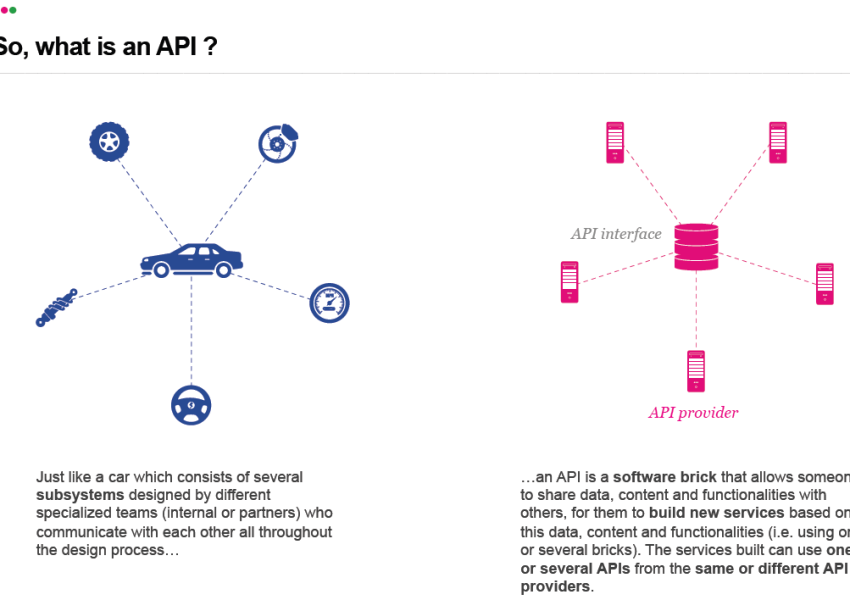

Tous les échanges passent désormais par des données. Dans un écosystème ou une filière, les connexions entre les acteurs se numérisent sans cesse. Pour les géants, l’API se présente comme le moyen majeur pour faciliter, accélérer et augmenter les échanges entre les partenaires :  le bouton like sur le web s'est répandu grâce à une API pour dominer le marché de la recommandation, Expedia produit 90% de sa valeur grâce à son API et c’est une API qui a permis à Twitter de voir près de 700 applications mobiles naître à partir de ses données.

L'API doit être comprise et utilisée pour innover, développer de nouveaux services, de nouveaux marchés, de nouveaux canaux de distribution. En mettant en œuvre des APIs, l'entreprise se transforme également dans la gestion de ses propres ressources numériques, mieux organisées, plus accessibles, donc plus efficaces.

**S'API-ser, c'est donc d'abord pour soi. Et pour les ressources physiques ? C'est simple, numérisez-les ou d'autres le feront.**

\[caption id="attachment\_541" align="alignnone" width="822"\] 6 Reasons Why APIs Are Reshaping Your Business\[/caption\]

Dans la Fabrique des Mobilités, nous portons un soin particulier aux ressources apportées par nos partenaires. Elles sont étudiées, sélectionnées, configurées pour être exploitables par des porteurs de projets que nous accompagnons. Pour cela, la transformation numérique des partenaires de le Fabrique sera facilitée en _API-sant_ leurs ressources. _L’API-sation_ devient une nouvelle action, celle de structurer des données pour qu’elles soient accessibles de façon directe et robuste par des logiciels externes. L’API-sation va transformer les ressources, la façon dont chaque partenaire gère ces données, mais surtout les façons de travailler entre les acteurs. L’API-sation transforme également l’entreprise dans ses circuits internes, en améliorant les échanges entre entités, comme l’a fait Jeff Bezos pour Amazon via AES. L’API-sation ouvre également de nouveaux clients, modèles d’affaires et relation avec les clients.

Les pouvoirs, bénéfices et exemples d’entreprises qui font levier des API sont décrits dans cette présentation de FaberNovel avec une analyse des nombreux bénéfices directs et indirects :

<iframe style="border: 1px solid #CCC; border-width: 1px; margin-bottom: 5px; max-width: 100%;" src="//fr.slideshare.net/slideshow/embed_code/key/sIiLnXNQk4tuTH" width="425" height="355" frameborder="0" marginwidth="0" marginheight="0" scrolling="no" allowfullscreen="allowfullscreen"></iframe>

**[6 Reasons Why APIs Are Reshaping Your Business](//fr.slideshare.net/faberNovel/6-reasons-why-apis-are-reshaping-your-business "6 Reasons Why APIs Are Reshaping Your Business")** from **[FΛBERNOVEL](//www.slideshare.net/faberNovel)**

La Fabrique des Mobilités offre un cadre idéal aux partenaires pour API-ser leurs ressources, pour les ouvrir progressivement uniquement aux porteurs de projets, puis aux partenaires de la Fabrique. Cet espace-temps _tiers de confiance, protégé et neutre_ est unique. **Il permet une API-sation intermédiaire entre uniquement privée à des fins internes et publique**. Il est dédié à un écosystème en mutation qui doit se transformer. L’ouverture des données via des API n’est plus un problème, c’est maintenant une action à engager et une chance que d’autres ont déjà saisi.

Chaque partenaire (industriel, laboratoire, mais également collectivité) pourra plus facilement API-ser ses ressources numériques. Pour les ressources physiques, nous commencerons par utiliser les plus faciles à numériser, pour les API-ser, puis nous numériserons les autres ressources. L'API-sation permet également d'externaliser une partie de sa R&D en accueillant des innovations externes.

**La Fabrique des Mobilités joue alors tout son rôle : amener les acteurs à se transformer individuellement pour l'écosystème doit plus performant, apporter un cadre de confiance et de neutralité pour API-ser progressivement les ressources numériques de chaque partenaire. Les projets accompagnés y gagneront en rapidité d’exécution et les partenaires également dans leur transformation numérique.**

Images : présentation de FaberNovel, [6 Reasons Why APIs are reshaping your business](http://fr.slideshare.net/faberNovel/6-reasons-why-apis-are-reshaping-your-business?related=1).
