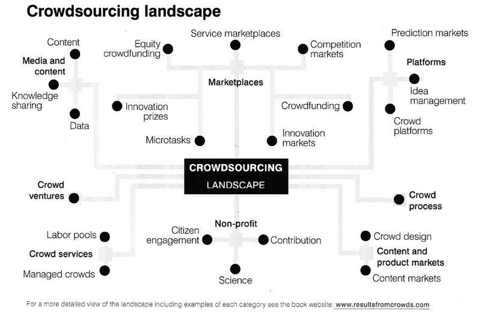

Article initialement publié sur le blog [Transport du Futur](http://transportsdufutur.typepad.fr/blog/2014/04/que-savons-nous-du-pouvoir-de-la-donn%C3%A9e-.html) par Gabriel Plassat le 7 avril 2014

Récemment équipé d'un objet nomade dans lequel nous externalisons des fonctions et une partie de notre mémoire et nous devenons producteur de données. Elles sont nombreuses (géolocation, produit/service acheté, ...), elles sont quasi-invisibles, elles sont utilisées par des acteurs marchands sans que l'on sache vraiment comment et dans quels objectifs, elles ne sont pas facilement exploitables, aujourd'hui. Cette production commence et rien ne dit qu'elle va se réduire, bien au contraire: objets connectés, montres et lunettes productrices de données (lire [Google avance ses pions vers le parfait Assistant Personnel de Mobilité](http://transportsdufutur.typepad.fr/blog/2014/03/avec-android-wear-google-avance-ses-pions-vers-le-parfait-assistant-personnel-de-mobilit%C3%A9.html)).

La valeur de la donnée produite n'est pas connue "à priori", quand elle est produite. Sa valeur ne viendra que dans l'hybridation, le croisement qui seront faits, éventuellement par d'autres persones, avec d'autres données. La valeur est donc déterminée "à posteriori", dans le flux. Ceci est essentiel à comprendre, car en conséquence, les modèles d'affaires sont donc particulièrement délicats à établir. D'autant que c'est bien l'accès à cette donnée qui permettra de réaliser cet outil; rendez là payante et l'outil disparaît. Une narration fictive N°7 ([La plateformisation a commencé](http://transportsdufutur.typepad.fr/blog/2014/01/fiction-n7-cc.html)) propose un futur possible dans ce domaine ...

Chaque personne doit maintenant prendre conscience que les données qu'elle produit (ou produira bientôt) doivent être répertoriées et gérées, sinon [des acteurs le feront](http://www.huffingtonpost.com/2013/03/07/data-brokers_n_2831805.html) (mais pas avec les mêmes conséquences).

**Du commerce de ces données à la data-philanthropie, tout existera.** Il y a une effervescence dans les solutions de production de la donnée, dans l'hybridation des données, dans les usages, les modèles d'affaires et la répartition des bénéfices. Nous trouvons par exemple :

[Action Path](https://civic.mit.edu/blog/erhardt/action-path-a-location-based-tool-for-civic-reflection-and-engagement), projet permettant à une collectivité de pousser des questions, des sollicitations à des citoyens partenaires (ayant chargés une application) en fonction de leur géolocalisation dans la ville (Particulier => Acteur Public + Reconnaissance, image => particulier + gain € => collectivité), [SeeClickFix](http://fr.seeclickfix.com/), projet associant remontées citoyennes des incidents/problèmes rencontrés et suivi par la collectivité (Particulier => Acteur Public + Reconnaissance, image => particulier + gain € => collectivité), [GoodData](http://www.fastcoexist.com/3026452/instead-of-giving-google-your-data-for-free-now-you-can-donate-it-for-good), solution de stockage de vos données et de versement volontaires à des entreprises. Les bénéfices sont ensuite verser à des ONG partenaires (Particulier => Acteur Privé + € => ONG). [Charity Mile](http://www.soonsoonsoon.com/bp10050), vos traces de mobilités actives permettent à des ONG de recueillir des aides via un fonds financé par des mécènes (Particulier => ONG, Image, reconnaissance => particulier et mécène + € => ONG). [Walkmore](https://walkmo.re/), vos traces de mobilités actives vous rapportent des points, remises sur votre crédit et sont versées à une banque partenaire, qui connaît beaucoup vos habitudes (Particulier => Acteur Privé + € => particulier), [CarePass](https://www.aetna.com/individuals-families/health-care-tools-apps.html), votre activité physique est tracée pour bénéficier d'une mutuelle santé à prix réduit et alimenter l'assurance Aetna en connaissances nouvelles (Particulier => Acteur Privé + € => particulier), [Waze](http://transportsdufutur.typepad.fr/blog/2013/06/google-ach%C3%A8te-waze-sans-doute-une-%C3%A9volution-majeure-dans-le-domaine-des-transports.html), Votre adhésion et participation alimente le système (et Google) en données de mobilité en voiture "fraîches" et en échange vous bénéficiez de données temps de réel de trafic issues de la communauté (Particulier => Particulier + Acteur Privé, temps gagné => particulier). [Moovit](http://www.moovitapp.com/francais/), idem pour les transports collectifs [Cycletracks](http://www.sfcta.org/modeling-and-travel-forecasting/cycletracks-iphone-and-android), Vos traces de mobilités en vélo alimentent une base de connaissance publique permettant à la collectivité d'améliorer, faire les travaux aux bons endroits (Particulier => Particulier + Acteur Public, Reconnaissance, image, participation projet citoyen => particulier + gain € => collectivité) Pour cartographier ces solutions, il convient d'identifier les caractéristiques principales qui les différencient. Ces "vecteurs propres" pourraient être : existence d'un contrat (O/N), données personnelles "privatisées" ou accessibles/partageables (O/N), maîtrise individuelle dans la clé de répartition des richesses crées par la donnée (O/N)...

**Le crowdsourcing, à quoi ça sert ?**

[Ville & Transports](http://www.villetransports.fr/data) en IdF a organisé une rencontre et produit une synthèse sur le sujet pour les transports.

<iframe style="border: 1px solid #CCC; border-width: 1px; margin-bottom: 5px; max-width: 100%;" src="//www.slideshare.net/slideshow/embed_code/33223211" width="477" height="510" frameborder="0" marginwidth="0" marginheight="0" scrolling="no" allowfullscreen="allowfullscreen"></iframe>

Ainsi équipée et organisée, la foule peut désormais devenir un partenaire dans plusieurs projets à la fois pour :

des industriels qui souhaitent identifier de "nouveaux" besoins, connaître comment des services/objets sont utilisés, pour trouver des citoyens "partenaires". des collectivités qui peuvent alors identifier des incidents, recueillir des propositions, animer des communautés et également identifier des citoyens pionniers. des communautés d'intérêt pour faire émerger des innovations sociales. De façon transversale, l'implication de la foule ou de la Multitude (en référence au livre de Nicolas Colin et Henri Verdier, l'âge de la Multitude) permet :

de soutenir, de dynamiser les initiatives sociales, de favoriser l'engagement des citoyens en les engageant par l'action, de créer une nouvelle relation citoyen / entreprise-collectivité, en réseau, horizontale, de participer à questionner les organisations et les modèles d'affaires établis, d'identifier les citoyens pionners, ceux avec qui, l'entreprise ou la collectivité pourra tisser des liens forts en les impliquant au plus près des choix stratégiques. Il devient essentiel de comprendre pourquoi des citoyens participent à ce type de projet, quelles sont les valeurs portées et pourquoi ils s'engagent. Plusieurs livres travaillent ce sujet et développent des concepts :

[Wealth of networks](http://transportsdufutur.typepad.fr/blog/2010/01/la-puissance-des-r%C3%A9seaux-seratelle-suffisante-.html), How social production transforms Makets & Freedom par Yochaï Benkler, [L'âge de la multitude](http://transportsdufutur.typepad.fr/blog/2013/02/les-transports-%C3%A0-l%C3%A2ge-de-la-multitude.html), Henri Verdier et Nicolas Colin, [Getting results from crowds](http://www.resultsfromcrowds.com/), Row Dawson et Steve Bynghall qui a identifié les différentes formes de crowdsourcing dans le schéma ci dessous. [L'abeille et l'économiste](http://www.franceculture.fr/oeuvre-l-abeille-et-l-%C3%A9conomiste-de-yann-moulier-boutang.html), Yann Moulier Boutang sur l'économie de la pollinisation  **Produire et consommer de la donnée**

La production de grandes quantites de données devient techniquement possible. Ces flux alimenteront (alimentent déjà) des moteurs d'apprentissage de nos habitudes, de nos usages, de nos fonctionnements, de notre consommation bien sûr, puis de nos relations sociales, puis de nos comportements. Majoritairement, ces flux de données sont aujourd'hui gérés par des acteurs marchands qui captent l'essentiel de la valeur. Vous l'acceptez pour plusieurs raisons :

vous n'avez pas le choix, sauf à ne plus utiliser la plateforme en question, Mais la plateforme est particulièrement performante pour vos usages, plus vous vous servez de la plateforme, plus elle vous propose des produits/services adaptés. Pour faire autrement (lire notamment [de l'hyperempire à l'hyperdémocratie](http://transportsdufutur.typepad.fr/blog/2013/11/de-lhyperempire-%C3%A0-lhyperd%C3%A9mocratie.html)), il convient tout d'abord de clairement établir qui utilisent vos données, pourquoi faire ? Est il possible de refuser tel ou tel usage ?

Plusieurs projets travaillent sur des solutions de regroupement de vos données, des coffres forts numériques dans lesquels tous les acteurs ayant des données vous concernant vous les renvoient. Ce premier pas permettra ensuite de décider où et pourquoi partent vos données. Il sera possible de le gérer comme une ressource, ou de déléguer cette gestion à une ONG, à une entreprise ou de ne rien faire. Il y a notamment le projet [MesInfos de la FING](http://mesinfos.fing.org/), ou encore [Open Paths](https://openpaths.cc/) qui permet de structurer de [nombreux projets citoyens](https://openpaths.cc/projects).

Puis des "solutions entre pairs" apparaitront. Inimaginable il y a 20 ans, aujourd'hui n'importe qui peut trouver une information précise sur le web. Demain, nous aurons des dispositifs numériques capables de générer des services performants, utilisant des flux de données produits entre citoyens, sans nécessairement passer par des acteurs marchands. Ces flux de richesses pair à pair modifieront notre rapport au collectif puisque chacun (du moins les citoyens volontaires) participera à améliorer la vie de la cité. Bien sûr ces flux alimenteront également les services publics, et créeront des hybrides, des services citoyens, non gérés par l'Autorité publique.

**Réflexivité et Holoptisme**

Ces flux apporteront au quotidien une nouvelle sensation. Ils nous permettront d'observer puis de ressentir la réflexivité (lire [l'article sur ce sujet](http://transportsdufutur.typepad.fr/blog/2014/03/devenir-r%C3%A9flexif.html)). Ainsi liés, nos comportements individuels seront partiellement influencés par les conséquences collectives qu'ils vont engendrer. Le collectif va émerger de façon partielle et progressive, d'abord dans certaines communautés mieux connectées, mieux préparées. Cette émergence va amplifier la capacité des personnes à décider individuellement en tenant compte des boucles rétroactives, des conséquences globales.

Ces collectifs décideront mieux et plus vite, se connecteront encore mieux, augmentant la confiance et engageant un cercle vertueux. Comme une tribu, une équipe de sport entraînée ou un groupe de musique, chaque personne sera à la fois parfaitement individuée, expert/compétente dans un ou plusieurs domaines ET consciente des compétences des autres ET reliée aux autres ET reliée à l'émergence du collectif lui permettant de "s'ajuster". La structure de commandement n'est plus verticale mais devient horizontal, holomidale. Pour [Pierre Lévy, auteur de l'Intelligence collective](http://fr.wikipedia.org/wiki/Pierre_L%C3%A9vy_(philosophe)) - " Pour une anthropologie du cyberespace, il s’agit d'une « intelligence partout distribuée, sans cesse valorisée, coordonnée en temps réel, qui aboutit à une mobilisation effective des compétences ".

Pour continuer, suivez : [@crowdsourcing\_](https://twitter.com/search?q=%40crowdsourcing_&src=typd)et [@jowyang](https://twitter.com/search?q=%40jowyang&src=typd)
