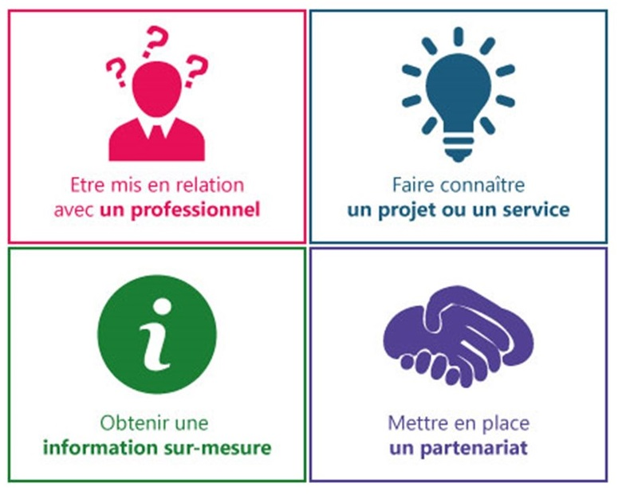

Issu d’un appel à projet de l’ADEME, le projet CoMoN vise à favoriser l'innovation et le développement économique dans le domaine des mobilités des biens et des personnes. Pour accroître les possibilités de création ou réplication de projets de mobilité innovants, CoMoN s'appuie sur deux piliers : d'une part une plateforme numérique qui recense et partage des connaissances clés sur des initiatives emblématiques (les "références") ; d'autre part, la mise en place d'une équipe d'animation pour analyser les besoins, mettre en relation les acteurs et répondre aux demandes spécifiques.

La plateforme de partage d’informations et de mise en relation dans le domaine des mobilités est maintenant lancée !

**_Etre mis en relation avec un professionnel_**

Vous êtes à la recherche de la personne qui pourra vous raconter comment elle a monté son projet, ou de l’expert pointu qui vous donnera l’idée lumineuse qui manquait à votre démarche ? Vous êtes au bon endroit. Envoyez-nous votre demande, nous ouvrons notre carnet d’adresse pour vous trouver la personne faite pour y répondre.

**_Faire connaître un projet ou un service_**

Vous connaissez un projet, un service, une offre, ou un évènement particulièrement intéressant et qui mérite d’être partagé ? Vous souhaitez faire connaître un appel à projet que vous lancez ? Vous êtes au bon endroit. Envoyez-nous votre proposition, nous discuterons ensemble de sa mise en ligne.

**_Obtenir une information sur-mesure_**

Vous souhaitez en savoir plus sur un projet ou un sujet dans le champ des mobilités ? Vous êtes au bon endroit. Envoyez-nous la thématique, le type de projet, d’acteur, de territoire, ou même le nom d’un projet qui vous intéresse en particulier, nous ferons tout pour trouver l’information dont vous avez besoin.

**_Mettre en place un partenariat_**

Vous vous lancez dans une aventure qui demande d’être à plusieurs, mais il vous manque des acolytes ? Vous êtes au bon endroit. Racontez-nous votre projet et le profil du mouton à cinq pattes que vous recherchez, nous vous proposerons des mises en relation.

Ouverte à tous les bêta-testeurs, elle vous permet de soumettre vos questions et besoins pour recevoir des informations ciblées. Elle s’étoffera prochainement de fiches descriptives à haute valeur ajoutée sur des projets de mobilité innovants.

Tiers de confiance destiné à l’ensemble des acteurs de l’écosystème, CoMoN se positionne donc comme déclencheur d’actions et de partenariats.

CoMoN vient en amont et en complément de la Fabrique des Mobilités en facilitant l'identification des projets et des acteurs, en accélérant le montage de nouveaux projets.

**Pour en savoir plus :** [http://comon.mobigis.fr/](http://comon.mobigis.fr/)
