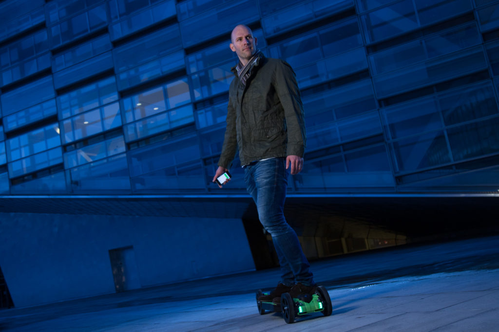
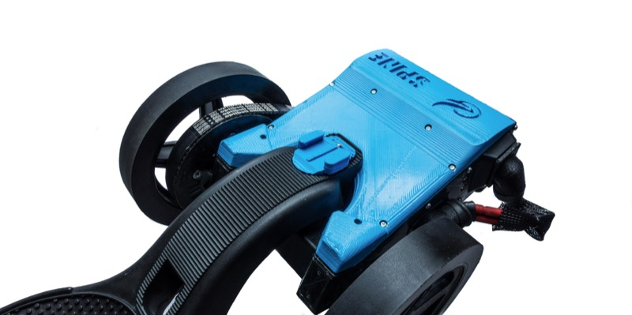

Open Hardware in the sector of transportation is starting. Many projects aim to develop next generation components of our ecosystem. Open, connected, electric, distributed, like [**Local Motors**](https://localmotors.com/localmotors/the-awesome-system-driverless-mobility-on-demand/activity/) and [**Mobotiq**](http://mobotiq.com). [**Faraday Motion**](http://www.faradaymotion.com/) is also working on open source skate board, and it's just the beginning. La Fabrique des Mobilités will organise a dedicated workshop on OpenHardware Nov 15th with [**Paris Open Source Summit**](http://www.opensourcesummit.paris/). We have interviewed [Sune Pedersen](https://dk.linkedin.com/in/spedersen), founder of [Faraday Motion](http://www.faradaymotion.com/).

**Dear Sune, you have launch an open hardware project for a new mobility system. Can you tell us why you have chosen to make it "open source" ?**

Our belief at Faraday Motion is that technology should be available to everyone in order to maintain its rapid and continuous development. As we also ourselves rely on open source technologies to create our products it was perfectly clear that we also will be open sourcing our own code and designs. For now the electronics designs are in CC Non commercial, but it will be changed in the near future to full open source. Together with the open source community a big and accelerated change can be achieved within the mobility industry. Besides that, by opening up our technology we want to encourage others to build even more things that the world has not yet seen. We believe collaboration and open source is the key to global tech advancement.

 ** What are the objective of Faraday Motion ? What are your dreams ?**

At Faraday Motion we envision a world of increased mobility efficience. A world in which its easy to combine public city transportation with efficient last mile vehicles in the city. Our objective is to create the technology foundation that will enable people to exploit modularity and find solutions to the current and future mobility challenges.

**Can you describe your Spine project ? How long does it take ? how did you work and what are the news ?**

The Spine has a very interesting story. I will start by saying that the first prototype was built in Sweden during an internal hackathon weekend. By then we had the Hyperboard R2, the most advanced electric skateboard in the world, but it's technology complexity felt to be too challenging for starting maker enthusiasts. That is how the decision was made to have a starter version, hence it's name. The first iteration was very basic: the deck, 3D printed brackets to hold the motor and the electrics and surely enough a battery that was taped to the construction.

Today the Spine is more mature in it's design and reliability and its design. The intense testing we have been putting it through has taken it to a whole new level. It takes around 2 hours to assemble a Spine, we made it so that you only need simple tools to do it and published the manual online for everyone to contribute to the documentation [https://faradaymotion-spine.readme.io](https://faradaymotion-spine.readme.io) . Many customers print most of the plastic parts themselves, it will take from 25-100 hours, depending of the type of 3D printer that is used.

We have many more updates and upgrades coming to the Spine. Besides the features of our Hyperboard R2, we are working on a belt tightening system, swappable batteries, websocket communication enabling communication and control from a web browser and complete custom hand controller are just a few updates that are comming up, some of them can be seen on our new Makerspace [http://makerspace.faradaymotion.com](http://makerspace.faradaymotion.com)

**So you just launch your MakerSpace. How is it working ?**

The online Faraday Motion Makerspace was prototyped with the objective to stimulate collaboration around lightweight electric vehicles, particularly for the Spine to begin with. Everyone is invited to publish ideas for projects, team up and accomplish them. Users can contribute their knowledge and skills to other projects. For example a developer can team up with an industrial designer to create LED lighting modules for the Spine. Then others can 3D print the parts and implement the software to upgrade their own Spines. We have seen customers contribute with brilliant good ideas and designs already. I.e. One of our customers, Roman, has published his first ever 3d design – a fender protecting him from rain when driving. Internally we use the Makerspace to share projects that we are working on with the community. One example is the Spine's swappable batteries that we showcased recently but did not release yet. We are actively engaging with all the makerspace members and try support them.

**Thank you Sune and see you in November !**
