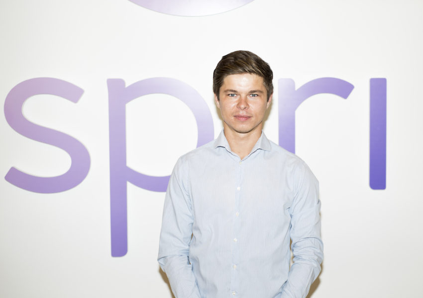

 

**Interview de Rytis Jakubauskas -  Spiri.io**

_Réalisée par Stéphane Schultz et Gabriel Plassat_

_Retranscrite par Ludivine Bigot_

_Traduite de l’anglais par Stéphane Schultz_

Vous avez peut-être été intrigué(e) par ce drôle de véhicule apparu dans les publications spécialisées récemment. Ce drôle d’engin est le prototype de Spiri.io, une startup basée à Copenhague. Spiri ambitionne de créer un tout nouveau service de mobilité qui combine véhicule dédié, application de mise en relation et modèle économique révolutionnaire.

À quelques minutes du Salon Autonomy le mois dernier, nous avons rencontré Rytis Jakubauskas, le responsable business et commercial de Spiri.

_**Qu’est-ce-que Spiri ?**_

C’est une bonne question !

Nous sommes en train de créer un nouveau mode de transport. Il est basé sur un véhicule électrique conçu spécialement pour cela. Ce véhicule est intégré à une nouvelle offre de mobilité que personne n’a proposé avant nous. C’est une combinaison entre un modèle de partage de véhicule dédié comme Bolloré par exemple en France, et du partage de trajet comme Uber Pool. Nous prenons le meilleur de chaque modèle : vous pouvez prendre un véhicule au hasard pour vous rendre de là où vous êtes et le laisser là où vous allez, et si quelqu’un va dans la même direction que vous et que vous le transportez, votre trajet sera totalement gratuit. Pour le passager cela coûtera un peu moins cher qu’Uber Pool et un peu plus que le transport public. Par exemple pour un trajet qui coûterait 12€ en taxi, le tarif serait de 4€ avec Spiri contre 5 ou 6 en Uber Pool. Notre service va abaisser le coût de la mobilité grâce à un véhicule très peu cher construit dans spécialement pour ce service. Nous abaisserons le coût également en parvenant à mettre deux personnes ou plus dans la voiture. Pour cela nous avons besoin de passer à l’échelle. Notre modèle s’appuie sur trois piliers : le véhicule, dont le design particulier du prototype n’est qu’une étape vers un véhicule qui sera produit en 2018; la connectivité, qui pourra fonctionner avec ces véhicules mais aussi avec d’autres véhicules; la plateforme de mise en relation.

_**Où pourra-t-on trouver ces véhicules ?**_

Ces véhicules seront opérés par nous, personne ne pourra en posséder un pour son usage propre. Au départ nous commencerons par mettre des voitures dans des “hubs”, des parcs de stationnement comme Intermarché ou Carrefour, au plus près des gens qui les utiliseront et seront transportés. Le conducteur ne paiera rien car il donnera du temps et de l’attention pour prendre le véhicule et conduire. Nous aurons suffisamment de “hubs” dans la ville pour que ce soit pratique pour tous. Nous discutons avec les villes où nous prévoyons de nous lancer, en Scandinavie et en Allemagne. En particulier celles qui ont le plus de places de stationnement disponibles.

Le principe est de n’être jamais à plus de 10 minutes de marche de votre lieu de départ ou de destination. Mais il ne sera pas possible de laisser la voiture ailleurs. Vous indiquez à l’appli votre destination et elle vous guide vers le parking et la voiture la plus proche.

L’étape suivante, une fois passé à l’échelle dans de grandes villes, sera de proposer le _free floating_ (la mise à disposition d’un véhicule là où le précédent utilisateur l’a laissé, pas dans un parking).

_**Est-ce que vos clients seront plutôt des touristes ou des gens qui utilisent ce service tous les jours ?**_

Nous avons besoin des deux types d’utilisateurs. Des conducteurs qui font le même trajet aller et retour, mais aussi des conducteurs et passagers occasionnels.

_**Que se passe-t-il si le conducteur n’a aucun passager à transporter ?**_

Le trajet est gratuit pour le conducteur, qu’il ait ou non un passager. Nous ne pouvons lui interdire les trajets sans passager au risque de ruiner l’expérience client. Mais rien n’est vraiment gratuit. En tant que conducteur, vous payez avec votre temps et vos efforts et en ramenant la voiture au hub d’arrivée.

_**Cela ressemble au principe développé par [La Zooz](http://lazooz.net/) en Israël ?**_

Oui cela va dans le même sens. Notre système permet de baisser tellement le coût du transport que cela va changer les comportements individuels.

_**Comment comptez-vous atteindre la masse critique d’utilisateurs nécessaire ?**_

À Londres Uber a déjà 26 000 chauffeurs. Ils ont un réseau très dense. Nous ne sommes pas encore en position de faire la même chose. L’année prochaine nous lancerons plusieurs centaines de véhicules dans des secteurs limités. Par ailleurs notre service va faire baisser sensiblement le coût du transport. La voiture pèse lourdement dans ce coût : c’est pourquoi nous designons des véhicules dédiés à ce service. Ils seront construits par des constructeurs.

_**Combien de hubs sont-ils nécessaires ?**_

Nous prévoyons de lancer le service avec 4 à 8 hubs par ville selon leur configuration. Pour le conducteur, cela revient à peu près au même espacement qu’une ligne de métro. Pour les passagers c’est beaucoup mieux, puisqu’ils sont pris et déposés au plus près. Concrètement nous créerons des “arrêts virtuels” selon les demandes. L’idée est de prendre le meilleur des lignes de transport et de systèmes plus souples comme Autolib.

_**Quelles complémentarités votre service aura-t-il avec les réseaux de transport public ?**_

Pour que les gens sortent de leur voiture, il faut leur proposer des services professionnels, efficaces et peu cher. Les abonnements mensuels illimités par exemple vont dans ce sens. Notre modèle a besoin de densité. Sans des subventions publiques il ne pourra pas s’étendre. Certaines villes au Danemark ou en Allemagne nous ont approchés pour remplacer des lignes de bus peu efficaces. Mais notre service a aussi besoin d’un certain niveau de densité pour être pertinent, à moins de bénéficier de subventions.

_**Vous travaillez à la fois sur le design d’un véhicule, sa production et le lancement d’une plateforme de mise en relation entre conducteurs et utilisateurs; que répondez-vous à ceux qui préconisent de se concentrer sur un seul objectif à la fois quand on démarre une startup ? Pourquoi par exemple ne pas avoir privilégié un partenariat ?**_

Ce serait ennuyeux (rires) ! Le véhicule dédié fait totalement partie de notre produit. Nous avons besoin de le concevoir. C’est un projet très ambitieux, je suis d’accord. Nous parlons avec beaucoup d’entreprises, c’est pour cela que nous sommes ici à Paris, aux Salon de l’Auto et au Salon Autonomy.

Nous sommes une startup. Une grosse startup avec 60 personnes, dont 20 proviennent de DrivR. Cela nous permet d’avancer sur nos trois piliers : le véhicule, la connectivité et la plateforme.

_**Attendez-vous quelque chose des autorités françaises ?**_

Pour le moment nous sommes concentrés sur quelques pays. Nous discutons avec des villes qui auraient à la fois des données, des infrastructures et de l’espace pour nous lancer. Une arrivée en France n’est pas prévue à court terme.

_**Que pensez-vous de l’open source ?**_

Nous ne travaillons pas sur ce sujet aujourd’hui. Mais un de nos investisseurs, David Helgason, est le fondateur d’[Unity Technologies](https://en.wikipedia.org/wiki/Unity_Technologies), une entreprise qui a démocratisé le développement mobile en donnant à tous ceux qui voulaient créer des jeux les outils pour le faire. La voiture autonome par exemple nous intéresse mais nous ne pourrons pas le faire seul. Nous développerons une plateforme open source avec d’autres partenaires pour créer les meilleurs services possibles.

 

Merci Rytis, et longue route à Spiri !

[En savoir plus sur Spiri.io](https://medium.com/@Spiri_io/the-spiri-prototype-hits-the-track-40ea2b42bd35#.jv0hqh6vf)

Tous les visuels sont fournis par Spiri
