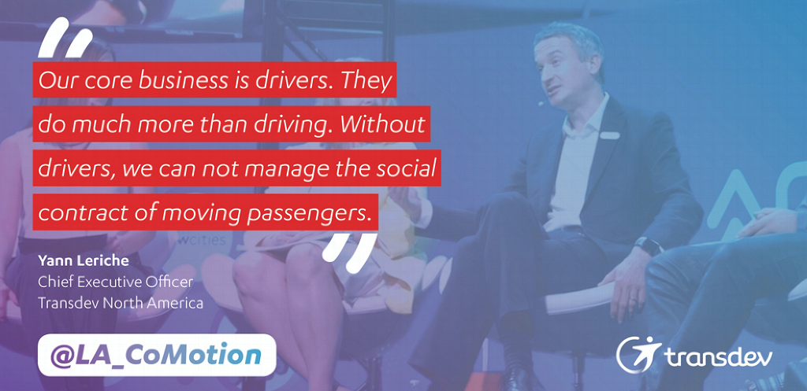

**_Pouvez-vous vous présenter en quelques mots ?_**

Directeur Amérique du Nord chez Transdev, également en charge de la _business line BtoC_ (NB : les activités non conventionnées avec des collectivités) et des véhicules autonomes pour l’ensemble du Groupe.

**_Quand avez-vous entendu parler de la Fabrique des Mobilités pour la première fois ?_**

Il y a très longtemps. Elle n’existait pas encore ! Lors d’une discussion avec Gabriel Plassat,  qui avait une vision de ce qu’il voulait faire : “_Est-ce que tu penses que ça va marcher ? Est-ce que ça t’intéresse ?_ “Je lui avais répondu : “_Oui, vas-y fonce !_” .

**_Quelles sont les principales difficultés que rencontre l’Amérique du Nord pour faire avancer des projets de mobilité durable ?_**

Aux USA le sujet du transport public n’a pas la même place dans les discussions politiques que celle qu’il occupe en France. Il est globalement moins présent, moins travaillé. Prendre les transports publics (hors New-York et quelques autres grandes villes) reste connoté socialement, réservé aux “captifs”. Les élus qui se retrouvent en charge ont moins de moyens, et en plus leurs villes sont moins adaptées. Uber a changé les choses et a rendu la mobilité “sexy”, a donné envie de la rendre plus efficace, d’y investir plus d’argent (secteur n°1 aux US pour l’investissement des sociétés de capital risque). L’augmentation des moyens est toutefois du côté privé, avec une vision du transport public pas toujours positive.Les [récents propos d’Elon Musk](https://www.wired.com/story/elon-musk-awkward-dislike-mass-transit/) en sont une bonne illustration.

**_Que manque-t-il selon vous pour faire avancer ces sujets ?_**

La réflexion sur la mobilité, toutes les formes de mobilité, est moins en avance qu’en Europe, d’où l’intérêt de recréer un écosystème de gens qui s’intéressent à ça.

Ce qu’a montré le récent évènement [LA CoMotion](https://www.lacomotion.com/) est l’intérêt des élus pour des systèmes de transport plus souples. Or Uber n’est pas partout, tout le monde n’a pas de smartphone ni de carte de crédit. Comment fédérer les gens et faire avancer des sujets au-delà d’évènements comme LA CoMotion ? Aider les gens du public, du privé à trouver ensemble les solutions les plus adaptées aux clients et aux territoires. L’espace public est limité, il faut faire des choix pour son allocation à un mode plutôt qu’à un autre. Par exemple un des débats actuels aux États-Unis est l’accès au “curb”, le trottoir.  Exemple : les bus de Google qui ont suscité une grosse colère des habitants car ils occupaient l’espace des bus publics. Qui gère l’accès à l’espace public  ? Faut-il faire payer son accès ? On va sans doute bientôt parler de “neutralité de la voirie” comme on parle aujourd’hui de “neutralité du net”.

Autre sujet ici aux USA : peut-on lancer des services de transport collectifs plus chers et de meilleure qualité pour capter une clientèle qui a plus de moyens, sans pénaliser les transports publics classiques ?

**_Qu’est-ce qui a retenu votre attention dans la proposition de valeur de la Fabrique des Mobilités ?_**

Deux choses m’intéressent :

**Le travail en écosystème :** aujourd’hui si l’on veut réussir, il faut qu’on propose des produits qui soient bons pour nos clients : que veulent-ils ? que leur proposer ? Ensuite seulement on regarde ce que nous Transdev pouvont proposer. Ce qu’on constate c’est qu’on n’est souvent pas capable de l’apporter seul. Prenez l’exemple de MaaS (Mobility as a Service, un concept où l’opérateur se chargerait de fédérer et rendre accessible toutes les offres de mobilité pour l’utilisateur) : les gens ne sont pas des clients de chaque mode exclusivement, ils changent tout le temps ; si l’on veut avancer et servir le client on doit travailler avec d’autres; travailler à plusieurs, dans des écosystèmes qui ne soient pas un acteur dominant qui agrège autour de lui. Par conséquent avoir un écosystème neutre qui n’a pas d’autre objet que servir ses membres, comme le propose la Fabrique des Mobilités, est important.

**Les communs** : vu l’ampleur et la complexité de la tâche et le niveau de fragmentation des responsabilités, travailler en commun ne suffit pas : il faut créer des communs, des objets en commun. Favoriser la coopétition, ne pas recréer des couches basses de services qui n’ont aucun impact sur le client.  La Fabmob a été créée dans ce but.  Cette notion des communs est d’une banalité complète en Californie (cf. big data qui utilise des solutions ouvertes et des standards partagés) mais en France ce n’est pas encore dans les gènes.

**_Que pourrait apporter la Fabrique des Mobilités en Amérique du Nord ?_**

Comme en France les deux sujets écosystèmes et communs sont pertinents aux USA. Les moyens sont du côté des entreprises privées plus que des collectivités. Il faut faire le lien entre ces deux mondes, les faire discuter.

Ce qui s’est passé dans le monde informatique n’est pas arrivé dans la mobilité : information, ticketing, open data,...souffrent du manque de standards.

**_Quelles sont les prochaines étapes ?_**

Il faudrait surfer sur les suites de LA CoMotion et que la FabMob anime les débats et fédère les initiatives entre les deux conférences. Pourquoi ne pas commencer à Los Angeles ?  Les autorités viennent de lever une taxe spécifique pour les 30 prochaines années : 120 milliards de dollars pour financer les infrastructures dont les transports, c’est tout à fait exceptionnel. Le maire dit : “_vous avez des projets, venez les faire à Los Angeles ! Je financerai les meilleurs projets_”.

_Propos recueillis par Stéphane SCHULTZ en Décembre 2017 pour la Fabrique des Mobilités._
