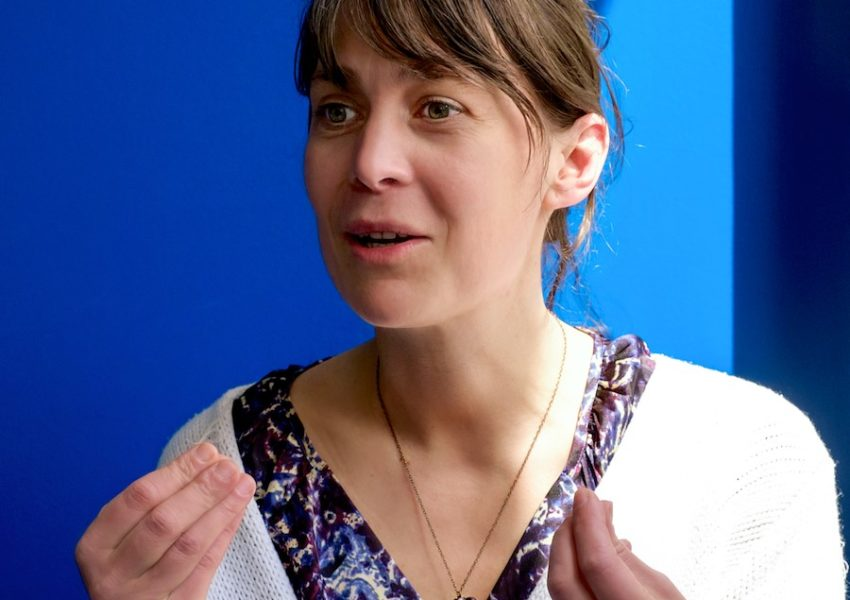

Dès le départ, la Fabrique a été conçue pour être répliquée, hackée, bricolée et ainsi étendre les principes des communs tout en s'adaptant aux conditions locales. Nous avons intérêt à avoir plusieurs Fabriques dans le monde. En effet, en créant une Fabrique dans un autre pays, cela permet :

- de tester plus rapidement les communs produits dans d'autres contextes réglementaires, juridiques, donc de les renforcer et de valider leur réplication,
- de créer plus rapidement des communs dans un grand nombre de communautés en augmentant ainsi la productivité des écosystèmes,
- de mutualiser les retours d'expériences pour produire un référentiel central et ouvert de nos connaissances.

A Montréal, nous avons rencontré dans un écosystème très riche, Elsa Bruyère et Vincent Dussault. Elsa est entrepreneur et facilitatrice, elle a créé [**la Fabrique Agile**](http://fabriqueagile.com/) pour stimuler l'innovation. Vincent, expert en technologies numériques, est responsable du développement des initiatives en transport de [**Coop Carbone**](http://coopcarbone.coop/), coopérative québécoise.

**_Quand avez-vous entendu parler de la Fabrique des Mobilités pour la première fois ?_**

**V.D.**

Il me semble que j’ai toujours entendu parler de la Fabrique (rire). Il y a un an nous cherchions des solutions de mobilité et sommes tombés sur le site http://lafabriquedesmobilites.fr. Il y avait beaucoup de solutions intéressantes référencées sur ce site, notamment pour la mobilité partagée. L’approche _bottom up_ de la Fabrique m’a séduit immédiatement. J’y suis revenu régulièrement et l’intérêt est allé grandissant jusqu’à notre rencontre en 2017.

**E.B.**

Avant même que Gabriel vienne la première fois à Montréal (mai 2017) pour préparer Movin’On, j’avais entendu parler de la Fabrique. Sans doute est-ce aux entretiens Jacques Cartier en 2015. Comme à la Fabrique A nous travaillons sur les modèles d’innovation ouverte, j’avais entendu parler des travaux de la Fabrique (l’autre) sur les communs.

**_Quelles sont les principales difficultés que rencontre Montréal pour faire avancer des projets de mobilité durable ?_**

**V.D.**

Montréal est l’une des villes d’Amérique du Nord dans laquelle le transport collectif est le plus développé, avec New York et Los Angeles. L’aménagement du territoire est très propice. Le quartier du Plateau Mont Royal est l’un des plus denses d’Amérique du Nord. Comment augmenter l’offre de mobiilité durable ? Le transport collectif est à saturation en heures de pointe. La nouvelle mairesse faisait campagne sur le concept de “classe sardine” pour souligner les difficultés subies par les voyageurs. En parallèle, il y a une grosse demande pour la mobilité durable mais l’étalement urbain rend difficile de desservir les secteurs hors des quartiers centraux. La congestion automobile est forte : Montréal apparaît dans le classement des villes les plus congestionnées.

Concrètement nous avons un problème de _first/last mile_ de/vers les quartiers périphériques qui sont très peu denses.

Il y a beaucoup de talents, beaucoup de startups : Montreal est devenu un pôle d’intelligence artificielle, même si beaucoup de villes le revendiquent. En même temps, on a un côté un peu protectionniste : en transport on a tendance à protéger les joueurs en place, ce qui peut ralentir l’implantation d’innovations.

**E.B.**

Le Canada est un pays qui reste fortement dépendant de l’automobile. Il y a une sorte d’addiction : malgré tous les efforts des pouvoirs publics, l’achat de voitures est toujours fort en Amérique du Nord. Peu importe les contraintes, cette tendance s’accentue. La faible densité du territoire autour de Montreal renforce cette tendance.

Par ailleurs on a pas une masse critique très forte. Pour embarquer une communauté d’_early adopters_ de nouvelles habitudes (covoiturage, partage de vélos,...), c’est plus simple à San Francisco ou à Paris qu’au Québec où il n’y a “que” 8 millions d’habitants. Beaucoup d’innovations sont arrivées de l’extérieur. Par ailleurs, pour les innovations créées chez nous, c’est ok pour aller jusqu’au prototype, en revanche le scale up se déroulera à l’extérieur. Il faudra nécessairement exécuter à l’extérieur.

Exemple de Potloc, startup de Montréal : ont mis en place une solution pour définir quel commerce tu veux dans ton voisinage (s’il y a des commerces vacants, les voisins peuvent donner leur avis). Ils ont démarré à Montréal et sont allé grandir en France où le marché des commerces est plus dynamique. Même en conquérant toutes les villes du Québec, même avec de jolies levées de fonds, il ne leur est pas possible de rentabiliser leur solution à l’intérieur de ce seul périmètre.

**_Que manque-t-il selon vous pour faire avancer ces sujets ?_**

**V.D.**

Il y a un vrai besoin de partir des attentes et besoins du citoyen. Les gens ont montré qu’ils étaient prêts à tester de nouvelles solutions. Il y a un besoin de concertation, de donner une plus grande place aux citoyens dans les choix.

**E.B.**

Montréal manque encore de projets qui vont faire changer le regard sur la mobilité. L’écosystème startup a une dizaine d’années, mais celui des “nouvelles mobilités” n’a que quelques années. Il lui faut grandir. Les gens sont prêts. Les citoyens sont prêts. La conscience personnelle est là. Il faut arriver à trouver la bonne proposition qui permet concrètement de transformer l’usage.

Donc il manque du temps, de la masse critique, et sans doute aussi un peu d’engagement politique.Et il manque aussi des communs ! Pour accélérer les projets, pour abaisser les barrières à l’entrée. Pour que ce qui n’est pas la proposition de valeur d’une startup (exemple : la solution de billetterie,...) soit accessible facilement.

**_Qu’est-ce qui a retenu votre attention dans la proposition de valeur de la Fabrique des Mobilités ?_**

**V.D.**

D’une part les enjeux de mobilité partent de besoins universels, partagés par toutes les grandes villes. L’échange sur ces problématiques est très important. Le travail d’inventaire de la Fabrique, son approche ouverte, facilitent ces échanges de bonnes pratiques et de solutions. Au Québec on a des capacités de créer des solutions, mais notre marché est minime dans un contexte de solutions numériques. Par conséquent la possibilité de collaborer avec d’autres régions est importante : s’inspirer des autres, trouver des marchés pour les solutions créées ici, est important.

D’autre part l’approche _open source_ facilite la création d’outils en utilisant des choses qui existent déjà.

La Fabrique a un rôle intéressant pour démystifier cette approche _open source_. Nous apprécions aussi la démarche pragmatique, l’intégration de l’_open source_ dans des modèles existants. Par exemple dans l’Open Lab ou dans les communautés sur le covoiturage, la Fabrique a su mettre ensemble des acteurs différents pour avancer sur des sujets.

**E.B.**

Ce qui me marque le plus est l’idée que l’on puisse récompenser l’engagement des gens dans les communs. Que ce soit en financant, en partageant les retours d’expériences, en montrant qui s’est impliqué, qui a fait quoi,...on décentralise la création de la valeur, on la matérialise et on la valorise. Les communs sont une belle intention, ils ne sont pas un _nice to have_ : ce sont des moyens de faire. La Fabrique agit comme un flux, une dynamique de création de valeurs. La question du retour d’expériences, le partage dans les wikis, apporte une autre manière de travailler : je fais avec les autres, je transmets, je me sers et je sers les autres. Ça remet encore beaucoup les gens en cause : _qu’est que j’apporte comme valeur ?_

**_Que pourrait apporter la Fabrique des Mobilités en Amérique du Nord ?_**

**V.D.**

Nous n’en sommes qu’aux tous débuts de notre approche avec la Fabrique. Mais déjà, nous voyons du potentiel pour développer des outils qui aideraient les institutions et opérateurs à mieux intégrer certains pratiques de mobilité. Par exemple le [**projet de certification de trajets en covoiturage**](http://wiki.lafabriquedesmobilites.fr/wiki/Preuve_de_covoiturage) pourrait être utilisé en Amérique comme partout ailleurs.

**E.B.**

En tant que bi-nationale, je dois à la fois concilier l’amour des concepts et l’urgence de l’action. La Fabrique des Mobilités est un peu à la jonction des deux : définir des concepts, avoir du fond, une pensée dans la durée, mais aussi des réponses concrètes aux besoins de gens. Je ne pense pas qu’il soit nécessaire de re-créer une Fabrique des Mobilités en Amérique du Nord. L’expérience, la preuve de concept, a été validée en France. On peut totalement l’utiliser pour appuyer des projets ici en Amérique. Il faut une présence “physique” de la FabMob ici, des gens qui animent, mais tout le moteur méthodologique et les outils peuvent être utilisés. Pas la peine de le refaire.

**_Quelles sont les prochaines étapes ?_**

**V.D.**

Suite aux échanges initiés lors de [**Movin’On 2017**](http://wiki.lafabriquedesmobilites.fr/wiki/Movin%27on_Masterclass_on_Open_Source), la Coop Carbone a continué les échanges avec plusieurs intervenants en mobilité. Nous sommes en train de créer un Centre d’Excellence pour animer une communauté Open Lab. Les porteurs de ce projet sont, hormis la Coop, Savoir Faire Linux, la Fabrique Agile, Ouishare. Le projet est soutenu par Michelin, le Bureau de la Ville Intelligente de Montreal, Transdev NA et plusieurs autres partenaires intéressés par la démarche.

Cette équipe a répondu à un appel à projet du Ministère de l’Innovation (MESI) pour créer ce Centre d’Excellence, dont la réponse sera en 2018. D’autres projets impliquent des communautés d’utilisateurs pour permettre d’expérimenter de nouveaux services et de nouvelles solutions. L’objectif est de rejoindre [**la communauté naissante de la Fabrique des Mobilités**](http://wiki.lafabriquedesmobilites.fr/wiki/Communaut%C3%A9_des_acteurs_du_Qu%C3%A9bec) pour échanger sur l’innovation ouverte et les communs numériques.

Nous attendons également d’avoir des projets concrets pour collaborer avec des équipes d’autres régions.

**E.B.**

Nous devons nous demander : quel est le bout de “_produit minimal viable_” que l’on peut lancer avant la décision du MESI ? Quels doivent être les premières actions ? Une identité visuelle, un début de communication vers les communautés que l’on connaît déjà, leur faire découvrir et utiliser le [**wiki**](http://wiki.lafabriquedesmobilites.fr/wiki/Accueil)...Signer la charte, rejoindre la communauté. Exemple : avec BiXi, véritable intérêt pour travailler avec des communs. On va commencer des choses avant d’avoir un budget !

 

**Elsa Bruyère- Co-fondatrice Fabrique Agile et Katapult**

Entrepreneur et facilitatrice, Elsa intervient avec les entreprises, les OBNL et les acteurs publics en créatrice d’opportunité d’innovation, d’internationalisation ou de gestion de croissance. Elle vit à Montréal depuis 2011 où elle a créée la Fabrique Agile, qui s’investit en co-création dans le développement d’innovations à impact avec des entrepreneurs. L’équipe crée également des formations et jeux sérieux en creativ common et intervient en mandat.

Elsa a ainsi pu s’engager dans la mobilisation de la gouvernance d’OBNL, la refonte de stratégie d’affaires, le développement de produits en  innovation ouverte ou la transition numérique d’entreprise. Elle mobilise les techniques d’agilité, de lean startup, de business model generation, de design de service et d’innovation ouverte dans ses projets.

En 2015, avec 4 associés, elle a crée Katapult-Hub, dédié à l’internationalisation des startups, en offrant des programmes de « crashtest » dans plusieurs pays donc le Canada, la France et le Brésil. En France elle a travaillé durant 10 ans, en tant que consultante en ressources humaines, pour des groupes industriels et de services en France, dans des contextes de fusion, transformation organisationnelle. Elsa est engagée auprès des OBSL depuis 5 ans, et est notamment co-fondatrice de [**Bleu Blanc Tech**](http://www.bleublanctech.com/), la French Tech à Montréal.

**Vincent Dussault : conseiller stratégique transport**

Je suis responsable du développement des initiatives en transport de Coop Carbone, et avant tout un expert en technologies numériques. Après avoir administré un des sites web les plus populaires au Canada ([The Weather Network / MétéoMédia](https://www.theweathernetwork.com/ca)), je me consacre aujourd’hui à l’étude des transports et les impacts des toutes dernières technologies numériques : mobilité partagée, électrification, véhicules intelligents et optimisation de la mobilité à l’aide des applications mobiles.

La Coop Carbone est une [coopérative québécoise](https://www.economie.gouv.qc.ca/objectifs/informer/cooperatives/page/apercu-10303/?tx_igaffichagepages_pi1%5Bmode%5D=single&tx_igaffichagepages_pi1%5BbackPid%5D=68&tx_igaffichagepages_pi1%5BcurrentCat%5D=) présente sur le marché depuis fin 2014. Sa mission est de réduire les émissions de gaz à effet de serre (GES) au Québec. La Coop Carbone a d’abord développé un service de conformité au marché du carbone puis, sur cette base, a mis sur pied Inlandsis, un fonds d’investissement dédié à des projets générant des crédits carbone en Amérique du Nord.

Depuis 2 ans, la Coop Carbone a travaillé à développer de multiples projets structurants dans 3 secteurs d’activité : agroalimentaire, mobilité et énergie. Plus de détails à ce sujet sont donnés à la question 2. Ces travaux ont permis à la Coop Carbone de se positionner progressivement comme un acteur clé dans le montage de projets concrets de lutte aux changements climatiques au Québec, et en particulier à Montréal.

Les membres fondateurs de la Coop Carbone sont Fondaction CSN, le Mouvement Desjardins, la Coop fédérée, le Centre d’excellence en efficacité énergétique (C3E) et l’Association québécoise pour la maîtrise de l’énergie (AQME).
