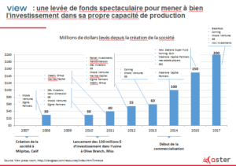

_Bandeau supérieur : Paysage vu d'un train de Philippe Cognée_

La fonction traditionnellement dévolue aux fenêtres et vitrages est de protéger du froid et des intempéries tout en permettant de jouir de la lumière naturelle et du paysage. Toutefois les dernières innovations technologiques ouvrent le champ des fonctions possibles.

Et si demain la fenêtre produisait de l’électricité ?

Fournissait de l’information contextualisée et en temps réel à la demande ?

Etait plus facile à entretenir en réduisant l’adhésion de la glace et de la neige, une propriété bien pratique dans les environnements au climat rigoureux ?

Ces vitrages innovants sont d’ores et déjà en déploiement ou à l’essai dans des applications tertiaires et pourraient par capillarité venir moderniser nos moyens de transport à brève échéance.

**Le vitrage photovoltaïque : une fenêtre ouverte sur l’autonomie**

Certaines innovations comme la fenêtre à opacité variable se déploient dans le tertiaire comme en témoigne le développement de start-up comme [Kinestral](https://www.kinestral.com/) ou [View](https://viewglass.com/) - sans oublier Sage Electrochromics acquis par Saint-Gobain en 2012. Elle pourrait se diffuser dans le transport grâce à la technologie SPD (_Suspended Particles Device_) qui permet des applications sur verre bombé avec des temps d’opacification inférieurs aux cinq secondes conformes aux exigences de ce segment de marché.

Plus balbutiante, la diffusion des technologies permettant aux fenêtres de produire de l’électricité devrait bénéficier des exigences européennes concernant la réduction de la consommation d’énergie des bâtiments (EPBD, 2010/31/EU). La France se prépare par exemple au règlement thermique 2020 qui exigera à cette date que tout nouveau bâtiment soit à énergie positive. Pour [Crosslux](http://www.crosslux.eu/fr/accueil), [Physee](http://www.physee.eu/), [SunPartners](http://sunpartnertechnologies.com/), [Stellaris](http://www.stellarissolar.com/) et d’autres, une course au meilleur compromis transparence / rendement est engagée.  Quelles perspectives un déploiement dans le tertiaire ouvrent-elles au transport ? Que la fenêtre de la voiture ou du train de demain puisse alimenter en énergie une fonction supplémentaire qui lui serait dévolue (opacité variable en remplacement de stores ; informations contextuelles en fonction du lieu traversé).

Enfin dès à présent des expérimentations de fenêtre interactive fournissant de l’information contextuelle en temps réel dans les transports ont lieu. Une des plus spectaculaires est menée par [Vision Systems](http://www.vision-systems.fr/), une PME qui se positionne sur le créneau du vitrage très innovant en petites séries. L’israélien Oran Safety Glass n’est pas en reste avec [ScreeneX](http://screenex-tech.com/).

\[caption id="attachment\_1955" align="alignnone" width="300"\] ScreeneX/OSG\[/caption\]

Opacité variable, production d’énergie, interactivité... Ces innovations candidates à des applications dans les transports privés ou publics peuvent créer un sympathique effet « Waouh ! » que les exploitants en mal de différenciation ne bouderont pas. Malheureusement leur prix encore élevé et la dépendance envers certains fournisseurs – la technologie SPD est une licence exclusive de Research Frontiers – exigent une analyse de la valeur rigoureuse. Le tri se fera probablement sur des applications ciblées mais visibles.

**Une fenêtre de tir étroite pour les start-up**

Quelles start-up dans ce secteur du vitrage innovant tireront leur épingle du jeu ? L’analyse de la chaîne de valeur nous conduit à penser qu’il est difficile pour une start-up d’accéder au marché. En effet, les films dits « intelligents » souvent développés par des spin-off d’université doivent ensuite être laminés dans le verre. Or cette opération reste particulièrement gourmande en CAPEX et par conséquent demeure sauf exception l’apanage de quelques grands groupes.

Les plus convaincantes des start-up pourront éventuellement se lancer dans une levée de fonds massive à l’exemple de View, cette entreprise américaine qui a levé plus de 600m$ depuis 10 ans auprès d’une vingtaine d’investisseurs. La cohorte de leurs consœurs n’aura d’autres choix que de passer un contrat de licences avec les fabricants comme AGC ou NSG en pariant sur un rachat à terme. Un chemin étroit sachant que les grands groupes ne restent pas les mains dans les poches de leur côté et cherchent pour la plupart à combler leur retard avec leur R&D interne.

 

**Quelles perspectives à moyen terme ?**

Avec sa petite [vidéo](https://www.youtube.com/watch?v=jEw-Ybb7RSA) montrant des passagères se commandant des macarons en tapotant sur le pare-brise de leur voiture autonome, Saint-Gobain nous projette dans un futur pas si éloigné que cela. Le déploiement espéré dans le bâtiment tertiaire des briques technologiques du vitrage intelligent devrait permettre de baisser leurs coûts et de sécuriser quelques cas d’usage bien choisis dans les transports notamment publics. Des innovations à suivre et à tester donc, par – et pour - tous ceux qui rêvent de bus et de trains plus modernes.

_Claire Lepelletier appartient à l’équipe Business Hub de la société de capital-risque Aster. Résolument au service des entrepreneurs qui ambitionnent d’établir de nouveaux modèles industriels (et notamment dans les secteurs de l’énergie, l’industrie et la mobilité), le Business Hub d’Aster est un écosystème complet d’opportunités qui accompagne les sociétés de croissance dans leur développement. Actuellement, Aster gère plus de 300 millions de dollars dans plusieurs fonds levés auprès de grands groupes mondiaux et d’institutions._
