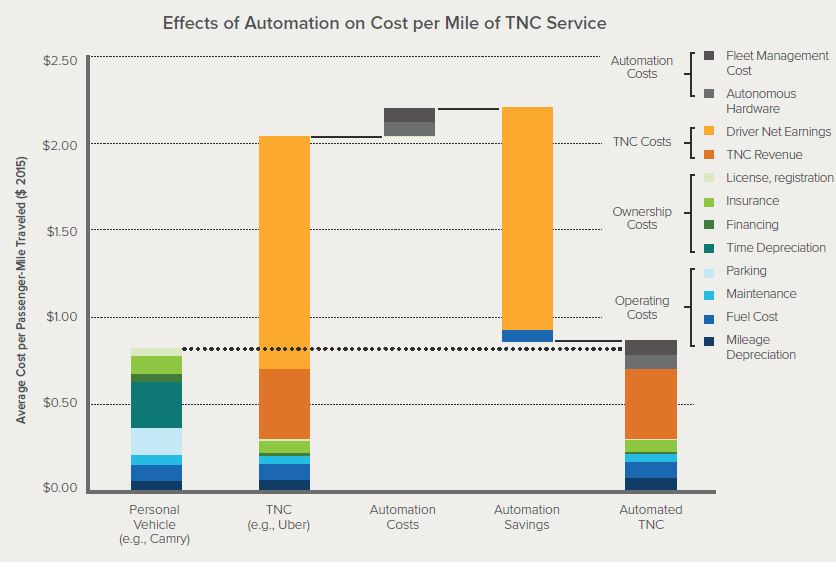

Les données y joueront un rôle crucial mais elles ne feront pas tout. Les algorithmes intégreront de plus en plus des décisions de politique publique mais pas toutes, heureusement. Les « nouvelles » entreprises numériques poursuivront leur effet de bouleversement de ce secteur mais nous observons des points d’inflexions. La « plateformisation » commence, déjà, à atteindre certaines limites même si elle poursuit et amplifie les formidables bénéfices qui la caractérisent.

> **En quelques mots, la Mobilité ce n’est pas le web.**

Il y a des règles spécifiques, les territoires y jouent un rôle central, la complexité des usages quotidiens ralentit les solutions uniques qui voudraient « tout régler », le hardware est une composante essentielle. Pour autant, les plateformes dominantes ont réussi à nouer avec la multitude une relation singulière dans un contexte très tendu de [l’économie de l’attention](http://transportsdufutur.ademe.fr/2016/09/le-lien-lattention.html).

Début décembre, nous étions invités par Uber à participer au premier « **Urban Mobility Summit** » organisé à Amsterdam avec une dizaine d’experts européens et une dizaine d’employés d’Uber, des spécialistes des données, des responsables des affaires publiques. Cette journée d’échanges se retrouve d’une certaine façon dans les [propos](http://business.lesechos.fr/entrepreneurs/actu/0211505639592-nicolas-brusson-en-2017-la-russie-sera-le-premier-marche-de-blablacar-302431.php?s7OwrzmkC5MoATzl.99) de Nicolas Brusson, cofondateur de Blablacar : « _Nous atteignons quasiment nos limites géographiques.\[…\] En ce moment, nous retournons donc à la planche à dessin. On doit se demander pourquoi plus de Français, d'Espagnols, d'Italiens n'utilisent pas notre service. Dans le monde de la mobilité, même longue distance, nous sommes encore petits._ »

Uber, dans une autre mesure, a atteint certaines limites et s’engage dans une démarche de co-construction avec les pouvoirs publics, les collectivités intéressées pour compléter le transport collectif public avec une offre de mobilité privée. Aux USA, Uber nous a présenté 9 projets en cours sur ce sujet ([**présentation complète**](http://www.slideshare.net/FabMob/uber-mobility-summit-dec-2016)) :

Le Rocky Mountain Institut a présenté une étude détaillant le pic de possession automobile accéléré par des services de mobilités automatisés et électriques. Le coût total de possession d’un véhicule privé devient progressivement du même ordre que de services de mobilités robotisés. Le pic de possession se situe alors autour de 2020 compte tenu des estimations concernant les évolutions des coûts ([**présentation complète**](http://www.slideshare.net/FabMob/peak-car-ownership-urban-mobility-summit-dec-2016)).

L’International Transport Forum a modélisé des flottes de véhicules robotisés et partagés sur un territoire donné pour estimer les bénéfices et les conséquences. En passant de 1.2 à 2-2.6 personne par voiture en moyenne, les parking sont réduits, l’espace public est re-distribué, les émissions de CO2 sont réduites de plus de 30% et l’équité d’accès sur le territoire s’améliore ([**présentation complète**](http://www.slideshare.net/FabMob/international-transport-forum-urban-mobility-summit-dec-2016)). Nous retrouvons dans ces travaux les mêmes hypothèses que celles émises par l’ADEME dans l’exercice de prospective 2030-2050 ([**lien**](http://transportsdufutur.ademe.fr/2013/04/visions-energetiques-2030-2050-complements-transports-mobilites.html?hlst=2030+2050)).

[**Citymapper présente**](http://www.slideshare.net/FabMob/citymapper-urban-mobility-summit-dec-2016) son app multimodale capable de coupler le transport public collectif et une offre privée (ici Uber). Uber s’appuie sur ce type de modèles et d’hypothèses pour s’engager maintenant dans une démarche radicalement différente de celle initiée à l’origine. La spécificité des plateformes de mise en relation, et une de leur force, tient dans la nature « hors sol » du dispositif. Que ce soit aux USA, en Europe ou en Asie, mise à part quelques considérations sur les différents moyens de paiement, la plateforme fonctionne de la même façon. Elle est alors scalable, permettant d’atteindre une taille critique pour ainsi maximiser les chances de faire répondre offre et demande, et éloignant une autre potentielle plateforme concurrente. La plateforme s’étire alors jusqu’à ces premières limites géographiques, de marchés et/ou technologiques. Puis une fois ce territoire « conquis » et la relation avec la multitude acquise, même provisoirement, il devient possible de chercher d’autres marchés, d’exploiter les données récoltées autrement. Une fois cette seconde option explorée, les plateformes doivent maintenant composer avec la complexité des acteurs locaux pour identifier des complémentarités. La transition numérique se compose également avec les territoires (voir cet [**article**](http://lafabriquedesmobilites.fr/articles/la-fabrique/1705/) sur ce sujet).

> **Nous verrons dans un prochain article que la licorne ne doit pas être l’unique mode de pensée, qu’il existe aussi une autre voie alternative à la quête d’une plateforme mondiale pour fournir une solution de mobilité pérenne, utile et rentable.**

Uber, mais aussi BlablaCar, commencent à se connecter aux acteurs publics, aux collectivités ou d’autres acteurs industriels pour comprendre la complexité, identifier les meilleurs partenariats et les territoires les plus ouverts. Il s’agit d’agrandir le périmètre. **La Fabrique offre ici un environnement unique pour comprendre les points de vues de toutes les parties prenantes, pour co-construire autour de ressources ouvertes. Le numérique n’offre pas uniquement de nouvelles solutions « _toutes choses égales par ailleurs_ », il offre aussi de nouveaux problèmes et de nouvelles façons de résoudre les problèmes.**
