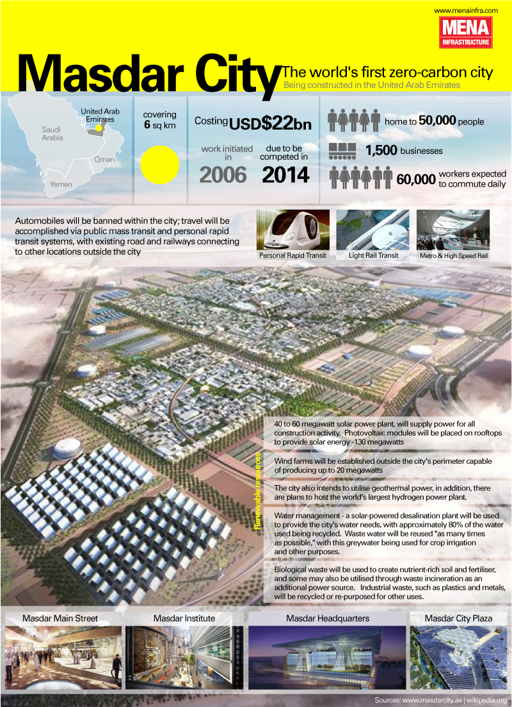

## Les enfants terribles

La Data et la Smart City sont indubitablement deux sujets dans l’air du temps, et le support de nombreuses innovations (du moins supposées telles par leurs promoteurs). Leur recoupement est évident et mis en avant par de nombreux acteurs. Ce sont aussi deux thématiques controversées qui ne manquent jamais d’opposer technologues et scientistes aux déclinologues et technophobes de tout poil.

La Ville Intelligente est un concept séduisant (quoique quelque peu clinique parfois) qui remporte les suffrages des dirigeants de métropoles engagés dans une compétition mondiale autant que les géants mondiaux du numérique et des services qui y voient des opportunités mirobolantes.

Les échecs théoriques comme pratiques sont toutefois nombreux, et Mazdar est certainement l’un des plus emblématiques : une ville sortie du désert, conçue comme autonome (donc autarcique) du monde extérieur, prévue pour 50 000 habitants et en accueillant actuellement 300 ! Pour être intelligente, une ville semble difficilement pouvoir être fermée, repliée sur elle-même. C’est contraire à sa vocation. La ville est depuis des millénaires le lieu des échanges commerciaux et culturels, toujours situés au confluent de réseaux de transport variés (fluvial, maritime, routier, aéroportuaire).

\[caption id="attachment\_1823" align="aligncenter" width="800"\] Masdar, la Smart City fantôme. Source : [GDS Infographics](https://www.flickr.com/photos/gdsdigital/4513622583/)\[/caption\]

Du côté des données, rien n’est simple non plus. L’approche propriétaire et fermée est souvent un réflexe chez les acteurs traditionnels (publics comme privés), qui par leurs activités génèrent pourtant de nombreuses données utiles : protection de la propriété intellectuelle et des savoir-faire métier, crainte d’exposer des données incorrectes ou déficientes, culture du secret, investissements nécessaires pour améliorer la qualité des données et uniformiser les formats utilisés, ressources informatiques à mobiliser pour les exposer, barrières concurrentielles, manque de compétence en interne et manque de vision des décideurs, complexité d’ouvrir des données dont les droits de propriété et d’usages impliquent de nombreuses parties prenantes, préservation de la vie privée. Les bonnes comme les mauvaises raisons de concevoir des systèmes fermés et des coffre-forts à données ne manquent pas.

## L’intelligence est-elle dans le commun ?

Pourtant les géants du numérique, qui ne sont pas des enfants de coeur, et rarement des apôtres (pour leurs propres données) des licences libres et ouvertes, ont parfaitement compris l’intérêt d’exploiter des données ouvertes, d’en favoriser l’essor, et d’échanger eux-mêmes des données (quelle que soit la licence) avec tous les acteurs possibles et imaginables. La donnée est un bien avec une caractéristique à nulle autre pareille : elle est un bien dont la consommation n’épuise pas la ressource, dont la somme est le produit des utilités, dont le croisement produit une utilité exponentielle. Les champions du numérique perçoivent spontanément que la donnée est un commun qui ne demande qu’à croître : ils n’ont pas peur de crowdsourcer des données (faire travailler - gratuitement - les utilisateurs !), de les exposer largement à travers des APIs performantes, de construire et animer des communautés.

S’ils perçoivent et pratiquent la donnée comme commun, les acteurs privés n’ont par leur nature pas comme mission (principale) le bien commun. Ils peuvent y être attachés, ou en faire un argument marketing selon les cas, mais leur mission première est l’intérêt financier et matériel de leurs actionnaires et de leur écosystème.

Toute ville, tout territoire, génère et a besoin de la donnée. Pour être intelligent, ce territoire doit considérer la donnée comme un bien commun, donc penser une gouvernance adaptée, qui associe toute la communauté des producteurs et utilisateurs du commun. À la différence d’un bien commun matériel (ex : l’eau), l’objectif de la gouvernance de ce commun ne se focalise pas uniquement sur les conditions d’exploitation et utilisation de la ressource, la donnée. Puisque la donnée ne s’épuise pas quand on la consomme, et que son utilité, ou sa valeur, augmente lorsqu’on la mélange à d’autres, alors la gouvernance de ce commun doit créer les conditions favorables à la croissance de ce commun, à la fertilisation, pour créer de nouvelles données, de la connaissance, des services.

\[caption id="attachment\_1824" align="aligncenter" width="850"\] Quels rôles pour l'acteur public en relation avec les données ?\[/caption\]

La gestion du commun passe par le choix de licences appropriées et la gestion de leurs interactions complexes. Qu’il s’agisse de licences dites ouvertes ([Creative Commons](https://creativecommons.org/licenses/), [ODbL](https://opendatacommons.org/licenses/odbl/) ou [licence ouverte Etalab](https://www.etalab.gouv.fr/appel-a-commentaires-sur-un-nouveau-projet-de-licence)) ou de licences propriétaires, la question est moins technique (malgré sa complexité) que culturelle, politique et stratégique. Ces aspects sont d’ailleurs essentiels, avec la notion de communauté et sa gouvernance, dans le développement de communs autour des données, qui apportent une véritable plus-value aux territoires, aux villes et à leurs écosystèmes.

# DataCités : comprendre et promouvoir la donnée comme bien commun au service de territoires intelligents

Au début de l’année [Le Lab OuiShare x Chronos](http://www.le-lab.org) a lancé sa première exploration prospective, consacrée au rôle de la donnée dans la construction de la Smart City. [DataCités](http://www.datacites.eu) s’interroge sur la “donnée comme bien commun pour la ville intelligente”.

[Nos partenaires pour cette exploration](https://datacites.eu/associes/) font preuve de maturité : ils s’interrogent sur la manière dont se construit le bien commun à l’ère des données. Ils recherchent des outils et modèles opérationnels pour initier des projets, développer des services, investir dans les nouveaux acteurs.

## Quels modèles pour les territoires et la donnée, aujourd’hui et demain ?

Nous avons déjà étudié 10 cas à travers le monde où de nouveaux modèles de gestion de la donnée sont expérimentés, dans les domaines de la mobilité, de l’énergie et des déchets. Nous en avons listé beaucoup d’autres. Parmi eux on trouve [OpenSideWalks](https://medium.com/le-lab/qui-rendra-nos-villes-accessibles-10d9d89bbd76?source=collection_category---4------1-----------), Qurrent, SolShare, [TransActive Grid](https://medium.com/le-lab/transactive-grid-le-réseau-dénergie-intelligent-à-brooklyn-ead550918cc2?source=collection_home---2------4-----------), [Ride Austin](https://medium.com/le-lab/ride-austin-la-plateforme-vtc-à-impact-local-et-positif-7429216d3ec5?source=collection_home---2------2-----------) ou [Le.Taxi](https://medium.com/le-lab/le-taxi-une-plateforme-made-in-france-61ef9fe34c42?source=collection_home---2------0-----------). Nous publierons prochainement une synthèse de nos analyses de ces cas et des modèles de partage / échange de données associés. Les enseignements sur les positionnements, les philosophies et les choix de modèles mis en oeuvre par les différents acteurs sont prometteurs.

\[gallery type="slideshow" size="full" ids="1840,1839,1836,1842"\]

Actuellement nous rencontrons une quinzaine d’experts internationaux aux profils variés pour enrichir ces modèles de gouvernance d’expériences nouvelles. En mai nous construirons avec les partenaires de l’exploration des guides pratiques à destination des acteurs de l’écosystème (acteurs publics nationaux, collectivités, entreprises, startups) pour développer une culture et des projets autour des données, pour construire des modèles de gouvernance équilibrés avec le soutien de communautés structurées et diverses.

## Et si on passait à l’action ?

### En poursuivant les travaux sur les modèles de données ouvertes pour les territoires

Il est déjà temps de préparer la suite de ces travaux. C’est une demande de certains de nos partenaires, c’est aussi le fruit des nombreuses rencontres avec des porteurs de projet. Le défrichage que nous effectuons, en nous appuyant sur de nombreux travaux antérieurs mais aussi des projets à l’approche complémentaire comme Audacity, ouvre des perspectives et des questions. Il s’agit évidemment de rendre opérationnel et exploitable le travail effectué jusqu’ici avec un cercle restreint de partenaires. Il n’est pas forcément nécessaire d’attendre des avancées législatives ou des décisions gouvernementales qui viendraient appuyer telle ou telle vision des choses. Les territoires, les acteurs, les entreprises comme les démarches citoyennes peuvent d’ores et déjà faire énormément avec les outils existants.

\[caption id="attachment\_1849" align="aligncenter" width="850"\] Écosystème de l'intérêt général de la donnée\[/caption\]

La première piste de travail consiste à décliner nos résultats en partant de modèles souhaitables qui remportent l’adhésion des acteurs de l’écosystème et qui ont été exprimés lors de cette première saison. Sur cette base un travail de déclinaison en profondeur mériterait d’être effectué pour expliciter dans des situations concrètes des modèles économiques et de gouvernance de la donnée associant des producteurs et consommateurs de profils variés (citoyens, développeurs, entreprises, acteurs publics).

Il y a beaucoup à faire notamment pour évaluer l’impact de modèles que nous jugeons équilibrés, qui sont déjà expérimentés, sur l’ensemble d’un écosystème ou d’une chaîne de valeur. Quels sont les incitatifs (le soft power) économiques ou réglementaires qui amènent de grands groupes du numérique à la coopération ? Comment faire évaluer la culture d’une organisation ou d’un secteur pour intégrer les particularités du numérique et une culture de l’échange ? Pour chaque profil d’acteurs, pouvons-nous formuler des recommandations pratiques, un guide opérationnel sur la manière de construire des projets et développer des services ?

### À l'intérieur même des projets qui sont en train de tout changer

La seconde piste de travail est de suivre au long cours la mise en oeuvre concrète de projets associant différentes parties prenantes. Des projets ambitieux qui ne se contentent pas d’assurer l’accessiblité à la donnée et les modalités de sa réutilisation, bien que cela soit essentiel. Mais des projets qui expérimentent des modalités de collecte, de partage et de fertilisation qui développent le commun, créent de la valeur non pré-existante, assurent que c’est effectivement le bien commun qui résulte du projet.

Cela pourrait consister à suivre et évaluer des projets de bout en bout, avec une approche écosystémique, intégrant tous les acteurs concernés, pour mieux comprendre les dimensions culturelles, sociétales, politiques, autant que techniques et réglementaires, de la création de valeur autour de données. Cela peut aussi aller jusqu'à des contributions dans la conception de projets, de services et d'initiatives. L'approche qui nous anime est orientée vers la production de communs ouverts, de ressources pour capitaliser.

### Par une coopération entre La Fabrique des Mobilités et Le Lab OuiShare x Chronos

C’est là que la coopération avec La Fabrique des Mobilités, outre qu’elle soit ancienne (depuis le démarrage) pour OuiShare, a tout son sens. La Fabrique fait l’hypothèse qu’un acteur économique a, dans certains cas, intérêt à ouvrir les droits d'une ressource propriétaire (approche Open Source) ou à mettre en commun sa ressource en utilisant une licence ouverte éventuellement à réciprocité.

La Fabrique mène ainsi trois types d'actions sur le sujet des ressources ouvertes :

- **indexation** des ressources existantes via [http://communs.lafabriquedesmobilites.fr](http://communs.lafabriquedesmobilites.fr), et mise en relation d'acteurs produisant des ressources ouvertes avec la Fabrique,
- **co-production** de nouvelles ressources ouvertes via l'[Appel à Communs](http://wiki.lafabriquedesmobilites.fr/wiki/La_Fabrique_%C3%A0_Projets_-_Open_FabMob) en partant des communautés d'intérêts. Il est essentiel de partir de communautés ayant exprimés des besoins communs, des problèmes similaires. Les acteurs peuvent être en compétition du point de vue traditionnel mais également avoir intérêt, pour certaines ressources, à engager une co-production de ressources Utiles, Mutualisées et Ouvertes. La Fabrique joue un rôle de tiers de confiance, de co-financeur (via l'[ADEME](http://wiki.lafabriquedesmobilites.fr/wiki/Co-financement_ADEME) et les partenaires), tout en incitant à utiliser la bonne [licence](http://wiki.lafabriquedesmobilites.fr/wiki/Communs/Les_licences_%C3%A0_utiliser_pour_prot%C3%A9ger_les_communs). Dans ce cas, il est essentiel que les acteurs de la communauté déterminent ensemble les meilleures conditions d'utilisation de la ressource co-produite.

- **ouverture** de ressource fermée existante via l'[Open Challenge](http://wiki.lafabriquedesmobilites.fr/wiki/FabMob_Open_Challenge) en partant des partenaires. En partant d'une ressource sous-valorisée (territoire, donnée, logiciel, matériel), la Fabrique accompagne le partenaire dans l'ouverture à plusieurs niveaux :
    - exploration pour le partenaire de l'intérêt stratégique à ouvrir cette ressource pour lui permettre d'expérimenter, au plus proche des marchés, de nouveaux modèles d'affaires, de nouveaux produits, de nouveaux usages, de nouveaux clients et de nouvelles communautés contributrices.
    - rencontre avec les partenaires qui ont déjà fait ce chemin, retour d'expériences (métier, culture, pratique, stratégie)
    - rencontre avec les communautés de Hacker / Makers essentielles pour ouvrir et produire une ressource "séduisante"
    - rencontre avec les communautés d'utilisateurs qui pourront innover en s'appuyant sur la ressource

L'[Appel à communs](http://wiki.lafabriquedesmobilites.fr/wiki/La_Fabrique_%C3%A0_Projets_-_Open_FabMob) a commencé par la communauté des acteurs du covoiturage pour s'ouvrir à d'autres communautés comme le vélo ou la voiture connectée. Sous certaines conditions, l'[ADEME](http://wiki.lafabriquedesmobilites.fr/wiki/Co-financement_ADEME) peut co-financer cette production. D'autres partenaires se sont manifestés pour co-financer également comme Kisio, le STIF. Les communs en cours de co-production :

- [Preuve de covoiturage](http://wiki.lafabriquedesmobilites.fr/wiki/Preuve_de_covoiturage),
- [Base de donnée des lieux de covoiturage](http://wiki.lafabriquedesmobilites.fr/wiki/Base_de_donn%C3%A9e_commune_des_lieux_de_covoiturage),
- [Interopérabilité des bases de données](http://wiki.lafabriquedesmobilites.fr/wiki/Interop%C3%A9rabilit%C3%A9_des_donn%C3%A9es_de_demande_et_d%E2%80%99offre_de_covoiturage_entre_acteurs_du_covoiturage),
- [Crowdsourcer les plans de transport en commun](http://wiki.lafabriquedesmobilites.fr/wiki/Crowdsourcer_facilement_les_plans_de_transport_en_commun_de_votre_ville)
- [Cadenas connecté pour vélo](http://wiki.lafabriquedesmobilites.fr/wiki/V%C3%A9lo_Partag%C3%A9_pour_tous),
- [Boitier connecté pour voiture](http://wiki.lafabriquedesmobilites.fr/wiki/Boitier_Connect%C3%A9_Open_Source).

## Venez concevoir l'écosystème de la donnée pour les territoires

Nos travaux actuels nous permettent de comprendre les difficultés rencontrées par les projets autour de la Data, d’identifier les modèles qui émergent et sont prometteurs, ou ceux qui inquiètent. Nous percevons surtout les bénéfices associés à des démarches de coopération réussies et qui produisent une valeur partagée équitablement. Il nous reste à déterminer la forme que va prendre la suite de DataCités, avec ceux qui y participeront.

Notre intuition est que La Fabrique des Mobilités et le Lab OuiShare x Chronos, et leurs communautés, poursuivent des objectifs convergents sur cette thématique, et disposent de ressources complémentaires. C’est pour cette raison que nous invitons nos deux communautés à un premier atelier de préfiguration, pour imaginer les coopérations autour de projets impliquant un écosystème autour de données, au service d’un territoire.

Nous vous donnons rendez-vous au Square - OpenLab Renault (3, passage Saint-Pierre Amelot) jeudi prochain 20 avril à 14H30. Merci de confirmer votre participation à l’aide de [ce formulaire d’inscription](https://goo.gl/forms/KA9d7YkYhe674QCE3).
