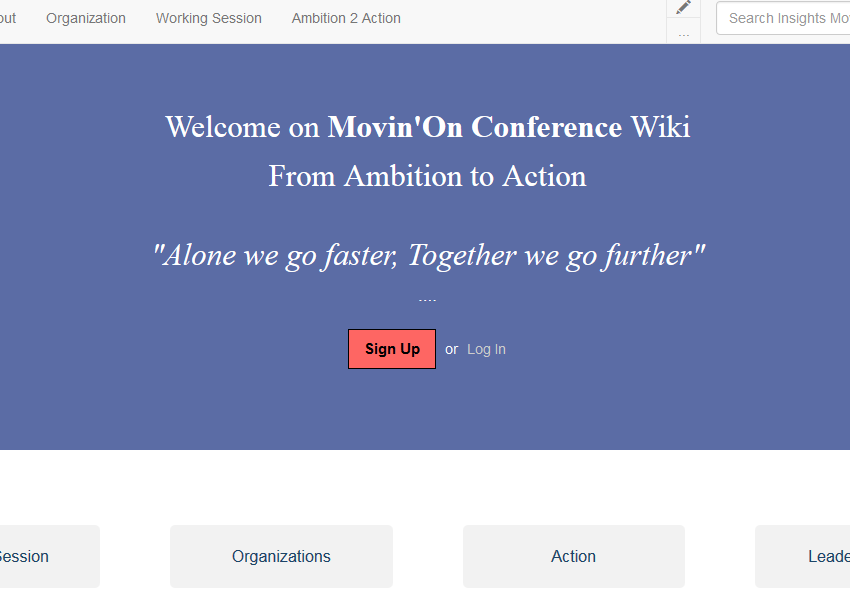

Moving from **Ambition to Action** is Movin'On's "Heart" goal ! It is obvious. But it's also a huge challenge. How to create a collective approach that exceeds and embraces all areas, all subjects ? How to engage a maximum of stakeholders ? how to thank those who commit themselves earlier than others?

At the same time, move from relatively stable and predictable industrial chain logic to a much more volatile, complex, uncertain and sometimes ambiguous ecosystem functioning. It is now another evidence ! The "others" are both potential competitors and future partners. With FabMob, Michelin and the Open Lab are engaged in this great adventure of innovative ecosystems including rethinking in-depth relations between industrial groups. How to initiate collective approaches without any hierarchical link ? How to give control to someone legitimately without unbalancing the fragile balance of trust ? How to commit without knowing in advance the distribution of future benefits ?

And if the process itself were just as important as the supposed benefits, by changing large-scale professional practices, it could change our cultures. It is priceless and it is a necessity in the face of the global challenges that we have to solve.

FabMob contributes by delivering a wiki for Movin'On and its 45 work sessions. In all areas, 45 moments of a 1h30 with over 80 people will share knowledge, learn, learn to learn, criticize, revisit and engage. These moments mobilize different forms of collective intelligence according to the cultures of the participants. We seek to enroll them in a creative dynamic. The session becomes a starting point for those who wish to get together and continue the work. One or more actions are identified by the participants who commit themselves to continue, to act together.

- Communicate on a new project
- Convince a new stakeholder to engage in a project
- Create a new community
- Experiment or implement a product or service in a specific context or territory
- Generate new ideas or bring new points of view
- Identify one or more people with skills useful for a project
- Identify or Produce a Resource useful for a community or a project
- Produce a synthesis collectively

The wiki then allows everyone to discover the content and production of each session, and also to follow the action identified and contribute by joining the discussion. Still fragile, this dynamic is reinforced with each new participant who legitimizes it by his presence and completes it with his knowledge. The wiki becomes the **link object** of the community that can document its productions and advance by watching itself progress.

Each participant succeeds in seeing his role and the collective benefits of his individual action as a person and, at the same time, the progress of the community as a whole. Any ideas that would reinforce this double reading are also welcome! The wiki will be completed by other devices according to the uses that will be revealed.

**Find the wiki and create your account** : [https://insights.movinonconf.com/wiki/Accueil](https://insights.movinonconf.com/wiki/Accueil)

