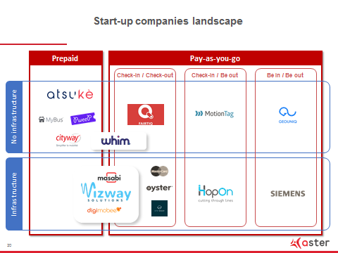

_Article rédigé par Claire Lepelletier - Aster est une société de capital-risque qui gère 520 millions d’euros au travers de plusieurs fonds levés auprès de grands groupes et d’institutionnels. Spécialiste de la transformation digitale et des nouveaux modèles industriels, Aster finance les sociétés innovantes dans les domaines de l’énergie, de la mobilité et de l’industrie. Avec son approche de « Business Hub », l’équipe accompagne les entrepreneurs et leur permet d’accéder aux réseaux et marchés des investisseurs corporate à l’échelle mondiale._

 

La marque Adidas et la société des transports publics berlinois créaient le [buzz](http://www.leparisien.fr/info-paris-ile-de-france-oise/transports/insolite-a-berlin-payez-le-metro-avec-vos-baskets-11-01-2018-7495797.php) il y a quelques jours en éditant en série limitée une paire de baskets avec titre de transport intégré. Au-delà de cette anecdote insolite, la billettique traditionnelle accomplit une mue importante qui pourrait ultimement  rendre l’acte de validation et de paiement totalement transparents pour le passager. Nous proposons ici quelques clefs de compréhension d’un marché en effervescence, notamment parce que la billettique est un canal d’accès au passager et donc à ses données de mobilité.

**Le mobile, support privilégié de la billettique et du paiement intégrés**

Après une première phase de dématérialisation au début des années 2000 avec par exemple l’introduction des cartes Navigo ou Oyster reposant sur la technologie NFC, la billettique franchit une étape supplémentaire en permettant à l’usager des transports publics de payer et valider simultanément en utilisant par exemple sa carte bancaire comme titre de transport. Les exploitants y voient l’opportunité de réduite leur coût de collecte (de 15% à 6% du prix du ticket d’après une étude Accenture parue en 2015) mais aussi d’améliorer l’expérience passager en lui épargnant un arrêt à l’automate.

Si la carte bancaire voire des technologies biométriques sont parfois expérimentées, le mobile est en bonne position pour devenir le support privilégié de la billettique et du paiement intégrés. Il cumule de nombreux avantages notamment celui d’engager avec le client en se transformant en canal d’informations en temps réel ou de ventes de services additionnels.

 

**Des acteurs traditionnels qui se préparent, des start-up qui tentent leur chance**

Les acteurs traditionnels déploient logiquement un éventail de démarches pour adapter leur offre. Ainsi Siemens promeut-il [SiMobility](http://www.mobility.siemens.com/mobility/global/en/integrated-mobility/simobility-justgo/pages/simobilty-justgo.aspx) JustGo basé sur une technologie de Bluetooth Low Energy et de beacons tout en procédant au rachat de Hacon. Le quatuor formé par Orange, Gemalto, SNCF et RATP parie sur le NFC via leur JV commune [Wizway Solutions](http://www.wizwaysolutions.com/en/). La branche billettique de Thalès quant à elle cherche toujours son Prince Charmant après l’occasion manquée avec Latour Capital au printemps 2017.

\[youtube https://www.youtube.com/watch?v=7Lk8ltBEzl8\]

 

En parallèle, une myriade de start-up vibrionnent et rivalisent d’ingéniosité pour séduire les exploitants. Ces derniers, pour quelques milliers d’euros de paramétrage, peuvent tester des solutions améliorant l’expérience sans couture de leurs clients. Ainsi [MotionTag](https://motion-tag.com/) effectue une preuve de concept _Check-in/Be out_ avec la  Deutsche Bahn  grâce à la précision de son algorithme de géolocalisation ; la start-up israélienne [HopOn](http://hopon.co/) déploie sa technologie de _beacons_ ultrasons dans les bus de Tel-Aviv et Jérusalem ; [Atsuke](https://www.atsuke.com/) a déjà conquis une partie des villes suisses avec son système d’achat de billets par SMS et s’attaque désormais au marché français...

**Gated or not gated ? That is the question**

NFC, Ultrasons, Wifi, SMS, QR code, algorithme de géolocalisation, Bluetooth Low Energy… Comment s’y retrouver parmi cette litanie de technologies et sur laquelle parier ?

Un premier critère de segmentation de marché est la présence ou non de portillons dans le système de transports publics. En effet, la présence de portillons, élément coûteux mais important dans le dispositif de lutte contre la fraude, empêche l’adoption de certaines technologies : ainsi les algorithmes de géolocalisation toujours plus précis (voir [MotionTag](https://motion-tag.com/) ou [GeoUniq](https://www.geouniq.com/)) pourraient théoriquement éliminer complètement le geste de validation (Be In/Be Out). Ils sont en pratique inadaptés dans une bonne moitié des villes européennes qui utilisent des portillons dans leur métro. Sur ce segment de marché le protocole NFC semble emporter l’adhésion comme en atteste sa récente adoption par New York City Transit.

Le deuxième critère de segmentation concerne la fluidité de l’expérience passager.****

 

**La billettique intégrée au calculateur d’itinéraires, une étape certaine dans un univers multimodal**

Le concept de mobilité-as-a-service s’incarne tous les jours un peu plus, par exemple dans les expérimentations franciliennes concernant le co-voiturage courte-distance. [Karos](https://www.karos.fr/) nous informe dans son bilan de déploiement de septembre 2017 que 20% de ses trajets réalisés en court-voiturage® sont intermodaux. La possibilité de s’acquitter de son trajet dans des calculateurs d’itinéraires multimodaux sera par conséquent la prochaine étape.

> L’enjeu de la digitalisation de la billettique dépasse donc largement celui d’une amélioration marginale du profit des opérateurs traditionnels.

Pour eux, il s’agit bien de rester au centre des arbitrages du client final à qui se présentent plusieurs options pour se rendre d’un point A à un point B. Tout en gardant la maîtrise de leurs données, pare-feu déployé contre l’offensive des GAFA : les start-up que nous avons rencontrées, qui collectent les données des passagers tels des écureuils précautionneux, le comprennent bien.

Des associations comme **[Calypso](https://www.calypsonet-asso.org/news/calypso-transport-ticketing-global)** travaillent la billetique avec des ressources open source. La Fabrique lance un projet autour d’un **[Compte Mobilité](http://wiki.lafabriquedesmobilites.fr/wiki/Compte_Mobilit%C3%A9)** pour intégrer tous les modes, faciliter le post-paiement, redonner à l’usager les données le concernant, permettre à toutes les parties prenantes de fournir à l’usager des incitatifs et des offres adaptées à ses pratiques réelles de mobilité.
