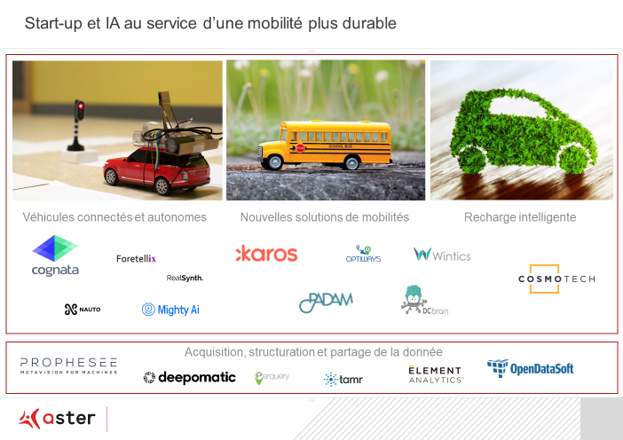

_Article rédigé par Claire Lepelletier – Aster est une société de capital-risque qui gère 520 millions d’euros au travers de plusieurs fonds levés auprès de grands groupes et d’institutionnels. Spécialiste de la transformation digitale et des nouveaux modèles industriels, Aster finance les sociétés innovantes dans les domaines de l’énergie, de la mobilité et de l’industrie. Avec son approche de « Business Hub », l’équipe accompagne les entrepreneurs et leur permet d’accéder aux réseaux et marchés des investisseurs corporate à l’échelle mondiale._

« GREVES PENSEZ COVOITURAGE » pouvaient lire les automobilistes franciliens sur les bandeaux de l’A86 lors de ce printemps troublé par les débrayages de cheminots. Peu d’entre eux sans doute ont relié l’émergence de cette nouvelle offre de transport aux possibilités offertes par l’intelligence artificielle (IA). Et pourtant l’IA est une des briques technologiques utilisée par [Karos](https://www.karos.fr/), l’application de court-voiturage™ leader en Ile-de-France, pour organiser la liquidité de leur place de marché.

L’IA – qui recouvre l’objectif ambitieux de créer des processus cognitifs comparables à ceux de l’être humain – s’est constituée comme domaine de recherche spécifique dès le milieu du XXème siècle mais ses promesses ne se concrétisent et surtout ne se démocratisent qu’aujourd’hui.

Sur quoi repose l’essor récent de cette technologie et quelles perspectives spécifiques l’IA dessine-t-elle pour la mobilité ?

**Un alignement des planètes permet à l’intelligence artificielle d’entrer dans une nouvelle ère**

Après avoir vécu différentes phases d’engouement et de désillusion au cours des soixante dernières années, l’IA semble désormais prête à trouver des applications courantes et économiquement viables. Cette multiplication des cas d’usage est le résultat d’un alignement des planètes technologiques que sont :

1. les algorithmes - qui n’ont cessé de s’améliorer depuis 1950 et de se diffuser -,
2. l’explosion de la quantité de données disponibles. Une partie de ces données est produite par les objets connectés dont le nombre s’envole pour passer de 8 milliards en 2012 à 50 milliards en 2020,
3. l’accroissement significatif des capacités de calcul et de stockage : un smartphone concentre désormais un millier de fois la capacité de calcul dont disposait la NASA pour guider une mission Apollo !

**« Les données sont le nouveau code source\* »** 

Avec le déploiement de l’IA, la programmation des machines serait révolue : vive l’entraînement des machines ! Les données, en venant nourrir les schémas d’apprentissage automatique, deviennent donc le nerf de la guerre.

Les GAFA et autres BATX ne s’y sont pas trompés en faisant de la collecte et de la valorisation des données la pierre angulaire de leur stratégie ; les contributeurs au rapport Villani encore moins en insistant sur la nécessité d’organiser le partage et la mutualisation de données sectorielles pour riposter contre l’hégémonie des géants du Web. Si le combat concernant la collecte massive de données se joue dans l’arène des géants, les start-up utilisant l’IA comme brique technologique jouent leur partition sur la préparation de la donnée, les usages et les solutions. Et dessinent les contours d’une mobilité plus durable selon une équation simple :

Parmi les champs d’application prometteurs de l’IA, le [rapport Villani](https://www.aiforhumanity.fr/) sur l’intelligence artificielle publié en mars dernier met particulièrement en exergue trois domaines : **« c’est autour de trois marchés clés que se concentrent à la fois les développements technologiques et les attentes des écosystèmes : le développement du véhicule autonome, les modes de transports durables, en particulier électriques, ainsi que l’émergence et l’interconnexion de nouvelles solutions de mobilité pour réduire la densité du trafic de certains segments. »** Les innovations portées par les jeunes pousses illustrent la manière dont ces espoirs s’incarnent petit à petit.

Ainsi dans le domaine du véhicule autonome – dont nous convenons que pour être durable il doit être partagé ! – certaines start-up comme [RealSynth](http://realsynth.de/) (D) ou [Cognata](http://www.cognata.com/) (IL) développent des solutions pour entraîner virtuellement l’intelligence artificielle. L’enjeu est de couvrir le maximum de scenarii de conduite en s’épargnant des millions de kilomètres de roulage et accélérer la mise sur le marché des véhicules autonomes.

Tandis que [DCbrain](https://alstomgroup-my.sharepoint.com/personal/claire_lepelletier_alstomgroup_com/Documents/7-ASTER/2.MARKET%20REVIEW/1.ON-GOING/9.AI%20for%20mobility/Hailo_logo.png) (F) et leur confrère israélien [Optiways](http://www.optiways.io/) (IL) déploient leur solution à base d’IA pour optimiser les flux logistiques, [Karos](https://www.karos.fr/) (F) et [Padam](https://www.padam.io/) (F) développent des offres de covoiturage ou de transport à la demande lorsque les transports de masse sont mal adaptés ou peu présents.

L’IA peut également être un recours intéressant pour préparer la ville et les opérateurs à l’accueil de (flotte de) véhicules électriques. Ainsi la start-up [Cosmo Tech](https://cosmotech.com/), spécialiste de l’intelligence augmentée, promet-elle de mettre son savoir-faire au service de l’optimisation des infrastructures et des stratégies de recharges.

Enfin, pour tirer tout le bénéfice des perspectives offertes par l’IA une politique de nettoyage et de structuration de la donnée est nécessaire. C’est bien la valeur des solutions offertes par [Element Analytics](https://www.elementanalytics.com/) (US) ou [Tamr](https://www.tamr.com/) (US).

**Positionnement de points de recharge électrique dans la ville, optimisation de flux logistiques, création et interconnexion de nouvelles offres de transport, construction de mondes virtuels... Les applications développées par les start-up à base d’intelligence artificielle remodèlent d’ores et déjà les flux et la cité.**

**Elles accréditent l’idée que l’IA représente une opportunité pour développer des solutions de mobilité plus durables.**

**Vers la possibilité d’une meilleure (v)Île ?**

 **\***_verbatim du CEO de Nvidia, prononcée en mars 2018 lors de la conférence des développeurs GPUs_
