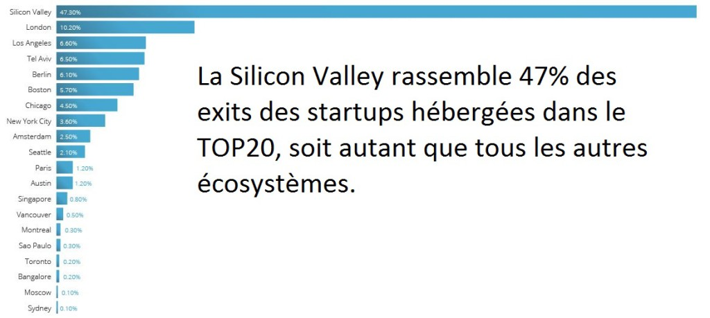

Le dernier rapport de Compass « _The Global Startup Ecosystem Ranking 2015_ » classe les écosystèmes de startup au niveau mondial par région. Pour cela, les auteurs décrivent les transformations en cours, analysent les déterminants de la suprématie des startups dans les processus d’innovations et rassemblent les conditions favorables à mettre en œuvre pour qu’un écosystème soit performant. Ces analyses portent sur des écosystèmes _localisés_. La Fabrique des Mobilités adresse un écosystème sectoriel, multi-localisé.

Paris a été un lieu mondial pour l’art. Cette réalité n’a pas été créée uniquement par des peintres mais par un environnement réunissant des artistes, des acheteurs, des galeries d’art, des mécènes, des fondations, des critiques, des conditions fiscales et réglementaires et un espace-temps favorable. Cet écosystème a fonctionné, puis le contexte mondial a évolué. De la même façon, dans un secteur industriel comme celui des transports et de la mobilité, il faut à la fois comprendre et rassembler chaque acteur et embrasser le tout.

Compass analyse particulièrement la Silicon Valley et compare l’explosion des innovations portées par des startups à une évolution des espèces vivantes : nous changeons d’ère. Et nous le constaterons, pour la plupart, à posteriori. De nouvelles entreprises sont capables d’innover dans des contextes très incertains, d’accomplir des changements radicaux sur leurs organisations dans cette « nouvelle » ère de l’information. Et l’écosystème, le terreau, accompagne plus ou moins ces mutations. La biodiversité des acteurs et la qualité de leur lien deviennent notamment essentielles.

Pour Compass, la performance des acteurs historiques décline pour essentiellement trois raisons : augmentation de la compétition, réduction de l’asymétrie d’information pour le consommateur et la réduction de la consommation apportée par l’économie du partage. En parallèle, les startups émergent pour au moins quatre raisons :

- réduction du coût pour créer un produit/service augmentant fortement le gisement d’entrepreneur,
- création d’une industrie du financement du risque adaptée,
- structure d’accompagnement des entrepreneurs et application massive et organisée du lean startup
- rapidité d’adoption des produits/services par la multitude (les utilisateurs, citoyens) éduquée et équipée.

Pour accompagner cette transition, à la fois la création de startup et la mutation des acteurs historiques, l’écosytème joue un rôle essentiel. La Fabrique construit cet écosystème favorable aux startups et aux partenaires dans une verticale, la mobilité. Il est essentiel de rappeler que l’évolution d’un écosystème commence par chaque organisation qui, à son tour, engage chaque personne la constituant. Au commencement, ce sont les dirigeants de l’organisation guidés par les [**linchpins**](https://kindle.amazon.com/work/linchpin-are-indispensable-seth-godin-ebook/B002L9Z3S2/B00354Y9ZU). **La première chose à faire pour chaque organisation : identifier vos linchpins internes**.

La qualité de l’écosystème se caractérise d’abord par les personnes, leurs compétences et leurs talents pour faire ce qui n’a jamais été fait avant, mais aussi par sa diversité (des connecteurs, des disrupteurs, des facilitateurs, des archivistes, des critiques …), sa densité, sa capacité à concentrer des richesses (toutes les ressources apportées par les partenaires, les compétences et les communs dans le cas de la Fabrique), à créer des rencontres pertinentes, à capitaliser les retours d’expériences et à accélérer. Ainsi, un écosystème fertile permet aux investisseurs de rencontrer les bonnes startups, aux startups d’échanger avec les linchpins dans les organisations, aux mentors de suivre les bons projets et aux entrepreneurs d’être en contact avec les utilisateurs rapidement pour concevoir et éprouver leur _Minimal Viable Product_.

Compass constate aussi que la concentration en startups et leurs performances varie en fonction des territoires. Ce dernier joue donc un rôle que la Fabrique intègre avec plusieurs collectivités partenaires. Tous ces éléments fertilisent le terreau pour faire naître de futurs leaders dans leur domaine. La Fabrique ajoute une nouvelle composante inédite : les « **[Communs](http://lafabriquedesmobilites.fr/articles/les-communs-mobilite/)** », des graines produites par chaque projet sont collectées, conservées par la Fabrique et mises à disposition des prochains projets.

En synthèse, ce rapport propose un intéressant Ecosystem Canvas qui rassemble dans onze blocs et quatre domaines les paramètres de chaque écosystème : Idées & talents, communauté de startup, politique & finances et les marchés. Au départ ce canvas permet des aller-retours entre chaque acteur, les liens et synergies, et le tout. Puis il permet de construire un programme de travail pour accompagner chaque acteur ainsi que la communauté, les interdépendances et les opportunités.

**IMAGE en tête** : source **[Complexity Graphics](http://complexitygraphics.com/About-Contact)**

**POUR EN SAVOIR PLUS :**

**[Rapport Compass "The Global Startup Ecosystem Ranking 2015"](http://fr.slideshare.net/FabMob/the-global-startupecosystemreport2015v12-52079912)**

**[Le lézard et le linchpin](https://plassat.wordpress.com/2015/08/16/du-lezard-au-linchpin/)**

[**Frédéric Laloux, reinventing organisation**](https://kindle.amazon.com/work/reinventing-organizations-creating-inspired-consciousness-ebook/B00IINJ1P6/B00ICS9VI4)
