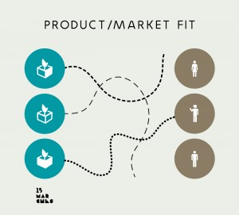

La mobilité a changé. La manière d’innover a changé. Il est urgent de compléter les dispositifs de soutien à l’innovation pour répondre aux nouveaux défis : comment faire levier du numérique et aider les start-up à faire évoluer l’ensemble de l’écosystème ? Comment fédérer ces acteurs autour de la nouvelle filière industrielle des mobilités ?

L’innovation ne s’impose plus. Elle ne se déclare plus. Elle se constate, dans l’adoption massive par le marché d’une technologie, d’un service ou d’un usage. Le secteur des mobilités n’y échappe pas, avec le succès de startups comme Uber, Blablacar ou Tesla qui ne sont pas issues de la filière traditionnelle. Ce changement de paradigme nécessite d’adopter une approche plus modeste et plus résiliente de l’innovation.

Pour les acteurs traditionnels la question n’est plus : “_comment lutter contre les changements et défendre nos positions_ ? », mais “_comment apprendre nous aussi à inventer des services de mobilités qui soient adoptés par nos futurs clients_ ?”.

S’appuyant sur les dynamiques entreprenariales issues des 2 jours du séminaire Mobilites Mutations, l’ADEME a confié à [15marches](15marches.fr) une étude de définition d’un nouveau dispositif de soutien à l’innovation dans le domaine des mobilités.

 **_L’innovation vue par celles et ceux qui la pratiquent_**

La démarche retenue est inductive. Une quinzaine d’entretiens semi-directifs ont été réalisés. Le choix s’est majoritairement porté sur des acteurs opérationnels: startups, structures de soutien, grandes entreprises impliquées dans l’écosystème, experts de l’innovation. L’objectif n’était pas de bénéficier d’un panorama global mais d’un retour d’expériences.

Les personnalités interrogées dans cette étude considèrent que les démarches d’innovation actuelles sont peu efficaces pour relever ces défis : trop prévisibles, trop lourdes, trop ciblées sur les seules technologies, répétant le passé. Ces démarches privilégient les grandes entreprises au détriment des startups, têtes chercheuses de l’innovation moderne. Et surtout, ces méthodes passent à côté de ce qui fait le succès des “nouveaux entrants” : la capacité à trouver l’adéquation produit/marché et passer à l’échelle rapidement.

Le succès foudroyant de certaines startups – souvent étrangères – interroge sur les ingrédients et les modèles mis en oeuvre par celles-ci. La manière dont elles interagissent avec leur écosystème en particulier est souvent décisive.

**_Hacker le sujet_**

La question posée :

“_quel est le meilleur dispositif pour soutenir l’innovation ?_ “ a été reformulée par nos interlocuteurs en :

“_comment développer une véritable culture de l’innovation dans les entreprises et organisations ?_” et “_comment faciliter l’émergence d’innovations de rupture au sein et autour de ces organisations ?_”.

Le défi de l’innovation à l’ère d’internet est de faire confiance à la capacité créative de chaque partie pour faire progresser l’ensemble de l’écosystème. Ceci suppose pour la filière d’accepter de ne plus tout maîtriser et de se mettre au service des autres acteurs, déjà identifiés ou non. De créer les conditions de réussite, de développer une nouvelle culture de l’innovation et d’ouvrir ses ressources, sans savoir à l’avance ce qu’il en adviendra. De co-construire ensemble un nouveau dispositif d’émergence et d’accélération de l’innovation. Les pouvoirs publics ont un rôle essentiel à jouer : ils maîtrisent l’infrastructure physique et légale; ils peuvent favoriser la diffusion des externalités positives générées. Ils peuvent également jouer le rôle d’intermédiation entre tous les acteurs pour identifier, lever les barrières, regrouper les ressources identifiées, capitaliser et diffuser les connaissances, et jouer dans certains cas le rôle de tiers de confiance. La tâche est immense, tant la filière des nouvelles mobilités s’ignore encore aujourd’hui. Elle est passionnante, car l’essentiel des changements est devant nous.

_**Créer une nouvelle culture de l'innovation**_

Le dispositif proposé dans cette étude n’a pas vocation à être exhaustif; il s’agit ici d’une esquisse. Il complète les dispositifs existants et ne vient pas les concurrencer. Le dispositif décrit est un prototype qu’il conviendra de travailler avec tous les acteurs de l’écosystème pour qu’ils se l’approprient intégralement et qu’il s’auto-réalise. Les liens, les connexions et les réseaux qui seront mis en oeuvre seront tout aussi importants que les ressources elles-même. Ils légitimeront ce nouvel espace d’action et de création.

La création d’une nouvelle culture de l’innovation en France est appelée de tous les voeux. Le secteur des nouvelles mobilités, au croisement des modes de vie et de la technologie, peut en être le fer de lance tant il touche à la fois nos vies quotidiennes, nos territoires et nos industries. C’est une chance qui se présente pour les citoyens, pour les entrepreneurs et pour l’environnement.

 

Photo en en-tête : Numa (Paris) Les pictogrammes en illustration sont des créations originales de [PollenStudio](http://www.pollenstudio.fr) inspirées de “Ecosystem”, de Red Cross Red Crescent Climate Centre et “startup”, de Five by Five

 

Consulter l’étude [ici](http://fr.slideshare.net/15marches/ademe-lieu-mob131114rapport-41614751 "rapport complet sans annexe")

Compte-rendu des entretiens [ici](http://fr.slideshare.net/15marches/annexe-ltude-ademe-vers-un-lieu-des-mobilits "annexe - entretiens réalisés")
