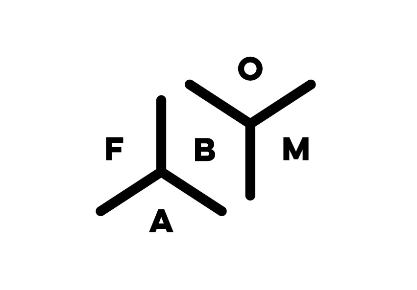
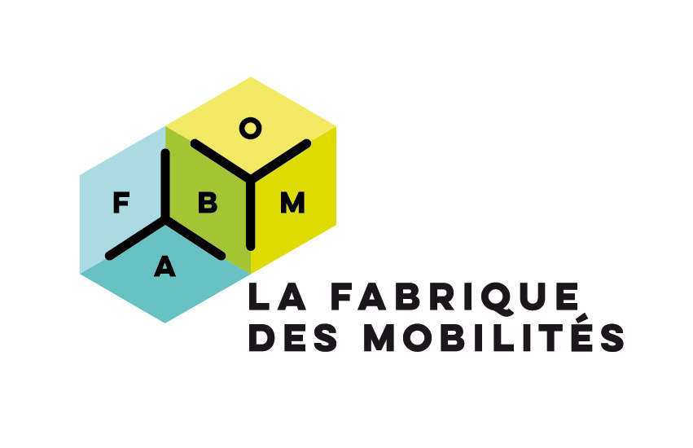
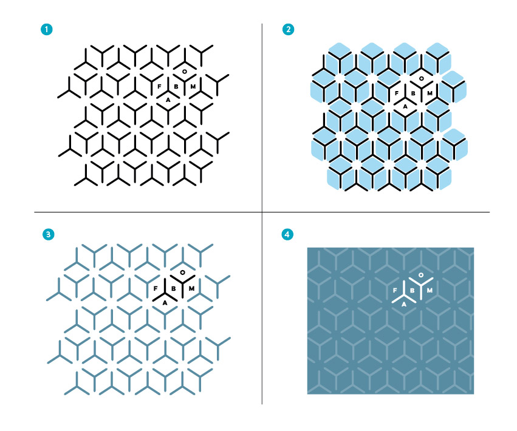

Le choix du diminutif "FabMob" pour le logo de la Fabrique des Mobilités est venu naturellement lors de la phase préparatoire. Il est inspiré également du [compte twitter @fab\_mob](https://twitter.com/fab_mob) et du hashtag #FabMob utilisés dès le lancement en janvier.

Les deux formes en « tridents » forment un signe complexe et simple à la fois. Ce signe abstrait fonctionne comme un code secret pour les initiés. Chaque trident sépare les lettres mais les relie également en se branchant sur son voisin. Les lettres F-A-B et M-O-(B) forment un puzzle. La lettre B est l’élément fédérateur qui relie les deux groupes de lettres pour en symboliser à la fois les combinaisons et l’unité. La lecture circulaire du terme « FABMOB » génère une dynamique. L’inclinaison des tridents donne également une direction et une dynamique au signe. La direction pointée par les tridents indique le point de placement du nom, écrit ici dans son intégralité.

Le logo peut être utilisé avec le nom complet « La Fabrique des Mobilités » en en-tête par exemple. La mise en couleur permet de relier le tout, en faisant ressortir le ou les volume(s). Elle montre l’association de 2 élements FAB+MOB. La transparence symbolise également la mise en commun, les deux couleurs en formant une troisième en leur point de convergence : à plusieurs, on se transforme.

D’autres éléments peuvent s’agréger. Le logo n’est pas monolithique, mais évolutif. Divers participants peuvent s’associer au cours de son histoire et le faire évoluer sans le dénaturer.

 

L'identité de marque est déclinée également sur des trames modulables qui permettent de personnaliser un fond, une photo, un profil. Le jeu des volumes, perspectives et transparences indique le mouvement, l’évolution, le changement de lieux.

Cette identité de marque a été réalisée pour l'ADEME par [PollenStudio](http://www.pollenstudio.fr "lien vers le site de pollenstudio"), agence de création graphique.
