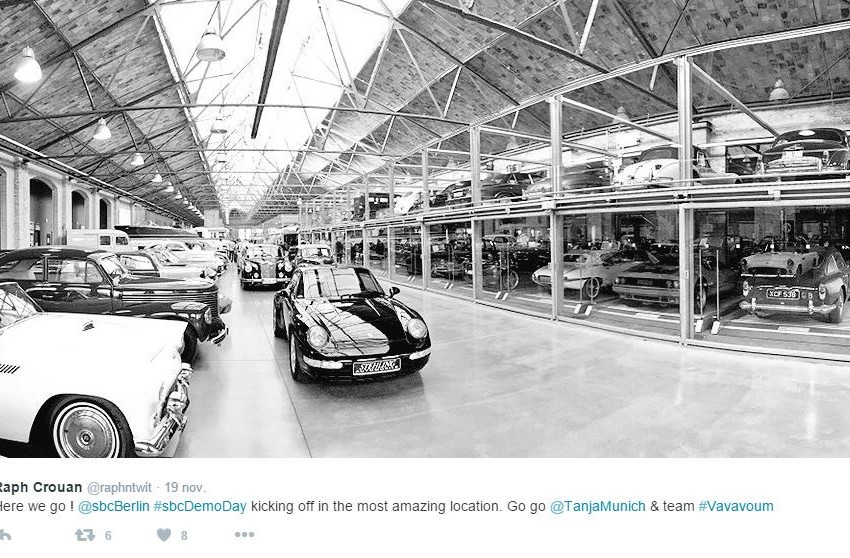
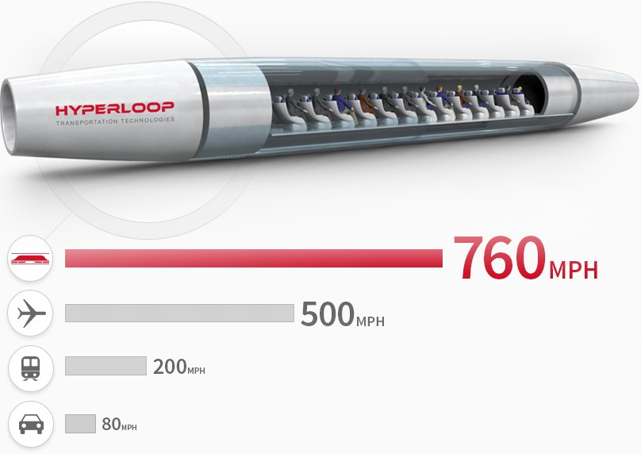

La semaine dernière, 8 startups ont présenté leurs projets à Berlin, sur scène, face à un panel de professionnels, de partenaires et d’entrepreneurs pour les « Demo Days » du programme d’accélération de [Startupbootcamp](http://www.startupbootcamp.org/).

Startupbootcamp, qu’est-ce donc ? Derrière ce nom poétique se cache une des plus belles machines à créer des pépites de l’écosystème entrepreneurial européen. Depuis 2010, ils accélèrent des projets en les connectant à des mentors de leur industrie. Les connexions extrêmement qualifiées, le challenge permanent sur le produit et la présentation à des investisseurs sont 3 des ingrédients ayant permis au Startupbootcamp de devenir une institution.

En 5 ans, ce sont plus de 300 startups qui ont passées 3 mois d’accélération dans leurs locaux maintenant disséminés aux 4 coins du monde. En moyenne, les startups qui passent entre leurs murs lèvent près de 600 000 €. Aujourd’hui, le SBC, c’est une famille de 13 accélérateurs dont l’un d’entre eux nous intéresse particulièrement puisqu’il est dédié au transport et à l’énergie, deux thèmes que le SBC a judicieusement choisir de regrouper tant l’innovation de l’un a d’impact sur les défis de l’autre et vice versa.

Avant le 19 novembre 2015, tout a donc commencé par un tour d’Europe de l’équipe « Transport & Energie » du Startupbootcamp avec 16 villes visitées en 2 mois. 19 projets ont été sélectionnés puis les 8 meilleurs, au terme des 3 mois, sont donc conviés à présenter leur projet. Le lieu choisi était un clin d’œil à lui tout seul : les entrepreneurs ont pitché au milieu d’un garage de voiture de collection et d’exception. Le vintage et l’innovation se sont cotoyés l’espace de quelques heures.

Entre les présentations des jeunes pousse se glissait un entrepreneur aguerri… Et quel entrepreneur !  La guest star de cette journée de démo était Dirk Albhorn, le PDG d’Hyperloop mais également, et cette réalité est souvent passée sous silence, le fondateur de JumpStartFund, une plateforme extrêmement innovante de « crowdstorm » ou « solutions par la foule ».

Hyperloop, c’est le projet un peu fou, mi startup mi science-fiction, issu du cerveau d’Elon Musk. N’ayant pas le temps de se pencher sérieusement sur ce moyen de transport hallucinant – des capsules projetées à plus de 1000 km/h par induction dans un tube à basse pression surélevé- le patron de Tesla a fait appel à Dirk Albhorn pour tenter de faire du rêve une réalité !

Pour creuser un peu le sujet, nous vous invitons à cliquer sur les liens suivants:

\- [Un article très complet sur l'ambition et les moyens d'Hyperloop](https://www.linkedin.com/pulse/qui-sont-les-natu-ne-vous-fiez-pas-aux-apparences-gabriel-plassat) [\-](http://transportsdufutur.ademe.fr/2015/06/bang.html) [Le site officiel du projet Hyperloop](http://Pour en savoir plus sur Hyperloop, suivez ce lien.)

En une seule image, nous percevons l'énormité du défi :

 Dirk présente son projet en précisant : "_Nous ne sommes pas une compagnie, nous sommes un mouvement. Il faut résoudre le problème du transport et nous avons besoin de toutes les énergies pour y arriver_".

D’ailleurs, près de 20 000 personnes se sont impliquées dans le projet à divers niveaux grâce à la plateforme [**JumpStartFund**](https://www.jumpstartfund.com). Parmi celles-ci, 450 professionnels obtiennent des stock-option tant qu’ils passent au moins 10h par semaine à offrir leurs compétences pour résoudre un problème particulier auquel est confronté Hyperloop. Et les challenges, Hyperloop les collectionne ! Chaque partie du projet est un défi entrepreneurial à lui seul : les pylones, la capsule, le maintien en basse pression de l’intérieur du tube, la décélération, l’ergonomie… Chacun rejoint un groupe par affinité et compétence, en essayant de garder au maximum des équipes agiles de 4 à 7 personnes puisque c’est la taille la plus efficace pour prendre des décisions rapides et intelligentes. Pour faire fonctionner une telle masse internationale de cerveaux, ils ont développé leurs propres outils même si la logique, l’architecture de leur mode de travail est proche de la **[méthodologie SCRUM](https://fr.wikipedia.org/wiki/Scrum_(m%C3%A9thode))**. C'est ainsi qu'ils sont en train de travailler sur un 5ème moyen de transport révolutionnaire à tous les points de vue avec le chiffre ahurissant de 4 salariés.

 Après une brève introduction de Tanja Kufner, la directrice de Startupbootcamp Berlin, nous avons pu découvrir les 8 pépites sélectionnés par l’accélérateur.

**Les projets du Demo Day dans le désordre:**

[Bike ID](http://www.bike-id.eu/)

**Problème qu’ils souhaitent résoudre ->** Le vol chaque année de 3.5 millions de vélos, rien qu’en Europe. Six chaque minute. **Leur solution :** Système intelligent de marquage des vélos + assurance de 2ème génération. Projet en béta à l’expansion exponentielle en Estonie. Très smart, expansion par essaimage de petites communautés, déjà quelques centaines de français.

[Envio](http://www.enviosys.com/cube/)  **Problème qu’ils souhaitent résoudre ->** Les bâtiments de taille moyenne n’ont aucune solution pour gérer leur consommation d’énergie. Il y a un gap énorme entre la domotique pour maison individuelle et les tours ou usines de très grande taille. **Leur solution :** Logiciel SAAS pour gérer la consommation d'énergie des bâtiments+ Boitier polyvalent de gestion des données clés.

[FreewayWorks](http://prelaunch.heyride.com/)

**Problème qu’ils souhaitent résoudre ->** l’expérience de transport et l’expérience de réservation d’un restaurant ne sont pas reliées aujourd’hui. **Leur solution :** Leur application permet de profiter d’un tarif avantageux pour se rendre dans un restaurant avec un service de VTC. Ils créent une seule application pour répondre à deux besoins : trouver un restaurant et réserver un moyen de transport pour s’y rendre.

[Podaris](https://www.podaris.com/)

**Problème qu’ils souhaitent résoudre ->** La gestion de projet des grandes infrastructures de transport touche de très nombreux acteurs qui ont beaucoup de mal à échanger et travailler ensemble **Leur solution :**Un outil collaboratif de Planification stratégique des grandes infrastructures de transport. Ils visent les institutions, les mairies, les régions...

[Seeusoon](https://www.seeusoon.io/) **Problème qu’ils souhaitent résoudre ->** Le transport et le logement « traditionnels » peuvent être choisis simultanément sur des plateformes mais ils n’intègrent pas l’économie du partage et les nouveaux usages. **Leur solution :** Une plateforme de planification de voyage intégrant le logement collaboratif (blablacar entre autre) et l’hébergement alternatif (type Airbnb)**.** A terme, on pourra choisir avec un budget X d'aller dans la ville Y en avion/train/covoiturage et de dormir sur place dans un hotel/airbnb/échange de maison...

[Shipwise](http://www.shipwise.co/)

**Problème qu’ils souhaitent résoudre->** Le fret par bateau est à l’âge de pierre, la gestion se fait principalement par papier. **Leur solution :** Outil de gestion numérique du fret par bateau. C’est une place de marché dynamique permettant à ses clients de suivre, réserver et manager leur stock facilement. Ils ont été mis en contact par le Startupbootcamp avec un professionnel du secteur extrêmement intéressé par leur innovation.

[Stickables](http://www.startupbootcamp.org/alumni/smart-transportation-energy-2015/stickables.html)  **Problème qu’ils souhaitent résoudre ->** Les objets connectés n’ont pas d’usage dans la vie quotidienne **Leur solution :** Leur premier produit permet d’obtenir un système de détection d’obstacle à accrocher à son pare-choc. Avec un smartphone et un objet connecté, on obtient à moindre coût une fonctionnalité efficace.

[TruckIn](http://www.truckin.io/)

**Problème qu’ils souhaitent résoudre ->** Chaque camion qui se déplace d’un point A à un point B à vide est une opportunité manquée. **Leur solution :** Truckin est une place de marché pour trouver un camion vide ou partiellement rempli et lui proposer de déplacer un stock sur sa route. L’équipe étant berlinoise, une partie du public lui était déjà acquis et ils semblaient aussi ambitieux que connectés aux grands acteurs du secteur.

Nous souhaitons une belle aventure entrepreneuriale à toutes ces startups en espérant qu'elles aient un impact significatif sur leurs secteurs !
