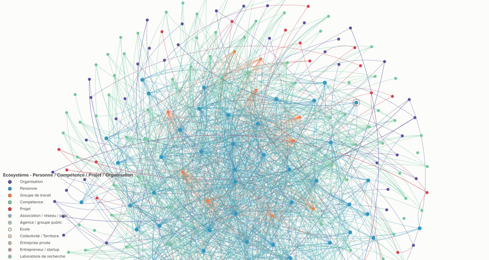

 

_Je ne suis pas un expert de la mobilité : j'ai cofondé [**practishare**](http://practishare.com/), la plateforme de partage de bonnes pratiques, un bien commun. Alors, concrètement... pourquoi participer à la fabrique des mobilités ?_

Il y a quelques mois, mon ami Fabien Gainier ([**In Principo**](http://www.inprincipo.com/)) m'a proposé de réfléchir au sujet suivant : "Comment visualiser les flux de richesses au sein d'un collectif, pour que chacun puisse valider son intérêt à y participer" ?

Parce que cette question résonne aussi bien dans mes projets que dans les actualités économiques, et sans savoir trop à quoi m'attendre, j'avais mis un pied dans la Fabrique des Mobilités, j'y contribuais... Quelques semaines plus tard, j'identifie 4 raisons qui continuent de motiver ma participation à la Fabrique :

**\> C'est un espace de biodiversité économique remarquable...** On y trouve en effet, concentrée en un même lieu neutre, une diversité de types d'organisations (écoles, incubateurs, territoires, industriels, startups, agences, laboratoires, pôles de compétitivité ...) ainsi qu’une diversité de liens les reliant. Ces organisations ont des propriétés différentes : modèles économiques, rythmes, enjeux, besoins, modèles de gouvernance, ….  Elles partagent pourtant toutes une envie de tisser des liens avec les autres, pour s'en nourrir et s’en renforcer. Chacun y apporte qui il est, ses compétences, ses besoins, l’écosystème se tisse naturellement.

**\> Il y a un effet d’accélération  réciproque :** le foisonnement de ressources facilement accessibles réduit les efforts traditionnellement nécessaires. Accéder à une expertise, des données, des communautés, des outils, ou plus simplement recevoir des conseils ou voir les choses sous un nouvel angle… Chacune de ces actions a sa contrepartie positive immédiate : les projets accompagnés se trouvent accélérés, et l’innovation qu’ils portent déteint sur les partenaires et entre eux.

**\> Des leviers de transitions apparaissent clairement.** Que l’on parle de transition digitale, environnementale, énergétique, de gouvernance, …  En côtoyant les autres partenaires, on peut y voir des modalités de fonctionner différemment. Si celles-ci ne sont pas toujours applicables en l’état, elles sont toujours une source d’inspiration.

**\> Faire de la recherche-action  autour de la notion de « commun ».** L’actualité fait état de profonds bouleversements de l’économie. Chaque jour de nouveaux secteurs se trouvent réintermédiés, et de nombreux acteurs en subissent les conséquences, souvent par manque de résilience. L’absence d’équilibre entre « état tout puissant » et « marché tout puissant » appelle la création d’objets hybrides, résilients, et répondant à des principes positifs de transparence. Ces objets sont à (ré)inventer théoriquement et surtout opérationnellement... La Fabrique des Mobilités  s’invente en la pratiquant,  et réciproquement.

_Francis dans le_ _Réseau des personnes, compétences de l'écosystème en construction_

La Fabrique n'est finalement pas un lieu de compétition puisqu'il n'y a pas de pouvoir à conquérir, mais un lieu neutre, où chacun peut s'enrichir, en commun.

**Francis Morel** - cofondateur de practishare.com, bénévole impliqué dans la Fabrique des Mobilités
