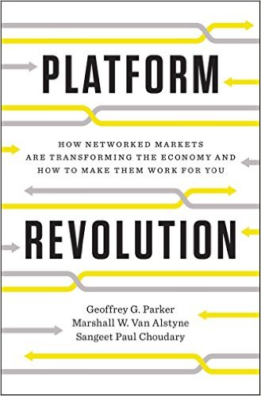

**_[Platform Revolution](http://platformrevolution.com/)_** rédigé par **[Sangeet Paul Choudary](http://www.amazon.com/Sangeet-Paul-Choudary/e/B015F8WY0U/ref=dp_byline_cont_book_1), [Marshall W. Van Alstyne](http://www.amazon.com/Marshall-W.-Van-Alstyne/e/B01A61PLQ0/ref=dp_byline_cont_book_2), [Geoffrey G. Parker](http://www.amazon.com/s/ref=dp_byline_sr_book_3?ie=UTF8&text=Geoffrey+G.+Parker&search-alias=books&field-author=Geoffrey+G.+Parker&sort=relevancerank)** sortira le 28 mars 2016. Ce livre décrit avec une grande précision l’économie des plateformes. Le fonctionnement d’une plateforme n’a rien de nouveau. C’est la place de village qui réunit et facilite l’échange d’une offre de biens et de services entre des parties prenantes. Mais le fonctionnement d’une plateforme à l’ère du numérique génère des performances bien supérieures aux fonctionnements industriels linéaires basés sur la sous-traitance. **[L’âge de la multitude](http://transportsdufutur.ademe.fr/2013/02/les-transports-a-lage-de-la-multitude.html)** présente également les forces de ce mode de création de valeurs et ouvre un point essentiel : la notion de sur-traitance. Cet article présente les éléments clés d’une plateforme réussie.

La Fabrique des Mobilités se construit clairement comme une Plateforme d’un écosystème industriel avec des composants et des fonctions essentielles :

**Les Participants** : La Fabrique rassemble tous les **acteurs de l’écosystème** : industriels des transports historiques, startups, laboratoires de recherche, écoles, nouveaux industriels des services, collectivités, agences et pouvoirs publics. Ils sont à la fois producteur et utilisateur, facilitateur et « encapaciteur ». Nous différencions la structure qui a un contrat avec la personne, du rôle de la personne elle-même. La FabMob doit permettre de comprendre les deux, de changer de rôle, de donner un angle de vision différent selon le rôle.

**L'unité de valeur** de la Fabrique des Mobilités : Ce sont les **ressources** dont les [**communs**](http://communs.lafabriquedesmobilites.fr). Les participants viennent dans la Fabrique pour y échanger des ressources et en tirer des bénéfices. Déjà de multiples ressources ont déjà été identifiées, ce sont des personnes avec des compétences, des moyens d’essais et de calculs, des communs ou plateformes ouvertes, des données, des logiciels ou l’accès à des réseaux. L’unité de valeur de la Fabrique est donc la ressource documentée, indexée et utilisable. La mise à disposition d'une ressource apporte des _bénéfices_ individuels et collectifs. La transparence et quantification de ces _bénéfices_ peuvent être considérées comme des monnaies décrites plus loin.

**Le filtre** : Il permet de simplifier et rendre possible la rencontre d’une offre et d’une demande en filtrant parmi les ressources et les participants, donc de les engager dans l’action. Le traitement des flux entre les participants permet de révéler les acteurs actifs et les passifs, les influenceurs. Une version prototype est réalisée par notre outil [**Kumu**](https://kumu.io/FabMob/). Le filtre offre un moyen simple « d’anguler » les ressources en fonction de son besoin, de se connecter à la bonne personne, au bon partenaire. Il permet également de visualiser les ressources de façon holistique ou de façon individuelle et précise.

Ainsi outillée, la Fabrique permet d’industrialiser des flux, des échanges d’abord avec de petits volumes puis potentiellement à grande échelle. Trois type d'échanges opèrent :

**Échanges d’informations** : La Fabrique offre grâce aux [**communautés**](http://communautesfabmob.strikingly.com/), aux ateliers et séminaires des moments d’échanges complétés par des outils de gestion des ressources (unité de valeur), par le [**wiki**](http://wiki.lafabriquedesmobilites.fr) ou encore le blog.

**Échanges de biens et services** : La Fabrique permet l’échange de ressources en dehors de la plateforme mais rendues possible via la plateforme. Il s’agira de rendre visible cet échange, de le capitaliser et de renseigner la ressource échangée pour améliorer sa qualité. Les participants impliqués seront alors récompensés de cette action grâce à la monnaie _Influence Réputation_.

**Échanges de monnaie** : la Fabrique va permettre, construire et rendre visible des flux de ressources entre des participants. Ces échanges apportent par eux-mêmes de la valeur aux participants. En complément, une monnaie d’_Influence Réputation_ par personne (rôle) et par structure (statut) permettra de capitaliser et renforcer les échanges. Via cette monnaie, de nouveaux pouvoirs pourront être donnés aux participants. Le flux de la monnaie sera représentatif du niveau de confiance dans la Fabrique.

Ainsi équipée la Fabrique se constitue comme une plateforme qui permet des échanges d’information, de ressources (richesses) de façon simple en renforçant tous les acteurs y participant. Se faisant, elle constitue des actifs matériels et immatériels documentés et indexés disponibles pour cet écosystème. Les échanges sont mis en œuvre grâce à trois fonctions : tracter, faciliter, matcher.

**Tracter** : Une première masse critique déjà créée par les 40 partenaires et [**10 projets lauréats**](http://laureatsfabriquedesmobilites.strikingly.com/) catalyse l’invitation des prochains participants. Les premiers matchs offre-demande vont maintenant donner accès aux ressources (unités de valeur) utilisables. Ces premiers échanges seront amplifiés par les séminaires et les ateliers. La Fabrique doit maintenant pousser des recommandations aux participants de façon manuelle dans un premier temps pour obtenir une traction naturelle.

**Faciliter** : la Fabrique améliore les échanges et les rencontres entre les participants en baissant les barrières. Ceci via des contrats simples, un outil de gestion des ressources _user-friendly_, des ateliers et des rencontres. En complément, tous les moyens pour augmenter la friction entre acteurs seront encouragés, tel le tutorat. Ceci également dans le but d’accompagner 50 projets en 2017 puis aller vers 100 projets par an.

Enfin, il s’agit de faire **matcher** l’offre et la demande via l'outil de gestion des ressources. La Fabrique pourra améliorer les recommandations de ressources pour chaque participant pour augmenter la traction. La documentation précise des ressources est stratégique et les acteurs y travaillant seront récompensés via la monnaie, de même l'acquisition de nouvelles ressources documentées donc de nouveaux acteurs donc l'expansion européenne.
