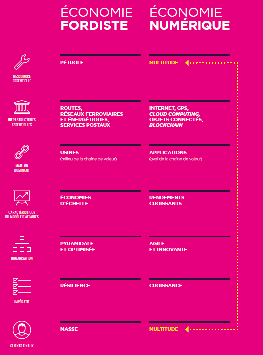
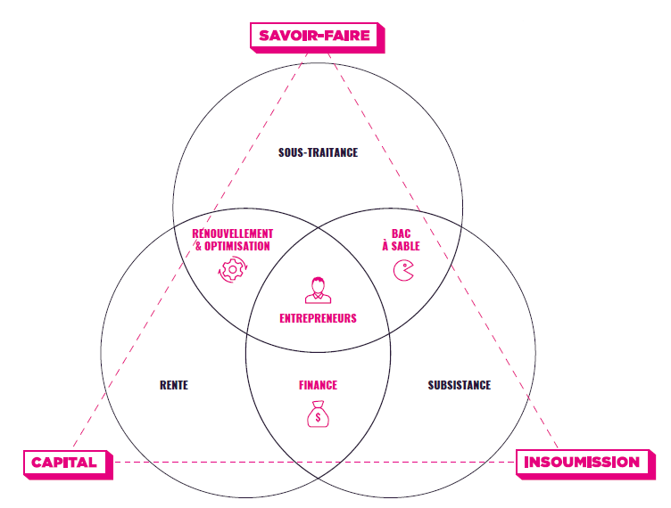

L’Etude de TheFamily « **[La Transition numérique au cœur des territoires](https://salon.thefamily.co/la-transition-num%C3%A9rique-au-c%C5%93ur-des-territoires-671d9ebcf0e1#.qfl7y9exb)** » analyse, avec un volet historique essentiel, l’importance des territoires dans les succès entrepreneuriaux. En rappelant en détail les principes de fonctionnement des entreprises numériques, TheFamily propose les trois ingrédients majeurs qu’il est nécessaire de rassembler autour des entrepreneurs ainsi que les cinq actions d’un écosystème entrepreneurial performant.

L’histoire de la Silicon Valley est également analysé, par sa capacité à attirer l’innovation, les talents, à faire émerger des entreprises mondiales. Le droit à l’erreur, la gestion des talents, la mobilité après un échec, les systèmes juridiques favorables, la formation par les générations précédentes, mais également l’insoumission ou encore du capital, font de la Valley un territoire inédit. Plusieurs facteurs expliquent l’émergence _là-bas_ de l’économie numérique : l’ouverture d’internet aux applications civiles et également du GPS sans décider _à priori_ d’une stratégie nationale, les premiers développements de la navigation sur le web et un cadre juridique favorable. D’autres territoires ont réussi, non pas à copier mais à s’en inspirer comme Londres, Israël ou encore l’Estonie.

De nombreuses propositions peuvent être mises en œuvre sans attendre. La Fabrique des Mobilités déploie progressivement plusieurs offres vers les entrepreneurs et également vers tous les acteurs de cet écosystème : formation, simplification de la création et animation de communautés, identification et soutien aux développements de communs, création d’une nouvelle culture commune. L’histoire de la Silicon Valley, [**également étudiée sous l’angle des communautés**](http://transportsdufutur.ademe.fr/2016/07/sources-lutopie-numerique.html) montre paradoxalement qu’il ne faut pas planifier cette transition. Chaque acteur doit respecter son rôle, développer ses talents, apprendre à mieux connaître les contraintes des autres et leurs temporalités. Il s’agit à tous les niveaux d’ouvrir les possibles, d’abaisser les barrières à l’essai, de capitaliser et valoriser les échecs, de faire levier des ressources disponibles et développer les communs, de connaitre les fondamentaux des entreprises numériques mais également de [**chercher à inventer notre chemin**](http://transportsdufutur.ademe.fr/2016/06/balise-transports-futur.html).

**Qu’est-ce qu’une entreprise numérique ?**

C’est une entreprise qui utilise des technologies numériques pour atteindre un régime de production à rendement croissant pour lui permettre _ensuite_ d’avoir une position dominante puis un monopole. Cette position est mise sous tension permanente par d’autres entreprises numériques mais d’abord par les utilisateurs eux-mêmes qui s’habituent à des expériences sans cesse améliorées ou qui changent de plateforme. Ce mode de développement est inédit par la vitesse et la taille, ainsi que le lien particulier que l’entreprise construit avec ses utilisateurs puisque ce sont eux qui vont aider à produire, par leurs activités sur les plateformes numériques, des données permettant de faire évoluer constamment les services fournis.

Il y a donc une traction auto-entretenue mais extrêmement volatile. Pour se déployer, elles actionnent trois leviers : une expansion mondiale, une diversification progressive des produits pour mieux servir leurs utilisateurs et ériger des barrières à l’entrée, et le déploiement de plateforme en partant en général d’une application.

En conséquence, les GAFA et NATU ne sont pas des entreprises traditionnelles qui utilisent plus de numérique. [**Uber n’est pas une société de taxi ou de transports**](https://www.linkedin.com/pulse/qui-sont-les-natu-ne-vous-fiez-pas-aux-apparences-gabriel-plassat) . C’est une entreprise numérique dont une application visible est une solution de transport. Uber déploie une infrastructure numérique mondiale (non visible) qui peut être utilisée pour produire plusieurs types de services dont le transport de personne ou encore la logistique des marchandises.

En commençant par des secteurs non tangibles et immatériels, les entreprises numériques ont pu atteindre des tailles suffisantes pour leur permettre de se déployer de plus en plus sur des secteurs matériels et réglementés qui demandent plus de temps et de ressources.

_TheFamily, la Transition au coeur des territoires_

> **A mesure que la transition numérique progresse, l’économie change du tout au tout. Les filières verticales laissent la place aux plateformes. L’économie des rendements croissants, caractérisée par le principe du Winner-takes-most, impose des efforts d’innovation en continu et dégrade la résilience des entreprises \[…\]**

**L’exemple d’Amazon**

Né à Seattle, en dehors de la Valley, Amazon a commencé en aval de la chaîne de valeur, au contact des clients, avec des bénéfices très (très) bas. En réduisant le prix des livres, Amazon a concurrencé les libraires puis les groupes d’édition. Une fois connectée à la multitude (ses clients), Amazon a lancé une innovation technologique, le livre électronique, pour délivrer une nouvelle expérience, et a élargi sa gamme de produit. Pour gérer autant de références, il a été nécessaire de faire progresser son infrastructure cloud. Amazon Web Services a été mis en œuvre pour ensuite devenir une nouvelle activité de l’entreprise. Récemment, Amazon poursuit sa progression et investit [**le champ de la logistique**](http://transportsdufutur.ademe.fr/2016/08/service-bientot-logistic.html). Les activités de cette entreprise numérique se diversifient, son lien avec ses clients se renforcent alimentant encore plus les nouvelles activités.

**Economie de la Connaissance**

En abaissant fortement les coûts pour se lancer, grâce également à l’open source ou encore à des accès gratuit aux plateformes de cloud, le numérique outille les entrepreneurs avec des logiciels, des formations et des solutions d’IA de plus en plus performants. De plus en plus d’entrepreneur peuvent se lancer avec une idée, un problème à résoudre. Néanmoins, dans un écosystème complexe comme celui des transports, il est quasiment impossible de maîtriser les modèles d’affaires des différents acteurs, leur mode de fonctionnement et leur stratégie. La Fabrique des Mobilités apporte à chaque acteur des outils et un environnement pour comprendre les contraintes de chacun, pour identifier et construire les besoins de formation et co-produire progressivement des connaissances de référence partagées (le [**wiki** , le](http://wiki.lafabriquedesmobilites.fr/index.php?title=Accueil) [**référentiel**](http://wiki.lafabriquedesmobilites.fr/index.php?title=Notre_r%C3%A9f%C3%A9rentiel_des_mobilit%C3%A9s/D%C3%A9finitions_et_ressources)).

**Expérimentation et Territoires**

La transition numérique modifie la répartition des richesses entre les acteurs de l’amont et de l’aval et a donc des effets sur les territoires. Il y a un découplage entre la création de richesse et le lieu. Pour les territoires où aucune entreprise numérique n’est installée, il est important d’engager des actions pour monter en compétence, former les actifs et créer des conditions favorables. Néanmoins, il est constaté qu’un territoire avec des entreprises fordistes a très peu de chance de voir se développer des entreprises numériques de premier rang. Le [**dilemme de l’innovateur**](http://transportsdufutur.ademe.fr/2014/09/toyota-versus-google.html?hlst=dilemme) explique cette difficulté culturelle.

TheFamily identifie quatre types de territoire :

- Les non connectés ou déserts numériques, ne sont pas équipés pour initier des entreprises. Mais ils servent souvent de terrains d’exploration pour des technologies frugales, pour « sauter » une ou plusieurs étapes.
- Des territoires avec des compétences et des technologies, utilisés comme sous-traitants des entreprises numériques. Il ne s’agit pas d’innover mais d’exécuter des prestations. L’Inde est dans cette situation avec du mal à s’en extraire comme l’a fait Israël.
- Des territoires avec peu d’entreprises numériques globales même si les utilisateurs présentent une forte appétence au numérique. La valeur est créée sur ces territoires mais captée par les entreprises localisées ailleurs. La réglementation et la taille des marchés morcelés en Europe expliquent en partie ce constat.
- Enfin, quelques territoires ont réussi à concentrer tous les ingrédients (entrepreneurs, ingénieurs, investisseurs et utilisateurs), associés à un ensemble de facilitateurs, de passeurs qui vont fluidifier les échanges et maximiser les rencontres.

****_TheFamily, la Transition au coeur des territoires_

Israël, Londres et l’Estonie présentent des alternatives matures à la Silicon Valley. Yozma (initiative en hébreu), doté de 100 millions de dollars, développe le capital risque en doublant la mise initiale. L’Etat se positionne en catalyseur et la sortie vers un rachat, comme Waze, a permis de créer cet écosystème favorable avec une première génération d'entrepreneur, même si cela ne permet pas la création d’entreprises numériques matures. L’Estonie choisit, à la fois, de créer un environnement favorable aux startups et d’investir la notion d’[**Etat-plateforme**](http://etatplateforme.modernisation.gouv.fr/), mise en œuvre en France par [**Henri Verdier**](http://www.henriverdier.com/). Il s’agit d’utiliser les technologies et les méthodes créatives pour délivrer de meilleurs services publics, moins chers et plus efficaces. Enfin Londres souhaite garder sa position de leader dans la finance et a choisi d’attirer les compétences dans ces domaines. L’autorité financière soutient les projets innovants même (et surtout) dans des secteurs réglementés pour faciliter l’arrivée de nouveaux entrants. La FinTech se développe ainsi en préférence à Londres. En transformant son territoire pour mieux accueillir les entrepreneurs tout en intégrant les spécificités de chacun, ces trois exemples montrent que de nouveaux écosystèmes fertiles peuvent grandir.

La concentration est un phénomène essentiel déjà existant avec les entreprises fordistes mais qui s’intensifient avec les entreprises numériques. En synthèse, ces entreprises se concentrent dans les zones urbaines, denses en compétences, en utilisateurs, également en concurrents, facilitant les premières phases ainsi que l’accès au capital. Pour mieux intégrer l’échec comme une option, les entrepreneurs pourront retrouver une activité plus facilement dans les territoires urbains. Une fois installée, l’entreprise qui rencontre son marché bénéficie de rendement croissant qui vont amplifier son développement et l’obliger à croitre.

**Ecosystème**

Pour disposer d’un écosystème favorable, TheFamily identifie trois paramètres indispensables pour alléger la pression sur l’entrepreneur sur certains sujets comme le financement, pour l’amener à maximiser sa capacité à prendre des risques : l’insoumission, le capital et le savoir-faire qui peuvent également s’appuyer sur des infrastructures issues des financements publics comme l’internet et le GPS.

_TheFamily, la Transition au coeur des territoires_

Une bonne circulation des compétences garantit aux entrepreneurs une porte de sortie en cas d’échec, des évolutions possibles vers des concurrents et une transmission des connaissances grâce à des accélérateurs agissant très tôt comme Y combinator. Les différentes générations d’entrepreneur entretiennent alors des relations avec des bénéfices croisés : nouvelles compétences / expériences et capital.

Les trois ressources agissent de cinq façons complémentaires, le territoire y jouant un rôle essentiel : **Valoriser** l’entrepreneuriat, **Mettre en tension** pour conserver des objectifs ambitieux, **Sécuriser** la phase postérieure au product-market fit en apportant du capital, des compétences, un support juridique, **Faire circuler** les personnes et les ressources en général et **Transmettre** à la génération suivante.

_TheFamily, la Transition au coeur des territoires_

La Fabrique des Mobilités conçoit à mesure qu’elle se développe des solutions sur mesure pour cet écosystème. La mise en tension est imposée par l’absence d’aide directe aux projets et la frugalité lors du co-financement des communs (lien vers [**l'appel à commun**](http://wiki.lafabriquedesmobilites.fr/index.php?title=La_Fabrique_%C3%A0_Projets_-_Open_FabMob)). Les communs, ou ressources ouvertes mutualisées entre plusieurs acteurs constituent des [**objets-liens**](http://transportsdufutur.ademe.fr/2016/05/communs-source-guerre.html), améliorent les collaborations et obligent à la mutualisation. Par des échanges entre tous les acteurs, la Fabrique identifie les points de blocage juridique et propose les meilleures options existantes, comme sur le sujet des [**startups et des collectivités**](http://wiki.lafabriquedesmobilites.fr/index.php?title=Atelier_Startups_et_Collectivit%C3%A9s_des_2_et_3_Mai). La transmission dans l’écosystème est également au cœur de la Fabrique, via le wiki et les [**Ateliers chez les partenaires**](http://wiki.lafabriquedesmobilites.fr/index.php?title=Construire_la_Fabrique_des_Mobilit%C3%A9s). Les startups en phase de croissance bénéficient également de formations ciblées sur des problématiques transversales (créer la confiance, maîtriser des réseaux sociaux, etc) et des retours des leaders comme BlablaCar. En facilitant la [**création de communauté d'intérêt**](http://wiki.lafabriquedesmobilites.fr/index.php?title=Communaut%C3%A9s), étape préalable à l'émergence de communs, la Fabrique met à disposition des infrastructures numériques et physiques pour mieux se rencontrer, capitaliser et se développer.

Les entreprises en place jouent également un rôle dans l’écosystème, les startups étant à la fois des menaces et des opportunités. La Fabrique joue également un rôle de médiateur pour faciliter la compréhension des rôles et modes de fonctionnement de chacun, simplifiant les prises de contact et amenant tous les acteurs à se livrer de façon la plus transparente possible. En laissant libres les associations et alliances entre acteurs, la Fabrique partage également les retours d’expériences d’autres écosystèmes ayant vécus la transition numérique pour identifier les meilleures pratiques entre startups, groupes, territoires, laboratoires et écoles.

**Attractivité du territoire et rôle des pouvoirs publics**

Pour TheFamily, la Valley a été et est attractive parce qu’elle a su faire émerger des entreprises numériques et non l’inverse. Il est très difficile pour un territoire de partir de zéro et rassembler toutes les conditions favorables. Il s’agit notamment de faciliter une première génération d’entrepreneur puis de s’y appuyer pour ensuite consolider les prochaines étapes tout en offrant un cadre juridique favorable à l’amorçage et à l’expérimentation. Le récent dispositif [**France Expérimentation**](http://www.economie.gouv.fr/france-experimentation-lancement-1er-appel-a-projets) est à ce titre intéressant en France pour identifier les règlements et processus administratifs bloquants.

La Fabrique, en rapprochant collectivités, startups, laboratoires et entreprises, cherche à raccourcir les démarches d’expérimentation, à identifier les verrous juridiques pour mutualiser des solutions pour le plus grand nombre. Il devient de plus en plus difficile pour les pouvoirs publics d’engager une stratégie d’accompagnement pour plusieurs raisons. Ces entreprises agissent à échelle internationale, alors que des silos restent, dans un écosystème donné comme les transports, à l’échelle locale. L’entreprise numérique qui a réussi est généralement en situation de monopole, par « construction », rendant quasi-impossible une concurrence frontale. Enfin, le succès d’une entreprise est d’abord déterminé par la vitesse de déploiement, le nombre d’utilisateur et leur fidélité, qui ont peu de lien avec d’éventuelles incitations publiques.

Nous avions également identifié dans la Fabrique que le lieu n’est plus la ressource clé des entrepreneurs et encore moins des écosystèmes ([**lien vers l'étude**](http://transportsdufutur.ademe.fr/2014/11/innover-aujourdhui-pour-mieux-se-deplacer-demain.html?hlst=15marches)). En s’appuyant sur un réseau de lieu pour se rencontrer et des ressources numériques ([**wiki**](http://wiki.lafabriquedesmobilites.fr/index.php?title=Accueil), [**slack**](https://fabmobteam.slack.com)) facilitant les échanges distribués et la capitalisation, la Fabrique invente un nouveau type de cluster.

> **_Les lieux d’innovation d’aujourd’hui ne sont plus des lieux de travail, mais des lieux de rencontres, d’éducation, de festivités et de mise en réseau_.**

Pour bénéficier du rôle des entrepreneurs dans un territoire, les modes de relation entre les acteurs locaux sont à repenser. La commande publique pour innover, par exemple, n’est plus vraiment adaptée puisque le livrable est spécifié, ainsi que le modèle d’affaire et l’échelle insuffisante. Les meilleures pistes identifiées sont : l’investissement public dans des startups, la mise à disposition des startups de ressources rares pour qu’elles puissent en bénéficier, l’identification des problèmes et besoins insatisfaits du territoire comme autant de piste pour les entrepreneurs, ou encore la création de startup publique comme la plateforme [**le.taxi**](http://le.taxi/)**.**

La Fabrique identifie et facilite [**l’accès aux communs**](http://communs.lafabriquedesmobilites.fr/#/p/list), et amène chaque partenaire, dont les territoires, à mettre à disposition des ressources (données, flottes véhicules, infrastructures) aux startups. Il est également possible d’exploiter cette transition pour repenser plus profondément les services publics tels qu’ils sont délivrés aujourd’hui. L’exemple de [**Sidewalk labs**](http://transportsdufutur.ademe.fr/2016/06/columbus-tout-commencer.html) est intéressant à ce titre, et cette démarche plus radicale pourrait inspirer des territoires. La Fabrique permettrait alors d’outiller au mieux cette évolution.
