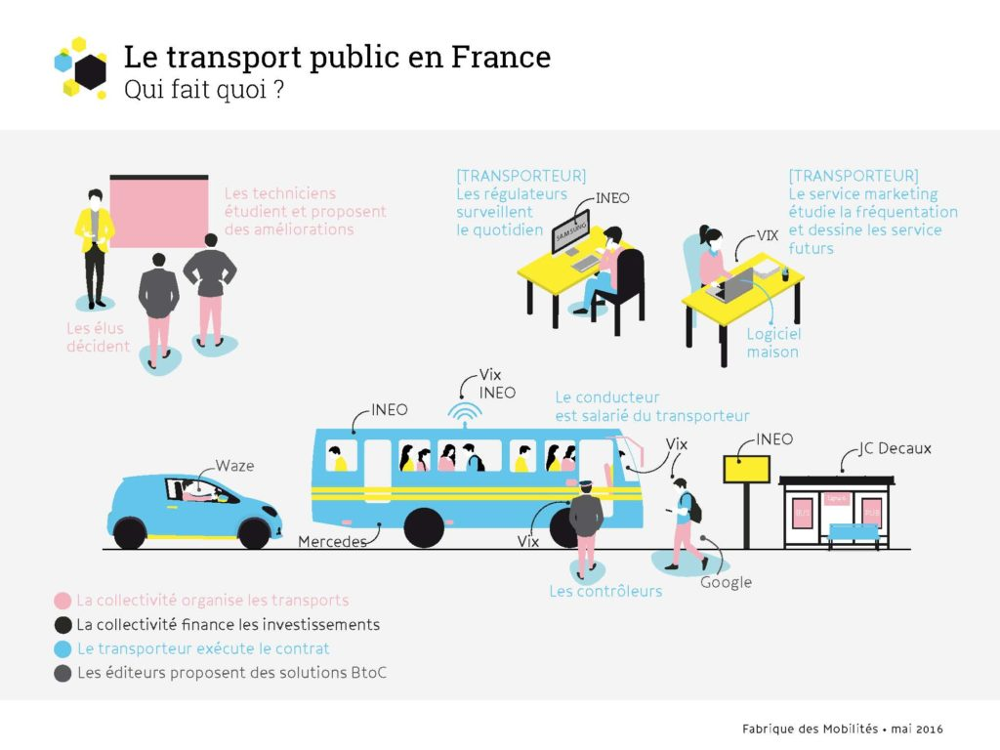
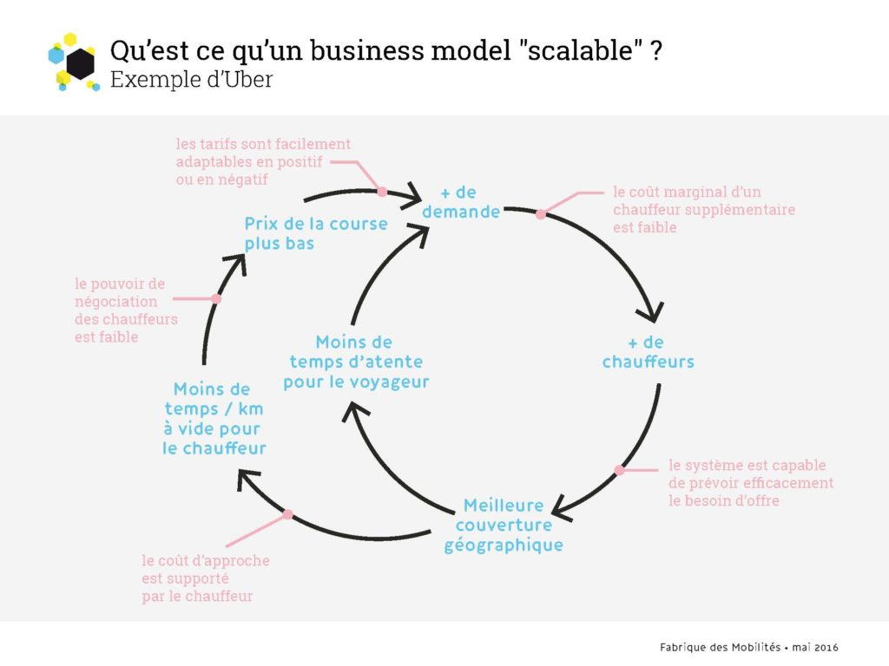

Startup et transport public : je t’aime, moi non plus

 

La mort le mois dernier de Jean-Claude Decaux a rappelé au monde des transports publics le nombre d’innovations que son entreprise éponyme lui a apporté : l’abribus (financé par la publicité), le vélo en libre-service (à grande échelle) et même la sanisette (automatique). Toujours dans le domaine des mobilités, des entreprises comme Blablacar ou Drivy révolutionnent le concept même de transport public, en démontrant leur capacité à changer les comportements individuels pour partager trajets et véhicules. Le point commun entre ces nouveaux services ? Ils n’ont pas été créés par le couple opérateur-autorité organisatrice de transport, qui règne pourtant sur un marché de 20 milliards d’euros par an.

 

**1\. Les transports publics ne savent plus innover**

À l’occasion du [Salon des Transports Publics](http://www.transportspublics-expo.com/fr) qui se déroule cette semaine, force est de constater que les transports “traditionnels” ne savent plus innover, en dehors de technologies coûteuses et lourdes à mettre en place (bus guidé, tramway, métro,...). Pensez à la manière dont vous achetez vos titres de transport ou cherchez un itinéraire dans une ville inconnue... Alors qu’elles avaient été pionnières en matière de calcul d’itinéraires et de monétique, les autorités du transport public semblent ne pas savoir comment tirer parti du potentiel d’internet et du smartphone, pourtant [largement adoptés](http://fr.slideshare.net/Transdev/transdev-explorer-les-voyageurs-numriques) par leurs “usagers”. Engoncées dans des procédures contraignantes, elles ne peuvent que regarder les “nouveaux entrants” inventer la mobilité de demain et conquérir les écrans de leurs passagers. Avec l’évolution de leurs compétences, **les nouvelles “autorités organisatrices de mobilité” (collectivités responsables de l’organisation des transports publics) vont pourtant devoir explorer de nouvelles recettes et de nouveaux partenariats** pour relever les défis de l’étalement urbain, du réchauffement climatique et de la mobilité pour tous.

**2\. Les startups ne comprennent pas le marché des transports publics**

De l’autre côté, si les startups se multiplient dans le domaine des mobilités, bien peu sont celles qui comprennent le marché des transports publics. Elles oscillent le plus souvent entre des approches centrées sur les utilisateurs finaux (en créant des applications grand public), ou d’autres ciblées sur les entreprises et leurs salariés. Les rares qui s’aventurent dans les transports du quotidien se “perdent” dans les méandres des champs de compétences et jeux d’acteurs particulièrement obscurs pour les non-initié(e)s. Sans compter l’absence de standards communs et de “briques” technologiques accessibles à tous (pensez aux données, à la billettique, aux interfaces d’affichage, ...) qui impose aux startups de réinventer la roue dans chaque nouveau territoire. Enfin, _last but not least_, **la division du marché des transports en centaines de marchés locaux de courtes durées** (5 à 10 ans) va à l’encontre de la recherche de taille critique et de “scalabilité” (voir plus bas la définition de ce terme) indispensables aux innovations à l’ère numérique.

En 2016, si des partenariats prometteurs ont été lancés entre chacun des “3 grands opérateurs” et des startups, il reste difficile de citer un seul exemple de succès d’envergure nationale et _a fortiori_ international issu de ceux-ci. La filière du transport public n’accouchera pas du prochain Blablacar français dans ces conditions.

 

**3\. Et si on apprenait à travailler ensemble ?**

La Fabrique des Mobilités a été créée pour pallier à ces manques : manque de capacité de test et de créativité d’une part, manque de connaissance du marché et de taille critique de l’autre. Elle part d’un constat simple et pragmatique. La transformation numérique de la mobilité ne passera pas par la substitution d’un modèle à un autre. La mobilité n’est pas le web : il n’est pas possible de recréer de toutes pièces les conditions du succès d’un nouveau service sans passer par les acteurs, les infrastructures et la réglementation en place. Les règles de conduite, de circulation, l’espace public, la signalisation, l’urbanisme,...sont sous la responsabilité des collectivités. Les infrastructures, le matériel, les systèmes informatiques,...leur appartiennent. L’enjeu aujourd’hui est d’optimiser l’usage de ces actifs, d’en faire levier, et non de les rendre obsolètes. L'enjeu est également de **[créer des "communs"](http://communs.lafabriquedesmobilites.fr/),** ces briques technologiques et échanges de savoir qui ont fait le succès du web et qui manquent cruellement au monde de la mobilité.

Uber ne remplacera pas votre réseau de bus. Blablacar ne supprimera pas le TGV. **Startups et transport public ont un destin commun, indissociable du futur des mobilités.** Les startups ont besoin des acteurs classiques du transport public pour apporter masse critique d’utilisateurs et territoires d’expérimentations. Elles peuvent proposer de nouvelles combinaisons et modèles pour les systèmes existants. Les acteurs du transport public ont besoin des startups pour explorer de nouveaux domaines et tester les services et technologies qui changeront peut-être demain la manière dont nous nous déplaçons.

Mais encore faut-il pour cela que les acteurs se comprennent, s’écoutent, et construisent ensemble les conditions pour innover. Je vous propose ci-dessous une présentation qui reprend les principales différences entre types d’entreprises, modèles économiques et écosystèmes. En particulier, il est crucial que les acteurs traditionnels comprennent ce qu’est une startup, autant qu’il est crucial que les startups comprennent ce qu’est une délégation de service public et "quifaitquoi" dans ce domaine. Une bonne coopération commence pour une compréhension des enjeux réciproques. Allons-y !

**4\. D'abord se comprendre**

Nous vous proposons ci-dessous une présentation en trois parties :

- _qu’est-ce qu’une startup ?_ En quoi se différencie-t-elle d’une entreprise traditionnelle dans ses modèles de croissance, de financement et ses cycles de vie ? Comprendre ces différences permet d’intégrer les différences de dynamiques et de temporalité, et l’inadéquation des procédures actuelles de commandes publiques
- _en quoi le modèle économique d’une startup_ comme Uber est-il différent de celui d’un opérateur comme RATP ou SNCF ? Comment une “plateforme” de mise en relation gagne-t-elle sa vie ?(lire aussi [ici](http://15marches.fr/business/modele-economique-scalable))
- Comment font les Uber ou Blablacar pour croître aussi vite et avec aussi peu de capitaux ?
- _Comment s’intégrer dans une procédure d’appel d’offres lancée par une autorité organisatrice ?_ Quelles sont les principales phases des contrats entre ces collectivités et leurs opérateurs ? À quel moment un partenariat peut-il être le plus fructueux ? À quel moment est-il voué à l’échec ?

<iframe style="border: 1px solid #CCC; border-width: 1px; margin-bottom: 5px; max-width: 100%;" src="//www.slideshare.net/slideshow/embed_code/key/2bMW6eMXBw49nO" width="595" height="485" frameborder="0" marginwidth="0" marginheight="0" scrolling="no" allowfullscreen="allowfullscreen"></iframe>

**[Modèle affaire, startup et transports publics](//www.slideshare.net/FabMob/modle-affaire-startup-et-transports-publics "Modèle affaire, startup et transports publics")** from **[FabMob](//www.slideshare.net/FabMob)**

La présentation ci-dessus n’a pas vocation à répondre à toutes ces questions, mais à les poser clairement afin d’éclairer chaque partie prenante. Il appartient aux partenaires de la Fabrique des Mobilités, assistés par l’équipe, de tenter de les résoudre, dans la réalité des projets portés par les startups, les partenaires industriels et les collectivités adhérentes. Nous espérons trouver des autorités organisatrices pionnières, qui ont envie de "renverser la table" pour construire de nouvelles relations avec les startups et opérateurs de transport.

Ensemble, transformer l’écosystème pour le rendre plus innovant.

**[Rejoignez la Fabrique des Mobilités.](http://lafabriquedesmobilites.fr/contact)**
