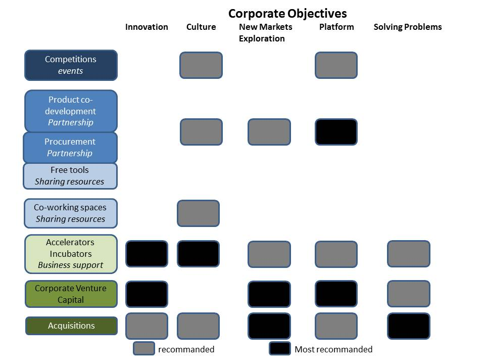

La prochaine conférence des partenaires (7/10/2016) va porter principalement sur les différents modes de collaboration entre les startups et les groupes industriels. Un précédent atelier a porté sur les liens et synergies entre les startups et les collectivités (voir les [**livrables**](http://wiki.lafabriquedesmobilites.fr/index.php?title=Construire_la_Fabrique_des_Mobilit%C3%A9s), ce sujet se poursuit [**là**](http://www.opendatafrance.net/2016/07/12/carrefour-data-innovation/)). Les options sont multiples et le sujet commence à être étudié comme le montre les rapports de l'INSEAD et 500Corporations ou encore ceux de NESTA Winning Together and Scaling Together. Lors de la conférence, nous bénéficierons de retour d'expériences de secteurs qui ont eu à collaborer plus tôt avec des startups, pour ensuite faire un état des lieux factuel des succès et des échecs des différentes parties prenantes.

La France se distingue par un niveau d'engagement des plus élevés des groupes industriels avec les startups sous plusieurs formes. Les collaborations et l'interdépendance n'ont rien de nouveau dans le monde professionnel. Ce qui change ici c'est la nature de la Startup, entreprise numérique qui cherche un modèle d'affaire scalable. Sa fragilité et ses objectifs de croissance en font une structure spécifique qui nécessite de créer des conditions pour que les deux parties soient gagnantes. Les différents rapports s'entendent sur quelques recommandations. Pour le groupe :

- Le dilemme de l'innovateur amène les groupes à maîtriser les innovations incrémentales tout en souhaitant des innovations de rupture. La mise en oeuvre d'une véritable culture du risque et de la rupture n'a rien à voir avec les startups; Cette culture entrepreneuriale doit être développée en amont si le groupe souhaite intégrer des ruptures technologiques ou investir de nouveaux marchés.
- La définition de la stratégie à court et moyen terme est également inhérente au groupe pour pouvoir identifier à posteriori un port folio de startup cohérent lui permettant d'explorer telle ou telle transition. Le groupe doit également prévoir le succès d'un des projets incubés et les conséquences sur les différents métiers et entités de l'entreprise.
- Une fois ces étapes internes franchies, les startups peuvent permettre d'apporter de nouveaux modes de travail, de résolution des problèmes et de collaboration. Il est bien souvent préférable de commencer "petit", par un projet identifié, d'apprendre à itérer ensemble, à le faire avec toutes les structures du groupe (achat, juridique, production) et à avancer à un rythme soutenu. Plusieurs modes de collaboration existent et sont présentés ci dessous. La Fabrique se positionne sur plusieurs modes en abordant l'écosystème dans son ensemble pour créer une culture commune.
- Il est préférable de faciliter également l'accès aux achats pour les startups d'une façon transparente, claire et adaptée. Les sources de données peuvent également être utilisées, une fois structurées et vérifiées en terme de qualité, pour attirer des startups et leur permettre d'innover avec.
- Il est alors possible de scruter les startups intéressantes au niveau mondial tout en proposant un point de contact unique et bien identifié au niveau du groupe. La startup intéressée doit avoir l'image d'une structure "agile et simple".

Les startups sont, par nature, centrées sur leur projet, avec une expérience faible des collaborations et une certaine difficulté à exprimer un intérêt réciproque. Les principales barrières identifiées sont :

- écart trop important dans la vitesse et les processus de décision.
- difficultés à comprendre la stratégie et les objectifs du groupe,
- complexité à identifier les bons interlocuteurs et à conserver un réseau,
- culture de l'innovation différente,
- la phase négociation et protection intellectuelle est trop longue et asymétrique,
- les objectifs des deux parties ne sont pas clairement exprimés,
- la startup n'a pas accès aux ressources dont elle aurait besoin.

Il est conseillé de commencer par un projet avec une équipe dédiée, avec des chaines de commandement et de décision clairement partagées et les plus réduites possibles. La Fabrique des Mobilités crée ces conditions d'un espace temps neutre et bienveillant, permettant aux partenaires volontaires de s'engager dans des projets concrets, directement opérationnels, utiles pour l'écosystème et open source. Les startups de chaque communauté peuvent s'y associer et bénéficier des livrables qui deviennent des objets-liens. Ces collaborations centrées sur des démarches open source présentent plusieurs avantages que nous retrouvons dans les conclusions de ces rapports :

- se définir des objectifs communs, atteignables à court terme,
- être transparents et précis sur les bénéfices de part et d'autre,
- apporter une plus value aux parties prenantes à l'issue de la collaboration,
- plus largement, apporter des bénéfices à des communautés plus large,
- explorer de nouveaux marchés en s'appuyant sur des communautés d'intérêts.

Les études montrent également qu'il existe de nombreuses formes de partenariat en fonction du niveau d'intégration depuis l'achat simple, un partenariat dans le marketing ou la distribution, une licence, un développement commun ou une Joint Venture. L'utilisation de livrables communs open source s'ajoute comme une option permettant de simplifier en amont les questions de propriétés intellectuelles.

La Fabrique des Mobilités travaille pour développer un cadre propice pour toutes les parties prenantes. Des modules de formations seront proposés aux startups et intrapreneurs sur des verrous identifiés lors des ateliers. Le [**Wiki**](http://wiki.lafabriquedesmobilites.fr/index.php?title=Accueil) et la [**plateforme des communs**](http://communs.lafabriquedesmobilites.fr/) constituent également des ressources facilitant la collaboration. Enfin, un [**appel à communs, Open FabMob**](http://wiki.lafabriquedesmobilites.fr/index.php?title=La_Fabrique_%C3%A0_Projets_-_Open_FabMob), va être lancé pour la communauté des acteurs du covoiturage pour identifier, développer et co-financer des ressources open source directement exploitables par tous les acteurs.

Source : NESTASource : INSEAD & 500 corporations

**Pour en savoir plus :**

- Rapports NESTA, [**Winning Together**](http://www.slideshare.net/FabMob/winning-together-65925308) and [**Scaling Together**](http://www.slideshare.net/FabMob/scaling-together),
- [**INSEAD et 500Corporations, How do the world biggest companies deal with startup revolution ?**](http://www.slideshare.net/FabMob/big-companies-startups-deals)
