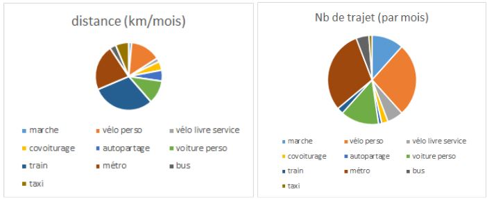

Les offres de "nouvelles mobilités" ne cessent d'apparaître. Essentiellement dans l'urbain, elles deviennent peu à peu illisibles par les citoyens. Des plateformes d'aggrégation comme Free2Move se développent en complément des assistants de mobilité comme CityMapper ou GoogleMap. Mobility Connect est le _symétrique_ vu du citoyen. Ce projet vise à redonner des avantages à l'usager en commençant par lui restituer une grande partie des données le concernant dans les domaines de la mobilité. Il s'agit donc d'un aggrégateur privé de données existantes aujourd'hui éparpillées. Pourquoi personne n'a accès simplement à une version numérique de son permis de conduire, les points associés, le bonus/malus de son assurance, les distances déclarées chaque année ou encore ses parcours en transport en commun. En rassemblant ces données et en pensant "plateforme", le compte Mobilité va apporter de la valeur à tous les acteurs de l'écosystème en commençant par le citoyen !

En s’inspirant de [**France Connect**](https://franceconnect.gouv.fr/), il s’agit donc de produire un compte mobilité individuel, potentiellement universel. Ce compte regroupera les informations de mobilités produites par différents services, objets, applications. Ce compte pourrait ensuite permettre de s’inscrire dans des services de mobilité : Voyage sncf, Uber, Blablacar ou encore tous les réseaux de transport. L'usager l'utilisera comme un France, facebook ou google connect au lieu de retenir les multiples login/mot de passe. A la différence majeure que les données seront gérées par le citoyen épaulé d'un tiers de confiance neutre. Mobilité Connect est à réaliser sans trop tarder avant qu'un GAFA ne le fasse :-)

Chaque compte est individuel. Il contiendra notamment les informations suivantes :

- Permis de conduire
- Nombre de point sur le permis
- bonus/malus assurance
- Âge, famille nombreuse, étudiant/chômeur/... pour bénéficier des meilleurs tarifs adaptés à votre situation sans avoir à justifier à chaque fois,
- Km covoituré - nb covoiturage envoyé par les opérateurs de covoiturage (via la preuve ou autre),
- Km en voiture partagé envoyé par les opérateurs d’autopartage
- Km parcouru en vélo fourni en déclaratif ou autre notamment pour l’IKV,
- Km en bus, train, métro ou nb de badgeage fourni par les opérateurs

La personne a accès à toutes les données le concernant et décide à qui il communique telle ou telle donnée. Dans un second temps, la personne pourra s’inscrire dans un service en utilisant son compte Mobilité ce qui permettra automatiquement un échange de données. C’est un progrès sur les questions de données privées puisque le citoyen va retrouver les données aujourd’hui éparpillées le concernant. Il aura bien sûr accès à ses propres données. Une synthèse publique de son “profil de mobilité” pourrait être produite (voir exemple ci dessous) et partagée avec les acteurs marchands. La _profondeur_ des données partagées reste à définir.

_exemple d'un profil public_

Ce compte permettra de donner des avantages à toutes les parties prenantes :

- Pour les citoyens, le compte permet de retrouver ses données, de mieux connaitre son profil, de bénéficier d’offres adaptées et ciblées, de pouvoir faire du post-paiement en fonction du profil,
- Pour les opérateurs de covoiturage, autopartage, les opérateurs de TC ... : le compte permettra aux usagers de recevoir des avantages donnés par les collectivités, l’état et des acteurs économiques qui pourront facilement déterminer les conditions. Le compte peut également permettre de mettre en oeuvre une solution de post-paiement.
- Pour les collectivités, l’état, l’ADEME : le compte permet de donner des incitatifs aux personnes qui présentent des profils de mobilité “à soutenir”, de faciliter la création de base de connaissances,
- Pour les constructeurs automobiles : le compte permet de faciliter le covoiturage, autopartage, ce qui améliore la solvabilité des acheteurs pour des leasings,
- Pour les acteurs économiques : le compte permet de donner des avantages aux profils intéressants en fonction du profil. Les offres les plus pertinentes pourront être proposées en fonction de chaque profil,
- Pour les vendeurs d’énergie: le compte permet de connaître les économies d’énergies réalisées donc les CEE associés,
- Pour les assurances : le compte permet de donner des avantages aux pratiques de mobilités intéressantes,
- Pour les acteurs de la santé : le compte permet de donner des avantages aux pratiques de mobilités intéressantes,
- Pour la CNIL, cela répond au [droit à la portabilité des données](https://www.cnil.fr/fr/le-droit-la-portabilite-en-questions) : _Le droit à la portabilité offre aux personnes la possibilité de récupérer une partie de leurs données dans un format ouvert et lisible par machine._ _Elles peuvent ainsi les stocker ou les transmettre facilement d’un système d’information à un autre, en vue de leur réutilisation_ _à des fins personnelles._

Les facteurs de succès d'un tel projet pour produire une preuve de concept, se concentrent plutôt sur :

- la vitesse de mise en oeuvre, la réplicabilité au niveau européen,
- le nombre d’acteurs rassemblés autour de la première version du compte pour créer une masse critique suffisante,
- La présence d’un tiers de confiance.

Ce projet vous intéresse ? Retrouvons nous sur le wiki de la Fabrique :

- créer votre compte,
- compléter [**la page dédiée**](http://wiki.lafabriquedesmobilites.fr/wiki/Compte_Mobilit%C3%A9) en cliquant sur 
