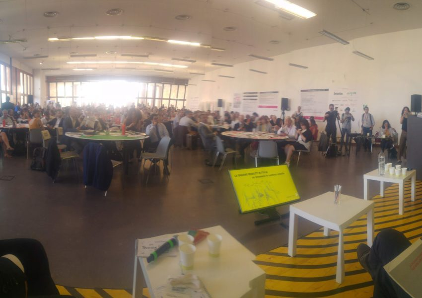
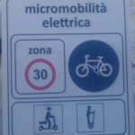
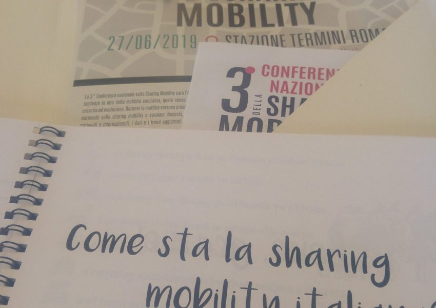

La FabMob a été invitée en introduction de cette 3ème conférence pour présenter son modèle basé sur l’open source et les communs. La [**troisième conférence nationale sur la mobilité partagée**](https://www.fondazionesvilupposostenibile.org/cresce-la-sharing-mobility-5-milioni-di-italiani-la-utilizzano/), organisée par l'Observatoire national sur la mobilité partagée (née d'une initiative du ministère de l'Environnement, du ministère de l'Infrastructure et des Transports et de la Fondation pour le développement durable), en collaboration avec le Réseau des villes vertes et en partenariat avec Deloitte présentait une analyse industrielle et sociale liée aux scénarios actuels et futurs de la nouvelle mobilité. Le rapport national est disponible [**ici**](https://www.fondazionesvilupposostenibile.org/download/16119/). Nous vous donnons ici un résumé.

La FabMob et la Fondation pour le développement durable pourront s’appuyer sur ces connaissances d’un large réseau d’acteurs pour initier une FabMob en Italie en utilisant et/ou produisant des premiers communs utiles aux communautés. Si cette démarche vous intéresse, nous vous invitons à échanger par ce [**canal**](https://chat.fabmob.io/channel/0-italia).

En 2018, les services actifs en Italie (autopartage, partage de scooters, covoiturage, vélos partagés, etc.) représentent 5,2 millions d’inscrits, un million de plus qu'en 2017. La « Sharing Mobility » se développe avec une augmentation du partage de véhicules électriques, notamment grâce au boom du partage de « scooters », les trottinettes électriques (+ 285% des locations en un an). Le partage de vélos a enregistré une légère diminution avec la fermeture de certains services. La popularité d'une mobilité qui révolutionne le mode de déplacement en ville est confirmée : 7961 voitures en auto-partage (2126 électriques), dont 6787 en free-floating; 2240 scooters en partage, 90% électriques; environ 36 000 vélos proposés en partage de vélos et 271 municipalités dans lesquelles au moins un service de mobilité partagée est actif (57% au nord), Milan et Turin étant les villes les plus équipées, et Milan est confirmée comme la ville de la mobilité partagée.

**De plus en plus de véhicules partagés électriques, toujours plus légers**

Le partage de la mobilité devient de plus en plus durable. En effet, en 2018, la part des voitures et scooters électriques partagés par rapport au total a augmenté, passant de 27% à 43% au cours de la dernière année. En plus d'être plus électriques, les véhicules partagés qui circulent sur nos routes sont en moyenne toujours plus légers et moins encombrants: _la masse moyenne des véhicules à moteur a en effet diminué de 17% entre 2015 et 2018_. Des résultats positifs obtenus grâce notamment au boom des services de partage de scooters (présent pour l'instant uniquement à Milan, Rome et Turin) qui ont mis sur la route au cours de l'année écoulée 1 740 véhicules neufs, dont 90% sont électriques, atteignant un quota de 1 million de loyers (+ 285% en 2017).

**L'auto-partage de plus en plus efficace avec Milan en tête, et des premiers pas pour le partage "entre particuliers"**

Carsharing, flottant ou stationné, couvre l’Italie du nord au sud. Le free floating ne se concentre que dans certaines villes du centre-nord, notamment à Rome et à Milan (plus de 6 millions de locations ont été enregistrées à Milan en un an) et la tendance positive des années précédentes se poursuit en termes d'abonnés et de locations effectuées, enregistrant une augmentation de + 26% entre 2017 et 2018. Certes, le nombre de voitures disponibles augmente moins que les années précédentes (ces dernières années, beaucoup a été mis sur la route pour créer un marché), mais ils sont plus utilisées : en moyenne 5 fois par jour en 2018, environ une fois de plus qu'en 2017. L’autopartage en station est répandu dans toute l'Italie. En 2018, d'autres villes du sud du pays ont été ajoutées (Naples, Lecce, Messine, Reggio Calabre et Sassari) et dans ce cas, les indicateurs de membres et de locations ont également un signe plus: respectivement + 37% et + 24% entre 2017 et 2018. La tendance à l'électrification de la flotte se confirme dans le L'année dernière, il a atteint 33% contre 26% lors de la période précédente. Turin est la ville où l'autopartage en gare est le plus populaire. Avec 17 000 abonnés et 1 600 voitures, le nouveau secteur de l'autopartage entre particuliers (peer-to-peer) apparaît dans les villes, offrant un potentiel important compte tenu notamment des chiffres enregistrés dans d'autres pays tels que la France où le parc de voitures est de 24 fois supérieur à celui en Italie. Essentiellement, un particulier met sa voiture à la disposition d'autres personnes (amis, collègues ou membres d'un réseau social "contrôlé") : ils libèrent de l'espace dans les villes.

**Vélo en libre service, lumières et ombres: environ 36 000 vélos (-9% par rapport à 2017)**

Le secteur du partage de vélos est en constante évolution. Seulement un an après leur arrivée à la fin de 2017 avec des milliers de bicyclettes, certains opérateurs de vélopartage en libre-service ont fermé leur service (Rome reste sans service). En revanche, les services les plus organisés dans les grandes villes du nord sont confirmés et 3 200 nouveaux vélos arrivent dans 4 municipalités de petite et moyenne taille: Pesaro, Reggio Emilia, Mantoue et Bologne où le système en libre service dispose également de zones de stationnement réservées aux départs et aux sorties. Par rapport à une flotte stable, le nombre total de bicyclettes (près de 36 000) est réduit de 9% entre 2017 et 2018.

**Le covoiturage corporatif et extra-urbain continue de croître**

Les chiffres observés pour le covoiturage en entreprise sont également excellents (partage de trajets et trajets individuels). Le nombre total d’abonnés augmente avec un taux de croissance similaire à celui des années précédentes, soit environ 70% par an. La croissance des voyages est beaucoup plus soutenue, presque quadruplée par rapport à l'année précédente et atteignant environ 380 000 en 2018, pour un total de 7 millions de km parcourus pour se rendre au travail. Les abonnés au covoiturage extra-urbain sont également en augmentation de 15% par rapport à 2017, dépassant les 2,8 millions au cours de l'année analysée. En 2018, les utilisateurs ont proposé un total de 1,5 million de trajets non urbains, dont 9 sur 10 sur des distances supérieures à 75 km.

**Le nouveau marché numérique et les nouvelles solutions de micro-mobilité s'affirment**

Le nombre de villes dans lesquelles les services numériques de planification de voyage et la gestion de plate-forme de partage de véhicules sont en augmentation continue : 48 en 2018 contre 43 en 2017, permettant ainsi à 7 services supplémentaires de L'année précédente, pour un total de 40. Parmi les plates-formes, il y a Nugo (application disponible pour Android et IOS) qui souhaite jouer un rôle important dans la révolution de la mobilité de partage. La plateforme technologique lancée par le groupe FS Italiane permet d’acheter tous les billets des transporteurs choisis pour le voyage dans une solution unique. Nugo intègre différents modes de transport: du train à l'avion, du bus au métro, du ferry au partage de voiture et de vélo. Les plates-formes numériques dédiées au service de taxi continuent à se développer en termes de diffusion: villes enregistrées et utilisées, enregistrant plus de 3,1 millions de trajets réservés en 2018. Le récent décret du ministère de l'Infrastructure et des Transports a donné le feu vert à l'expérimentation dans les municipalités de micromobilité, solution du "dernier kilomètre". En fait, dans les villes, 50% des trajets se font à moins de 5 km. Des moyens tels que les scooters électriques peuvent, par exemple, devenir une solution pour remplacer les voitures et les taxis sur de courts trajets en s'intégrant aux transports en commun.

**Les villes du partage de la mobilité**

Milan est reconnue comme la ville de la « Sharing Mobility » avec le plus grand nombre d'offres de véhicules par habitant et de locations. Bien placé Turin et Rome, avec ce dernier appel cependant à rattraper le retard dû à l’absence de services de partage de vélos. Grand bond en avant à Bologne qui a inauguré en 2018 deux services de covoiturage et un service de partage de vélos en libre-service. Au sud, les performances de Cagliari et de Palerme se distinguent par leurs services Carsharing et Bikesharing en station.

**Nouvelle mobilité, comme les impacts et les opportunités - analyse de Deloitte**

Pour 6 Italiens sur 10, la mobilité reste aujourd'hui une source de préoccupation quotidienne, avec des impacts à la fois sur la sphère privée (73% influence leur temps de loisir) et sur l'environnement (79%). Malgré le fait que la voiture privée reste le moyen de transport le plus utilisé par les Italiens (57%), plus de la moitié (54%) augmentera l'utilisation des nouveaux services de mobilité au cours des trois prochaines années (même si c'est dans une logique complémentaire et non substituable à la précédente voiture possédée - 69%), à condition que l'offre évolue selon quatre axes: confort économique (requis par 9 Italiens sur 10), facilité d'accès au service (7 sur 10), clarté de l'offre (7 sur 10, ils considèrent que les services ne sont pas encore clairs, également en ce qui concerne les plus populaires - par exemple, le covoiturage, 1 sur 2 ne sait pas qu’il s’agit d’une formule de paiement à l’utilisation) et que l’opérateur fournissant le service est reconnaissable (6 sur 10 ne le sont pas).

Retrouver ici [**toutes les présentations**](https://www.fondazionesvilupposostenibile.org/cresce-la-sharing-mobility-5-milioni-di-italiani-la-utilizzano/) faites pendant la conférence, le [**rapport**](https://www.fondazionesvilupposostenibile.org/download/16119/) et le [**petit guide**](https://cloud.fabmob.io/s/WX6y8okKqDNwTLq) remis durant la conférence qui illustre les évolutions de ce marché.

