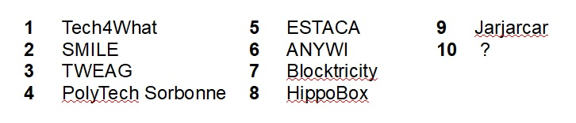

Do you like the smart city platforms? Are you the connected mobility performer or IoT solution developer? Would you like to take part in a [**challenge**](http://occ-challenge.strikingly.com/) organized by FabMob in Paris around Open Hardware Solution, in order to simplify data production and utilization from different type of vehicles?

We have **[3 use cases](https://drive.google.com/open?id=1-Wdh9qZxoaBs5Awdrbb1dpz3fv8_hMCz)** for you, defined by connected mobility stakeholders. The Challenge will run, in partnership with Movin'On LAB - Michelin, Sierra Wireless, Kisio Etudes & Conseil, AFD (French Development Agency), ADEME and Richardson RFPD. 

<iframe style="border: 1px solid #CCC; border-width: 1px; margin-bottom: 5px; max-width: 100%;" src="//www.slideshare.net/slideshow/embed_code/key/9iccFXOiOGdVb1" width="668" height="300" frameborder="0" marginwidth="0" marginheight="0" scrolling="no" allowfullscreen="allowfullscreen"></iframe>

**[Use cases Boitier Open Source](//www.slideshare.net/FabMob/use-cases-boitier-open-source "Use cases Boitier Open Source")** de **[FabMob](//www.slideshare.net/FabMob)**

**Open Source Electronic Kits are yours !!**

To move forward from idea to MVP (Minimum Viable Product) quickly, we prepared for you the Open Source Electronic Kits, a LTE mobile connectivity solution, and a cloud platform solution. Your prototype will simply have to be experimental. In the meantime, a technical support will be available on the online communication platforms (GitHub / the challenge forum and the web site). **Kick-off** took place February 19 @9:30 am in Michelin offices. 9 teams are already involved in the Challenge !

Challenge is still open until end of february => **[SUBMIT](https://docs.google.com/forms/d/e/1FAIpQLSdFiOPiEtkvIh4I04xnkSNT29GG-xcf04qf-fQyFtOoQ50dzQ/viewform)** [**NOW**](https://docs.google.com/forms/d/e/1FAIpQLSdFiOPiEtkvIh4I04xnkSNT29GG-xcf04qf-fQyFtOoQ50dzQ/viewform)

Prototypes your finalized application before April 30, 2019. Teams will be accompanied by the challenge partners and FabMob, to find a field of experimentation (Territories, operator of transport, sharing initial costs, etc). Without forgetting our 3 considered prices of 5000 €, 2000 € and 1000 € for the 3 best projects.
