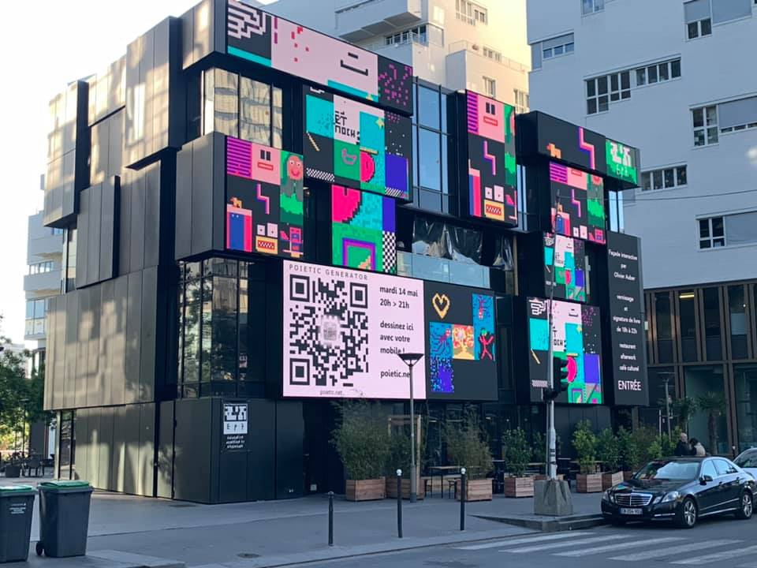

> Le temps n'a pas d'importance, seule la vie est importante - le 5ème élément

En matière d’innovation, le temps, réel et perçu, joue un rôle prépondérant. Bien souvent on considère que la rapidité d’accès aux marchés conditionne une partie des facteurs de succès.

Cette caractéristique est liée à la façon dont les acteurs se coordonnent, échangent, comprennent leur rôle en continu individuellement et collectivement ou encore ajustent leurs actions en fonction des autres et de l’évolution du contexte. Ont-ils besoin d’une personne pour se coordonner et leur indiquer comment agir quand le contexte change ? Comment prennent-ils leur décision ? Jusqu’à présent, les projets collaboratifs synchronisent les acteurs par des contraintes avec des rapports hiérarchiques et des chaînes de commandement fixées à l’avance. Dans un contexte où nous commençons à faire le deuil d'une quelconque capacité à prévoir les prochains évènements, la question de la compréhension et gestion du temps devient centrale.

Dans la FabMob, nous observons d’autres temporalités. Si, en apparence, les choses vont plus lentement, les productions de communs possèdent d’autres qualités et de nouvelles compétences se développent. La FabMob intègre dans ses actions la question des temporalités en agissant sur des durées de l’ordre de [18 mois](http://lafabriquedesmobilites.fr/articles/18-mois-temps-mort-de-linnovation/). Cette durée est le bon compromis pour mettre en tension positivement les rythmes de plusieurs territoires, entreprises ou encore startups.

Cet article est issu de la lecture du livre [_Anoptikon_](https://boutique.fypeditions.com/products/anoptikon-une-exploration-de-linternet-invisible) d’Olivier Auber qui apporte un point de vue intéressant sur les communs, un point de vue "non optique", c’est à dire an-optique précisement. _Anoptikon_ explore plusieurs perspectives ouvertes par un logiciel ludique : le générateur poïétique (GP).

# Le générateur poïétique (GP)

Le GP est à la fois un logiciel, un jeu et une oeuvre d’art utilisable par tout le monde. [Un site en ligne](http://play.poietic-generator.net/) permet à chacun d’expérimenter très facilement le GP. Chaque personne dessine sur un carré de 20x20 pixels, peut changer la couleur de chaque pixel et voit son dessin positionné dans une oeuvre collective formée par tous les dessins individuels des participants. Il n’y a pas de limite au nombre de participants simultanés. Une fois le temps de la découverte passé, chacun dessine en tenant compte, ou pas, des dessins adjacents à son propre dessin, d’une image globale qui pourrait émerger. Chaque participant est traité de la même façon, sans aucune hiérarchie, ni préférence, avec la même image globale renvoyée.

 _Projection live dans Paris_

Il y a donc une forme émergente collective générée par des dessins individuels. Le GP a d’abord été mis en oeuvre sur des minitels, puis des ordinateurs via un serveur central, mais également dans une version totalement décentralisée dite _multicast_. En fonction des tracés individuels, des formes globales peuvent émerger. Chacun voyant ce qu’il a envie de voir…

 _Une forme dans un nuage apparait (pour certains) puis disparait._

# Une perspective temporelle

Rappelons que le concept de [perspective](<https://fr.wikipedia.org/wiki/Perspective_(repr%C3%A9sentation)>) a été déployée lors de la Renaissance pour représenter une certaine vision du réel avec un point de vue unique. Le GP et son serveur central représentent également une perspective différente que l’on peut qualifier de temporelle.

Le serveur collecte et renvoie les dessins individuels, il devient le point de fuite. Les informations transmises par chaque participant sont agrégées et renvoyées à tous les participants en toute transparence sous la forme d’une nouvelle image globale émergente, sans filtre, instantanément. Chacun décide de faire évoluer son dessin comme il le souhaite en tenant compte de l’image globale ou pas, sans système de contrôle ou d’incitation. Le GP génère ainsi des pulsations temporelles produites par les réactions de chaque participant.

> Un temps _intersubjectif_ propre au collectif émerge. Seules les règles du GP conditionnent le fonctionnement du collectif.

Nous retrouvons exactement cela dans la production d’un nouveau commun. Par essence, au départ, il n’existe pas; il émerge, comme l’image globale du GP, sous la forme d’un « condensat » des interactions de plusieurs participants. Son émergence est conditionnée par les règles fixées par la communauté (aidée si besoin par la FabMob). Puis les itérations se suivent en fonction de l’apparition d’une première image globale dans laquelle une puis plusieurs personnes reconnaissent un commun intéressant. **Une temporalité dite intersubjective propre à cette communauté va alors dicter l’avancée du commun. Cette temporalité n’est pas prévisible ni maîtrisable à priori. L’auteur Olivier Auber parle alors d’un nécessaire « lâcher prise des instances politiques».** Ce point sera essentiel pour de prochains appels à communs.

Concrètement, l’émergence, en devenant « une réalité objective » (c’est à dire une connaissance, donnée, logiciel ou matériel) permet aux premiers membres de la communauté de valider que cette première « production commune » correspond bien aux attentes des parties prenantes. Nous retrouvons là le rôle du prototype, essentiel pour matérialiser une production commune et permettre ainsi aux membres de réagir.

> Le commun, le prototype, l’image globale du GP deviennent des points d’appui pour engager un nouveau cycle.

L’émergence permet également à d’autres de rejoindre la dynamique, avec pour conséquence de relancer les pulsations temporelles et de générer de nouvelles émergences. Chaque émergence est alors regardée sous l’angle des « cas d’usages » (Est ce que le commun répond bien aux usages envisagés, aux problèmes rencontrés ?) tout en devant respecter les règles que la communauté se fixe à elle-même (Quelle gouvernance et licence de cette émergence et des versions futures ?).

La temporalité intersubjective spécifique à chaque commun-auté va alors se mettre en oeuvre, dépendante de la complexité du commun et des cas d’usage, du nombre de parties prenantes impliquées. Voilà pourquoi les dynamiques autour des communs n’ont aucun rapport avec des projets traditionnels. Ces derniers sont caractérisés par une part d’asymétrie due à une temporalité imposée et une inéquité d’accès aux livrables. **Voilà aussi pourquoi il n’est pas possible a priori de planifier complètement la mise en oeuvre de communs dans tel ou tel domaine**. Puisque le temps n’est pas maîtrisable, c’est **l’attractivité** du commun qui est essentielle à maximiser pour faire comprendre sa valeur puis attirer de potentiels contributeurs qui viendront aider à faire grandir le commun.

Cette attractivité se travaille également aux niveaux des conditions les plus favorables à l’émergence d’un commun : transparence sur les objectifs et les productions, équipotentialité d’accès (tout le monde peut entrer et sortir avec les mêmes règles à respecter), horizontalité et documentation intégrale.

Notons également que la présence du serveur central reproduit les lieux physiques dans lesquels les humains se sont regroupés depuis toujours pour interagir et synchroniser des collectifs en plaçant en leur centre des chefs, chamanes, prophètes ou rois. Les Fabriques ou encore certains tiers lieux jouent un rôle pour que les perspectives temporelles soient plus « fécondes » car leurs hôtes auraient créé les conditions pour faire émerger des communs, pour réduire voire supprimer toute centralité.

# Une perspective numérique

Le GP a été développé dans une première version fonctionnant avec un serveur et un web dit unicast, c’est-à-dire fonctionnant avec une machine choisie pour être « au centre ». Puis une seconde version a été développée pour fonctionner avec un web expérimental (qui ne vit jamais le jour) dit multicast, c’est-à-dire totalement symétrique avec des noeuds jouant tous les mêmes rôles. Le logiciel du GP est dans ce cas alors totalement « distribué » et l’image émergente du GP n’est plus centralisée sur une seule machine. Le point de fuite temporel a alors « disparu » et la perspective devient alors numérique.

Le seul commun entre les membres du collectif est alors un « code ». Ce dernier organise les échanges de façon symétrique et synchrone entre toutes les parties prenantes tout en garantissant une équipotentialité d’accès à l’information et à la communauté. Chaque machine fournit alors une sorte de perspective. Le code, appelé « code de fuite », rassemble trois composants : un signe de reconnaissance (pour rejoindre le groupe), un protocole d’échange et un algorithme de traitement. Nous retrouvons là les règles mises en oeuvre pour [les communs numériques](https://communs.mattischneider.fr/2-constituants) bien décrites par Matti Schneider.

Concrètement dans la Fabrique, même si nous utilisons un internet unicast, cela souligne l’importance d’utiliser et de produire des outils et des codes open source pour rendre visibles et auditables les protocoles d’échanges ainsi que les règles de fonctionnement des communautés. Par ailleurs, nous retrouvons dans les règles de fonctionnement de la FabMob, la capacité offerte à tout le monde de la rejoindre (ou de la quitter), de s’impliquer dans un groupe, d’initier un commun sans aucune barrière à l’entrée en se reconnaissant et en se faisant confiance ou encore de récréer une Fabrique.

# GP et culture

Nous pensons que les personnes impliquées régulièrement dans des démarches de communs, similaires au GP, développent progressivement des formes de synchronisation dans la compréhension des émergences, les phases d’itérations, la maîtrise des temps intersubjectifs et globalement les processus créatifs collectifs. Par exemple, nous avons décidé de [badger ces compétences](https://wiki.lafabriquedesmobilites.fr/wiki/D%C3%A9couvrir_les_OpenBadges_%C3%A0_la_FabMob) pour les reconnaître et les rendre visibles. Il est ainsi probable qu’une pratique régulière de perspectives anoptiques améliore les capacités des personnes à créer collectivement dans des collectifs multi-culturels, hétérogènes avec un grand nombre de personnes.

Un autre avantage majeur de ce mode de fonctionnement vient de son agilité, son adaptabilité. Nous pouvons constater que le contexte dans lequel nous agissons n’est plus stable et planifiable. Caractérisé de VICA (volatil, Incertain, Complexe et Ambigu), il oblige les démarches collectives à se réajuster en permanence.

> Aucun projet prévu sur 3 ans ne se déroulera comme prévu dans le Gant chart. Aucun. Nous le savons et continuons malgré tout à produire et à utiliser les mêmes méthodes et outils.

Il devient donc essentiel d’agir collectivement avec de nouvelles méthodes intégrant dès le départ notre incapacité à prévoir les 3 prochaines années. En s’appuyants sur les outils, les règles des communs, la FabMob outille progressivement l’écosystème d’un autre mode d’intervention en raccourcissant les prises de décision. Le commun, l’émergence de la communauté, devient à la fois la production collective, un objectif à atteindre et en même temps le moyen pour y arriver. Grâce à la documentation intègrale et l’open source, **le commun devient par lui-même un Gant chart actualisé en temps réel**, les prochaines actions souhaitables y sont spécifiées pour mieux inviter les contributeurs. Le commun fournit ainsi à chaque contributeur des informations contextualisées et actualisées permettant à chacun de s’ajuster dans le collectif.

S’impliquer dans les communs amène ainsi chaque personne à avancer sur un chemin individuel, à se former pour explorer les perspectives temporelle et numérique. Chaque émergence, en étant des réalités objectives prêtes à être expérimentées, va lui permettre de se synchroniser avec sa structure, son entreprise et ses collègues « restés » dans des considérations plus classiques des marchés, de l’innovation, de la propriété intellectuelle ou encore des modèles d’affaires.

Nous avons plus de [30 communs au stade de l’idée](https://wiki.lafabriquedesmobilites.fr/wiki/Les_nouvelles_Id%C3%A9es_de_Communs) aujourd’hui sur le wiki. Rejoignez-nous avec vos lunettes anoptiques :-)
