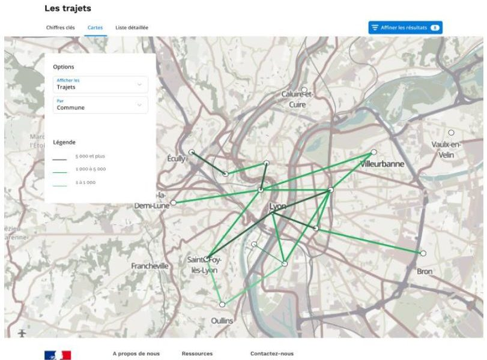

En 2016, dans les locaux du Conseil Départemental des Alpes Maritimes, un groupe de travail de la Fabrique des Mobilités se réunissait en marge d’un évènement sur les smart cities (voir le [CR de cet atelier](https://wiki.lafabriquedesmobilites.fr/wiki/Communaut%C3%A9_autour_du_Covoiturage_quotidien_Atelier_N%C2%B01) avec les présentations et toutes les productions). Ce groupe était constitué des principaux acteurs du covoiturage en France. La question posée était singulière : « **De quoi avez-vous besoin maintenant (pour mieux atteindre vos objectifs) et que vous avez intérêt à faire ensemble ?** ».

Post-it, idéation, travail en groupe etc… une des propositions s’intitule « preuve de covoiturage ». Les autres portent sur des problèmes qui ont également bien avancé comme le standard des données pour améliorer l’interopérabilité inter-opérateur ou encore une base de données des aires de covoiturage. L’idée de la preuve est simple : pouvoir **attester** qu’une personne a **vraiment** covoituré pour **légitimer** un soutien financier venant d’une collectivité, de l’état ou d’une entreprise pour ses salariés.

Le besoin est réel à la fois du côté des opérateurs de covoiturage, mais également des collectivités présentes. Les parties prenantes ont bien « intérêt à faire ce développement ensemble », de façon coordonnée et mutualisée, et à la réaliser en open source pour qu’il devienne, peut-être, un standard.

Une fois le besoin exprimé, la FabMob progresse avec les parties prenantes pour mieux décrire le problème – les pistes pour arriver sur le marchéc et recherche un moyen de financer un premier prototype. Le programme Beta.gouv se trouve le mieux placé pour développer et tester le concept. Grâce à un financement de l’ADEME puis de la DGITM, la startup d’Etat Covoiturage.beta.gouv [http://covoiturage.beta.gouv.fr/](http://covoiturage.beta.gouv.fr/) est créée avec une cheffe de projet et des développeurs. Sa présentation, son fonctionnement et ses spécifications sont détaillées sur ce [gitbook](https://registre-preuve-de-covoiturage.gitbook.io/produit/). Après avoir rassemblés des territoires pilotes et un premier cercle d’opérateur de covoiturage, la startup d’état se concentre sur le fameux Registre de Preuve de Covoiturage, développe un premier prototype et le teste.

Des échanges avec les collectivités, d’autres besoins deviennent visibles et les objectifs de la startup se complètent pour progressivement devenir la plateforme numérique publique de soutien au développement du covoiturage. Elle apporte notamment :

- des Conseils
- de l'Accompagnement pour concevoir une politique d’incitation ciblée
- un Observatoire du covoiturage sur le territoire pour cibler la mise en œuvre d’infrastructures de type parking de covoiturage ou voies dédiées
- une Mise en cohérence avec la mesure nationale du Forfait Mobilité

Le registre de preuve se développe également vers les employeurs pour leur salarié pour leur permettre également de concevoir, suivre et valider une bonne politique d’incitation au covoiturage. Grâce aux mécanismes de certification, les échanges de données entre les opérateurs et les collectivités via le registre (acteur neutre), permettent de constituer de nouvelles connaissances à forte valeur ajoutée pour les collectivités : **la connaissance des flux covoiturés sur le territoire pour tous les opérateurs** (exemple ci dessous à Lyon).

[source](https://cloud.fabmob.io/apps/files/?dir=/Documents/Formations/Mast%C3%A8re%20Smart%20Mobility%20Telecom%20Ponts/Ishan%20Bhojwani&fileid=2710#pdfviewer)

Ces connaissances sont à la frontière des données privées confidentielles des opérateurs et de celles des usagers du covoiturage. Elles permettront aux collectivités de bien cibler le prochain parking de covoiturage ou encore tester une voie réservée aux covoiturage.

> Ces connaissances émergent des pratiques de covoiturage via le registre et permettent à leur tour de concevoir, piloter et légitimer une politique publique du covoiturage. Le registre est donc la première plateforme numérique publique concernant les mobilités. Cette plateforme numérique publique a pour objectifs de concurrencer par ses fonctions les plateformes privées de type Waze connected citizen, Strava, Replica HQ de Sidewalk labs.

De l’idée à la plateforme, il aura donc fallu 4 années. Cette plateforme, aujourd’hui en fonctionnement, relie plusieurs parties prenantes de façon neutre, pour leur apporter à chacun de la valeur :

- Financière pour les opérateurs de covoiturage via les incitatifs,
- Financière pour les utilisateurs du service de covoiturage via les incitatifs,
- Des certifications pour légitimer l’aide publique pour les collectivités,
- Des infrastructures pertinentes aux bons endroits (parking, voies réservées),
- Un moyen pour mettre en œuvre une nouvelle politique publique, le forfait mobilité

Toutes les productions étant open source, le Registre de Preuve de Covoiturage intéresse la province du Québec pour les mêmes raisons qu’en France et des premiers échanges ont déjà eu lieu. Nous avons intérêt à faire de ce registre un standard international, pour nos collectivités mais aussi pour nos entreprises de covoiturage car elles auront déjà des systèmes techniques compatibles avec le registre.

Ce principe de certification, la Fabrique veut l’étendre à tous les modes, selon les mêmes principes : servir les intérêts de toutes les parties prenantes dans une logique de neutre et de bien commun. Le projet [Mon Compte Mobilité](https://cloud.fabmob.io/s/FqWd2SaXKEjSTRg), récemment sélectionné dans le cadre de l’Appel à Programme CEE Mobilité par la DGEC, vise à prototyper un tel dispositif en 3 ans avec 3 territoires pilotes. Nous devons construire de n[ouvelles plateformes numériques publiques](http://lafabriquedesmobilites.fr/articles/innovation/lage-des-infrastructures-numeriques-publiques/) pour mieux gouverner dans la complexité.
