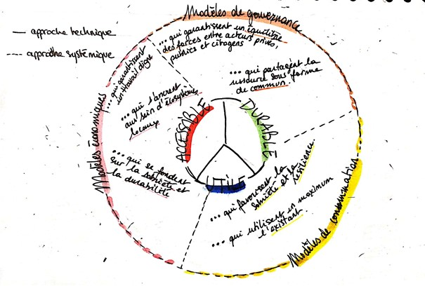
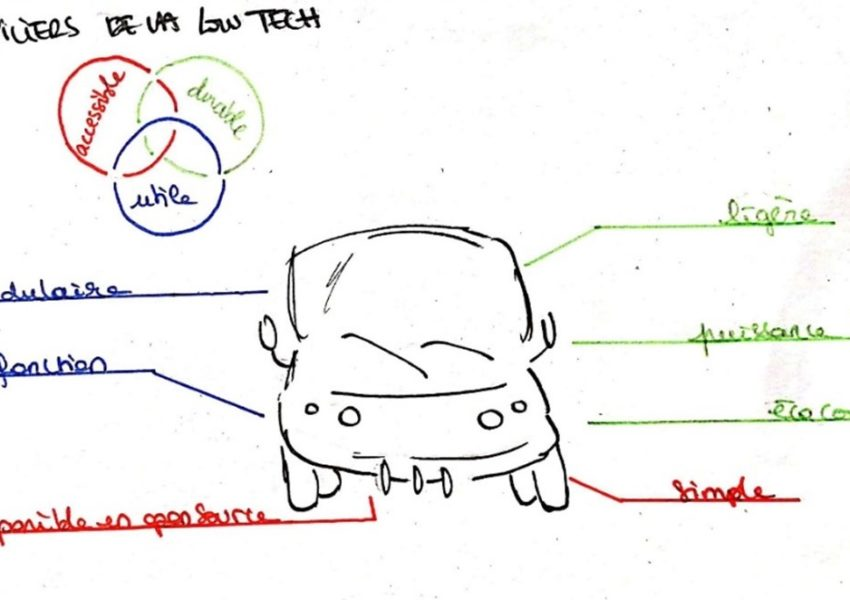

_C'est dans le cadre de mon master 2 à Sciences Po Rennes que j'ai effectué un rapport d'expertise sur les low-tech et la mobilité. En effet, le secteur des mobilités est marqué par une vision hautement technologique, en témoignent les nombreuses applications et nouveaux gadgets de mobilité entrant sur le marché. Parallèlement, j'entamais déjà des réflexions sur les low-tech à la suite de la lecture de l'Âge des low-tech de Philippe Bihouix et le numéro "L'Avenir sera low-tech" de Socialter. Marquée par l'approche d'une position écologique radicale, inclusive et systémique, le mouvement low-tech s'ancre aujourd'hui dans le réel via des associations comme le Low-tech lab qui promeut et invente des innovations pour se loger, se chauffer, se nourrir, etc. Néanmoins, il existe encore peu de littérature et d'innovations appliquées au secteur des mobilités. C'est pourquoi, je me suis lancée dans une première analyse du rapprochement entre les low-tech et les mobilités du quotidien. Je vous propose donc la lecture de cet article pour titiller votre curiosité, étayer vos connaissances sur le sujet ou peut-être même participer à la réflexion sur les espaces dédiés suivants : la [page wiki](https://wiki.lafabriquedesmobilites.fr/wiki/Peut-il_y_avoir_un_int%C3%A9r%C3%AAt_%C3%A0_d%C3%A9velopper_les_low-tech_en_mobilit%C3%A9_%3F) et/ou le [chat](https://chat.fabmob.io/channel/low_tech))._

« _De 60 millions d’euros initialement prévus, l’État remonte \[…\] le plafond à 200 millions d’euros_ »[\[1\]](http://»#fn1″) dédiés pour le vélo. Voici une des bonnes nouvelles annoncées dans le plan de relance suite à la crise sanitaire du Covid19. En effet, la bicyclette, grande représentante des mobilités urbaines, a eu un regain d’intérêt au sein des politiques publiques. Bien que l’on pourrait y voir une réelle prise de conscience écologique en faveur des mobilités durables de la part des élu.e.s et des citoyen.ne.s, une autre tendance moins encourageante se dessine.

Il est en effet intéressant de constater que l’autosolisme[\[2\]](#_ftn2) ne recule pas dans de nombreuses villes. Voiture électrique, autonome et connectée, micromobilités ou encore applications en tout genre apparaissent comme les solutions de mobilité durable. Les opérateurs de ces solutions annoncent allier à la fois notre besoin de confort, de rapidité, de praticité tout en respectant les objectifs de développement durable. On pourrait presque y croire ! Néanmoins en s’y penchant de plus près, on remarque un certain nombre d’incompatibilités entre ces projets et la transition écologique et solidaire : _Que fait-on de ce surplus d’électricité à produire pour faire fonctionner toutes ces voitures électriques ? Que fait-on de cette dépendance au pétrole qui converge vers une autre dépendance, notamment celle aux métaux ? Que fait-on de ce système fondé sur le « toujours plus » impliquant une injonction à l’hypermobilité ?_

Travaillant pendant la rédaction de ce mémoire au sein de la Métropole Européenne de Lille sur les sujets de management de la mobilité et mobilités innovantes, j’ai été frappée de l’argument des technologies numériques presque systématique invoqué par les porteurs de projets que l’on rencontrait.  Par conséquent, j’envisage ce mémoire comme une occasion de faire un pas de côté afin de m’interroger sur le mouvement qui prend le contre-pied de l’apologie aux technologies surreprésentées : les low-tech.  Sur le papier, les low-tech permettent de faire mieux avec moins. Ce sont des objets, des systèmes techniques, des services et savoir-faire répondant aux critères d’utilité, de durabilité et d’accessibilité. Alors que ce concept trouve de réelles opportunités de développement dans certains champs d’application comme dans l’habitat[\[3\]](#_ftn3), ce nouveau mouvement n’a que peu de résonnance dans le secteur de la mobilité. J’ai donc essayé de décrypter au cours de ce mémoire ce que serait l’intérêt pour la transition écologique et solidaire d’intégrer les low-tech dans la mobilité du quotidien et la façon de le faire.

**La voiture individuelle : l’apport d’une technologie de mobilité qui a profondément changé notre façon d’habiter le monde.**

Ah la voiture électrique ! Grande gagnante des dernières innovations de mobilité, elle fait figure de principal espoir du secteur automobile pour se convertir à la mobilité « durable ». En effet, ce bijou technologique ne rejette pas de pollution directe en termes de gaz à effet de serre et promet ainsi d’incarner le futur de la mobilité[\[4\]](#_ftn4). Il convient néanmoins de nuancer cette promesse de mobilité durable. Soulignons, par exemple, l’extraction indispensable de divers métaux en forte tension, comme le néodyme, manganèse ou encore l’or. À cela s’ajoutent d’importantes consommations énergétiques issues des énergies fossiles pour l’extraction de ces métaux, mais aussi pour l’état de marche et la fin de vie du véhicule.

> La vision selon laquelle il existe un produit miracle qui pourrait résorber notre déviance à la surconsommation ne peut pas conduire à une transition écologique effective.

Citons d’abord l’effet rebond : la seule innovation de la voiture électrique entraîne les ménages à utiliser davantage leur voiture si son coût d’utilisation baisse ou est constant. Cela s’accompagne d’un effet d’entraînement : la voiture électrique constitue tout un système industriel, économique et social qui nous laisse dans une même impasse, celle d’une société dépendante à l’automobile. Cette vision techniciste qui prétend que le levier technologique peut résoudre les dérèglements environnementaux et sociétaux est en réalité déconnectée de la transition écologique et solidaire.

**Proposer une transition écologique et solidaire radicale et cohérente**

En effet, une transition écologique et solidaire peut se mener sans soubresauts schizophréniques via trois piliers :

- **Sobriété** de consommation.
- **Proximité** dans nos façons d’habiter, de se nourrir, de travailler, de s’éduquer et de se divertir.
- **Réappropriation des technologies** en interrogeant notre rapport à celles-ci pour les abroger, les modifier ou les conserver.

Ce système œuvrant pour une écologie radicale et systémique est, selon ma vision, low-tech. Plus généralement, cette dynamique est définie par l’association du [Low-tech Lab](https://lowtechlab.org/) comme des objets, des systèmes techniques, des services et savoir-faire qui sont :

- **Utiles** car répondent à des besoins essentiels tels que l’accès à l’eau, à l’alimentation, l’habitat, l’hygiène, les transports …
- **Durables** dans leur fabrication, leur utilisation, leur intégration au sein d’un écosystème vivant.
- **Accessibles** en termes de prix, de connaissances et de compétences.

> L’approche low-tech ne réside pas en sa simple dimension technique mais est bien plus ambitieuse. Il est question de reconscientiser la technique et les relations complexes de dépendances sociétales qu’elle créée.

C’est ce que Philippe Bihouix appelle l’enchâssement.

Alors que nous assistons à la multiplication des crises économiques, sociales, environnementales et/ou sanitaires, le système technique fondé depuis la Révolution Industrielle sur l’exploitation croissante des ressources semble caduque. Si seulement nous avions eu un accès illimité et infini aux ressources pour répondre aux différentes crises ! Cependant, la réalité des limites planétaires nous rattrape chaque jour de plus en plus vite. Il est grand temps de nous adapter et de prouver notre capacité de résilience. L’objectif n’est pas de sauver la Terre, ni de la réparer, puisque tout cela est purement impossible. L’objectif, maintenant, est de trouver des moyens d’anticiper et de s’adapter. Quelle entreprise me direz-vous ! Effectivement, le travail collectif et individuel de mettre notre hybris de côté peut être fait de mille et une façons.

**Alors essayons de comprendre les raisons de cette fuite en avant**.

Un bref état des lieux de notre mobilité montre que nous assistons aujourd’hui à une course au toujours plus vite, toujours plus loin. C’est donc naturellement, que le concept de vitesse et d’échelle ont largement travaillé la trame de mon mémoire. _En quoi notre rapport au temps et aux échelles détermine notre façon de nous déplacer ?  Est-ce que cela génère un système de mobilité polluant, peu résilient et inégalitaire ?_ J’ai tenté de répondre à ces nombreuses questions lors d’[interviews](https://wiki.lafabriquedesmobilites.fr/wiki/Peut-il_y_avoir_un_int%C3%A9r%C3%AAt_%C3%A0_d%C3%A9velopper_les_low-tech_en_mobilit%C3%A9_%3F) avec différents profils (universitaire, ingénieur, chargé de mission en collectivité, journaliste…) concernés par le sujet.

L’une des conclusions que j’ai pu tirer de ces échanges est qu’il faut aborder une mobilité, voire une société, où nous nous interrogeons au rapport que l’on a aux temps et aux échelles.

**Rentrons dans le vif du sujet : mobilité durable, aujourd’hui, _greenwashing_ ?**

En France, le secteur du transport a représenté 31 % des émissions nationales de gaz à effet de serre (GES) en 2018. Il s’agit alors du premier poste d’émissions de GES, en raison de sa forte dépendance aux énergies fossiles.

> Le premier facteur de hausse continue des émissions est dû en grande partie à une demande en constante augmentation.

Selon le scénario de la Stratégie Nationale Bas Carbone (SNBC), cinq leviers sont identifiés pour décarboner le secteur : la demande de transport, le report modal (par exemple passer de la voiture individuelle au vélo), le taux de remplissage des véhicules, l’efficacité énergétique des véhicules (fabriquer des véhicules plus efficients) et l’intensité carbone de l’énergie (utiliser une énergie moins émettrice). L’analyse de la SNBC par Aurélien Bigo [\[5\]](#_ftn5) montre une stratégie fondée en priorité sur le levier technique par l’amélioration des technologies de véhicules et de carburant. Cette conception de la mobilité, floquée « durable », est insuffisante (voire peut-être même inefficiente) face aux enjeux de transition écologique et solidaire. Nous arrivons comme le spécifie Laurent Castaignède dans son ouvrage _Airvore, où la face obscure des transports_ dans une impasse : _«_ _le verdissement de ce secteur d’activité par l’affichage de moindres émissions de polluants sur banc ou par l’utilisation de carburants renouvelables se révèlent trop souvent \[…\] contre-productif. Et les nouvelles technologies que l’on nous promet semblent suivre le même chemin, réduisant la pollution de l’air ici, l’augmentant ailleurs, avec des consommations d’énergie et de matériaux et des émissions globales en constante augmentation »._

**Chercher une autre issue : l’avènement de la mobilité low-tech**

\> À quoi ressemblerait une technologie low-tech de mobilité ?

Un véhicule low-tech serait léger, avec une puissance bridée, simple, écoconçu (dans les matériaux utilisés, le design aérodynamique, la facilité de réparation), modulable et multifonctionnel, le tout disponible en open-source.Cependant, il ne faut pas se leurrer, même conçu de façon low-tech, le véhicule motorisé n’en reste pas moins high-tech.

> En réalité, une mobilité low-tech s’incarne par les modes actifs : vélo et marche qui permettent de réexpliciter l’effort énergétique à fournir (puisque le carburant c’est vos jambes !).

Ces modes sont garants d’une mobilité plus consciente, plus locale et plus lente. Portées depuis 10 ans, les stratégies modes doux sont donc essentielles dans le mouvement de la mobilité low-tech. Néanmoins, on note une faible augmentation de la part des modes actifs dans les grandes enquêtes mobilité. En effet, les chiffres de la dernière enquête nationale transport soulignent une baisse du vélo entre 1982 et 2008, passant de 4,5% à 2,7% de part modale. Les efforts notés depuis 10 ans, notamment sur les aménagements cyclables, sont devenus incontournables dans la politique mobilité des Autorités Organisatrices de Mobilité (AOM). Nombreuses sont les métropoles à se vanter d’une politique cyclable pro-active alors que la réalité peut parfois cacher des résultats plus timides (notamment pour Lille, Nantes et Rouen)[\[6\]](#_ftn6). C’est, en ce sens, qu’il est nécessaire de développer en concomitance des conditions d’émergence à une dimension low-tech plus systémique. 

\> Une seule approche technique, même low-tech, est insuffisante, l’objectif est de proposer un système de mobilité low-tech

Premièrement, on peut identifier l’urbanisme comme levier à activer pour proposer une politique fondée sur la sobriété. Plus de proximité, plus de mixité fonctionnelle et le retour à de plus petites échelles sont les éléments clefs d’une mobilité plus sobre. Il est aussi essentiel d’avoir un paysage de contraintes et d’incitations cohérent en faveur des modes les moins polluants. Ce qui n’est pas forcément le cas aujourd’hui. Les acteurs de la mobilité durable (entreprises, coopératives, collectivités, associations et collectifs citoyens) doivent provoquer un changement de perception pour contrer les freins au changement et casser les habitudes ancrées des usagers. Plus largement, nous devons renoncer collectivement à cet idéal mobilitaire incompatible avec le monde fini. Arrêtons de fonder nos systèmes sur l’hypermobilité, aujourd’hui à la limite de l’injonction morale. Arrêtons d’être soumis à cette obligation d’appartenir à la génération « globetrotter ». Prenons conscience que l’hypermobilité est entretenue par des _business model_ ventant et vendant toujours plus de produits de mobilités polluants, en témoigne la tendance des SUV.

**En bref !**

Différentes pistes de réponses, illustrées d’exemples inspirants, ont été apportées dans la troisième partie de mon mémoire. Pour résumer, ma définition de la low-tech n’est pas l’abolition des technologies mais bien le rééquilibrage de celles-ci face aux enjeux de soutenabilité. Plusieurs leviers sont identifiés : contraindre l’industrie automobile, proposer un paysage fiscal et d’incitations cohérents, fédérer une filière vélo, favoriser et sécuriser les modes actifs par des politiques publiques ambitieuses et enfin organiser, planifier, aider aux modes de vie plus locaux et plus lents. 

Alors peut-être que je n’aurais pas réussi à vous convaincre. En effet, la tâche est lourde et semble parfois diffuse. Néanmoins, le mouvement low-tech est pour moi une chance d’ouvrir d’autres imaginaires qui rompent avec la vision anthropocentrée fondée sur une technologie salvatrice. En effet, comme le dit Philippe Vion-Dury, rédacteur en chef de Socialter dans le hors-série « Le réveil des imaginaires », _« L’imaginaire est ce monde intérieur invisible qui se déverse dans l’inconscient collectif de nos sociétés pour forger notre devenir commun. Il est ce qui transforme le normal en anormal et l’anormal en normal. \[…\] Mais plus la crise s’approfondit, plus notre sensibilité, notre présence au monde, notre liberté, notre égalité, nos solidarités s’étiolent, plus ces voix dissidentes se font fortes. \[…\] Nous sommes certainement à l’aube d’une grande résurgence des imaginaires collectifs « comment pourrions-nous vivre ne suffit plus » : voilà qui vient « comment voulons-nous vivre ? » »._

> C’est donc là la force de l’imaginaire : le récit n’a pas la simple vocation à rester fiction, mais bien de s’ancrer dans le réel pour faire jaillir des espaces de résistance.

Alors à vos vélos, à vos baskets et peut-être à vos crayons pour inventer les futures innovations low-tech de mobilité !

[\[1\]](#_ftnref1) Weelz, « [Plan de relance : l’Etat promet 200M€ pour le vélo (et des milliards pour le reste)](https://www.weelz.fr/fr/plan-de-relance-gouvernement-economie-velo-2020/) », 4 sept. 2020.

[\[2\]](#_ftnref2) Le fait d’être seul dans sa voiture

[\[3\]](#_ftnref3) Projet de tiny house low-tech porté par le Low-tech Lab

[https://wiki.lowtechlab.org/wiki/Habitat\_Pilote](https://wiki.lowtechlab.org/wiki/Habitat_Pilote)

[\[4\]](#_ftnref4) La Loi d’Orientation des Mobilités a pour objectif d’augmenter les flottes de véhicules électriques de moins de 3,5 tonnes au sein des entreprises. Elle affiche un objectif de 20% de véhicules à faibles émissions au sein des flottes en 2024 à 50% en 2030, puis à 100% en 2050.

[\[5\]](#_ftnref5) Aurélien Bigo est ingénieur travaillant sur la transition énergétique dans le domaine des transports. Sa thèse « comment décarboner les transports d’ici 2050 ? » vise à approfondir différents moyens pour atteindre l’objectif

[\[6\]](#_ftnref6) Weelz. « \[Municipales 2020\] Lille, Nantes, Rouen… Ces métropoles où le vélo fait du surplace », 27 janv 2020.

[https://www.weelz.fr/fr/municipales-2020-lille-nantes-rouen-metropole-velo-surplace/](https://www.weelz.fr/fr/municipales-2020-lille-nantes-rouen-metropole-velo-surplace/)

_\- Article de Anouk GORCE-MOSKOVITZ -_
